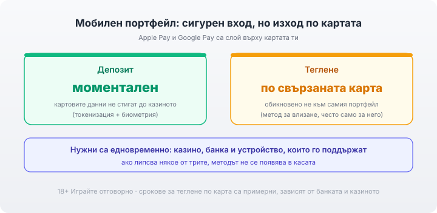

Title tag: Apple Pay и Google Pay в казино: как работят
Meta description: Как работят Apple Pay и Google Pay в онлайн казино: моментален мобилен депозит, токенизация и биометрия за сигурност, а тегленето обикновено се връща по свързаната карта.

---

# Apple Pay и Google Pay в онлайн казино: мобилни депозити и сигурност

Apple Pay и Google Pay не са отделна сметка, в която държиш пари. Те са слой върху картата, която вече имаш: добавяш своята Visa или Mastercard в портфейла на телефона веднъж, а след това плащаш с едно докосване и потвърждение. За депозит в казино това е сред най-сигурните начини, защото казиното така и не вижда номера на картата ти. На изхода обаче методът се държи различно. Лицензът на казиното в публичния регистър на НАП е условието преди всичко останало: без него и най-удобното плащане не пази парите ти.

## Какво всъщност са мобилните портфейли

Apple Pay и Google Pay действат като посредник между теб и картата ти. Картата стои отзад, портфейлът я представлява пред казиното. Затова и двата метода изискват първо да имаш подходяща карта, добавена в телефона, и устройство, което ги поддържа. Няма отделен баланс за зареждане както при електронния портфейл; парите идват директно от картата в момента на плащането. Къде стоят мобилните плащания сред [другите методи](/blog/casino-payments/) по скорост и такси си личи при пряко сравнение.

## Защо депозитът е сигурен: токенизацията

Когато платиш с Apple Pay или Google Pay, реалният номер на картата ти не се изпраща на казиното. Вместо него системата генерира уникален криптиран токен за конкретното плащане, и точно той минава през платформата. Казиното получава потвърждение, че плащането е одобрено, но никога не вижда и не съхранява самата карта. Дори платформата на оператора да бъде компрометирана, картовите ти данни просто не са били там, за да изтекат.

*Депозитът е моментален и картовите данни не стигат до казиното (токенизация). Уловката: тегленето обикновено се връща по свързаната карта, не към самия портфейл.*

## Биометрията е втората ключалка

Към токена идва и потвърждението от самото устройство. При Apple Pay всяко плащане се одобрява с Face ID, Touch ID или кода на устройството; при Google Pay през отключването на телефона. Затова дори някой да вземе телефона ти, не може да плати от твое име без лицето, пръста или кода ти.

## Депозитът е моментален

Самото захранване е бързо и познато: избираш Apple Pay или Google Pay в касата, потвърждаваш с биометрия и балансът се вдига за секунди. Няма отделна регистрация в платежен посредник и няма изчакване на превод. Самата игра от телефона е тема на [раздела за мобилните казина](/mobilni-kazina/).

## Изходът е друга история

Тегленето рядко се връща в самия мобилен портфейл. Тъй като Apple Pay и Google Pay са само представител на картата отзад, повечето казина връщат печалбата по свързаната карта или по друг метод, който държат верифициран, а не „към Apple Pay". Заради това мобилният портфейл на практика е метод за депозит, често само за депозит. Срокът за връщане по картата е като при обикновено картово теглене, обикновено няколко работни дни в зависимост от банката и казиното, и също минава през верификация (KYC) при първото изплащане. Затова е добре предварително да се провери по кой метод конкретното казино изплаща, още преди депозита с телефона.

## Съвместимост и къде спира методът

Дали методът изобщо ще се появи зависи от това казиното да го поддържа, банката ти да позволява добавянето на картата в портфейла и устройството ти да е съвместимо. Ако някое от трите липсва, методът просто не се появява в касата. Не всяко казино предлага Apple Pay или Google Pay и не всяка карта може да се добави. Плащанията в българските казина са в евро, така че евро карта зад портфейла обикновено минава без допълнително конвертиране, но какво точно таксува банката ти при такова плащане се чете в нейната тарифа.

## Сигурност и лиценз

Токенът и биометрията не отменят основните проверки. Лиценз от НАП първо: без него няма кой да отговаря за парите ти, колкото и гладко да тече плащането. Дръж устройството си заключено с биометрия и код, не добавяй карти на чуждо устройство и задай лимит за депозит и за загуба преди първото захранване. Гледай на сумата като на пари за развлечение, които можеш да загубиш изцяло. 18+ Хазартът може да пристрасти. Играйте отговорно. Ако усетиш, че играта излиза извън контрол, виж [инструментите за отговорна игра](/otgovorna-igra/). Пълната картина по захранване и изплащане стои в [раздела за депозити и теглене](/depoziti-i-teglenia/).

---

**Георги Тодоров**
Публикувано: 01.10.2026 · Последна редакция: 01.10.2026

[About Всички Казина boilerplate]

**Отговорна игра.** 18+ Хазартът може да пристрасти. Играйте отговорно. Ако усетиш, че играта излиза извън контрол или искаш да я ограничиш, виж [инструментите за отговорна игра](/otgovorna-igra/) и възможността за самоизключване чрез националния регистър на уязвимите лица към НАП (подава се писмено само от засегнатото лице). Национална информационна линия за наркотиците, алкохола и хазарта („Солидарност") 0888 99 18 66, делнични дни 10:00–17:00.

**Разкриване на партньорства.** Всички Казина съдържа партньорски (афилиейт) връзки; когато отвориш оферта през такава връзка, това може да финансира сайта, без да променя цената за теб и без да влияе на оценките ни. От 1 август 2026 г. дейността на афилиейт оператори в България се лицензира съгласно Закона за държавния бюджет за 2026 г. (ДВ, бр. 69 от 31.07.2026 г.). Всички Казина е подало заявление за лиценз пред Националната агенция по приходите и очаква издаването му.
