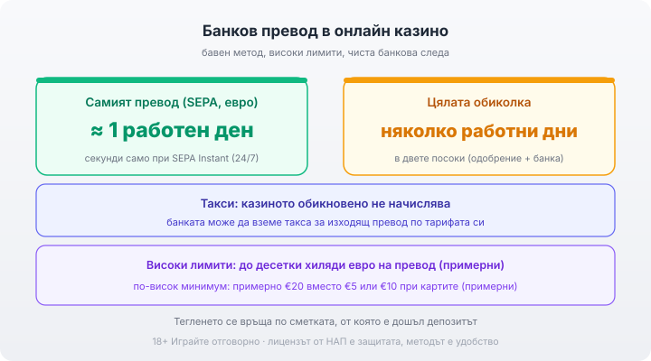

Title tag: Банков превод в казино: срокове, лимити, такси
Meta description: Банков превод в онлайн казино: най-бавният метод, но с високи лимити и чиста банкова следа. Срокове, такси (банката, не казиното) и правилото за същата сметка.

---

# Банков превод в онлайн казино: срокове, лимити и такси

Директният банков превод, или bank transfer, както пише в касата на част от сайтовете, е най-бавният от разпространените начини да захраниш сметка в онлайн казино. Парите тръгват от твоята банка към оператора без посредник между тях, и това се усеща веднага: вместо секундите на картата или електронния портфейл тук се броят работни дни. Затова пък банковият превод дава две неща, които [по-бързите методи](/blog/casino-payments/) рядко дават наведнъж: високи лимити и чиста банкова следа и в двете посоки. Преди самия превод провери лиценза на казиното в публичния регистър на НАП: без него и най-прозрачният метод не пази парите ти.

## Как минава депозитът

В касата избираш банков превод, а операторът ти дава своя IBAN и номер за основание. Вземаш ги и нареждаш превода през онлайн банкирането си или на гише, като изписваш основанието точно както е дадено. Сгрешиш ли го, разпознаването се бави. В зоната на SEPA, в евро, самият превод обикновено стига до банката получател за един работен ден. Балансът за игра не светва в мига, в който парите напускат сметката ти. Казиното трябва първо да види и потвърди постъплението, а това добавя време. Има и SEPA Instant, който движи парите за секунди в режим 24/7, но дори когато банката ти го поддържа, вътрешното одобрение на казиното пак стои между теб и баланса. При банковия превод ти сам нареждаш плащането към оператора; казиното няма достъп да тегли от сметката ти, както е при директния дебит, и това е предимство за контрола над разходите. SEPA покрива над 40 държави и работи само в евро, което приляга добре на българския пазар, където плащанията в казината така или иначе са в евро. Повече за този момент има в [материала за евро депозитите](/blog/evro-hazart-depoziti/).

## Колко чакаш на изхода

На изхода чакането е по-дълго. Казиното одобрява заявката, което при различните оператори отнема от няколко часа до няколко работни дни и върви по-гладко, ако верификацията ти вече е готова. Самият SEPA превод добавя своя един работен ден. Банката ти осчетоводява постъплението последна, а някои оператори пускат изходящите преводи на партиди веднъж дневно. Почивните дни и празниците не се броят за банкови дни, затова заявка в петък вечер реалистично пристига чак другата седмица. Същото важи и за часа на отрязване през деня: превод, нареден след следобедния cut-off на банката, тръгва едва на следващия работен ден, все едно си го пуснал на сутринта. Първото теглене минава през верификация на самоличността (KYC): лична карта, понякога доказателство за адрес. Добре е верификацията да е готова още преди първия депозит, за да не се трупа отгоре на чакането по самия превод.

## Такси: кой всъщност таксува

Казиното обикновено не таксува банковия превод. Разходът идва от твоята банка: SEPA преводът в евро струва колкото вътрешен превод, което при някои тарифни планове е нула, при други не. Ако сметката ти не е в евро, при обмяната може да се добави и разход за конвертиране, затова евровата сметка спестява това при българските казина, където сумите са в евро.

## Лимити и минимален депозит

За по-големи суми банковият превод е най-подходящ: лимитите стигат високо, при някои оператори до десетки хиляди евро на превод, там където картата опира в тавана си. Самата схема на SEPA допуска суми, които на практика нямат таван за обикновен играч. Реалните граници ги поставят банката и операторът, не платежната система. В замяна минималният депозит е по-висок, примерно €20 вместо €5 или €10 при картите. За дребните, чести суми това е неудобно, но при един голям еднократен превод не тежи.

## Правилото за същата сметка

Тегленето се връща по сметката, от която е дошъл депозитът. Казината прилагат това като правило срещу изпиране на пари: не можеш да захраниш от една сметка и да изтеглиш на друга. При банковия превод излиза естествено, парите се прибират там, откъдето тръгнаха, и следата остава чиста и в двете посоки. При по-голямо теглене банката или казиното може да поиска допълнителна проверка на произхода на средствата. Това е стандартна част от правилата срещу изпиране на пари и също удължава срока, особено при презгранични преводи.

*Банков превод в евро: самият превод обикновено един работен ден, цялата обиколка няколко работни дни. Казиното обикновено не таксува; банката може, по тарифата си. Високи лимити, по-висок минимум, теглене по същата сметка.*

## Банковата следа и сигурността

Банковият превод е сред най-прозрачните методи, защото всичко минава през регулирана банка, която вече знае кой си. В казиното не оставяш данни от карта и не вкарваш допълнителен портфейл като междинно звено. Директната банкова следа значи по-малко приватност спрямо картата или портфейла. За сметка на това тя прави метода уместен за по-сериозни суми. За разлика от картата тук няма механизъм за бърз chargeback. Спорна транзакция се урежда по общия банков ред, което е още една причина да депозираш само в казино с валиден лиценз от НАП. Задай си лимит за депозит и за загуба още преди първото захранване, преди да си видял баланса, и гледай на сумата като на пари за развлечение, които можеш да загубиш изцяло. Хазартът е платено забавление, не източник на доход. 18+ Хазартът може да пристрасти. Играйте отговорно. Ако усетиш, че играта излиза извън контрол, виж [инструментите за отговорна игра](/otgovorna-igra/).

## Кога си струва

За еднократна голяма сума с чиста банкова следа работните дни чакане са приемлива цена. Цялата картина по захранване и изплащане стои в [раздела за депозити и теглене](/depoziti-i-teglenia/).

---

**Георги Тодоров**
Публикувано: 01.10.2026 · Последна редакция: 01.10.2026

[About Всички Казина boilerplate]

**Отговорна игра.** 18+ Хазартът може да пристрасти. Играйте отговорно. Ако усетиш, че играта излиза извън контрол или искаш да я ограничиш, виж [инструментите за отговорна игра](/otgovorna-igra/) и възможността за самоизключване чрез националния регистър на уязвимите лица към НАП (подава се писмено само от засегнатото лице). Национална информационна линия за наркотиците, алкохола и хазарта („Солидарност") 0888 99 18 66, делнични дни 10:00–17:00.

**Разкриване на партньорства.** Всички Казина съдържа партньорски (афилиейт) връзки; когато отвориш оферта през такава връзка, това може да финансира сайта, без да променя цената за теб и без да влияе на оценките ни. От 1 август 2026 г. дейността на афилиейт оператори в България се лицензира съгласно Закона за държавния бюджет за 2026 г. (ДВ, бр. 69 от 31.07.2026 г.). Всички Казина е подало заявление за лиценз пред Националната агенция по приходите и очаква издаването му.
