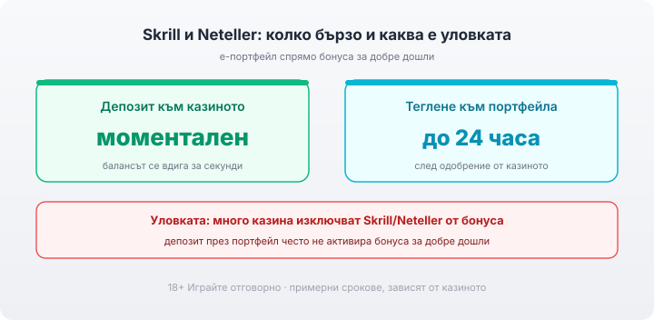

Title tag: Skrill и Neteller в казино: тегления, такси и бонуси
Meta description: Как работят е-портфейлите Skrill и Neteller в онлайн казино: моментален депозит, бързо теглене, такси от доставчика и защо много казина изключват портфейла от бонуса за добре дошли.

---

# Е-портфейли (Skrill, Neteller) в онлайн казино: депозити, тегления и бонус изключения

Skrill и Neteller са двата електронни портфейла, които играчите избират, когато искат парите да излизат бързо. И двата са на Paysafe Group и работят по един и същи принцип: зареждаш портфейла веднъж от картата или по банков път, а след това казиното вижда само портфейла, не самата карта. Това е и цялата идея. Печелиш на скоростта при теглене и на поверителността, но има едно място, където е-портфейлът често губи, и то е бонусът. Преди да избера метод, проверявам лиценза на казиното в публичния регистър на НАП; методът за плащане е удобство, лицензът е защитата.

## Какво всъщност е електронният портфейл

Портфейлът стои като посредник между банката ти и казиното. Веднъж регистриран и зареден, той плаща към оператора от свое име, така че номерът на картата ти не стига до платформата на казиното. За играч, който не иска картовите му данни да обикалят по различни сайтове, това е реална разлика спрямо директното плащане с карта. Срещу това удобство поемаш един допълнителен акаунт, който също иска поддръжка: верификация, а понякога и такси, за които малко по-надолу. Как се нареждат портфейлите спрямо картите и касите по срокове съм описал в [прегледа на методите за плащане](/blog/casino-payments/).

## Депозитът минава през два слоя, но пак е моментален

На практика депозитът изглежда като всеки друг: избираш Skrill или Neteller в касата, вписваш сумата, потвърждаваш в портфейла и балансът в казиното се вдига за секунди. Разликата е, че парите тръгват от портфейла, а не директно от картата, затова портфейлът трябва да е зареден предварително. Ако го захранваш с карта в момента на депозита, точно тази стъпка понякога идва с такса от доставчика, докато самото прехвърляне портфейл към казино обикновено е без такса при лицензираните оператори.

## Тук е силата на метода: тегленето

Това е причината повечето редовни играчи да държат портфейл. Заявката за теглене към Skrill или Neteller обикновено се обработва до 24 часа след одобрението от казиното, а реалното време от заявка до пари в портфейла най-често е между няколко часа и 72 часа. За сравнение, тегленето обратно по карта често отнема няколко работни дни. Първото теглене и тук минава през верификация на самоличността (KYC), затова я правя предварително, докато още нямам какво да тегля. След като парите влязат в портфейла, прехвърлянето им към банковата сметка е отделна стъпка и отнема допълнително време.

*Депозитът влиза моментално; тегленето към портфейла е обикновено до 24 часа след одобрение от казиното (примерни срокове, зависят от казиното). Важната уловка: много казина не признават депозит със Skrill/Neteller за бонуса.*

## Уловката, която изненадва най-много играчи

Ето я цената на удобството. Много казина изрично изключват депозитите със Skrill и Neteller от бонуса за добре дошли, при това често в една и съща клауза за двата портфейла. На практика това значи, че ако заредиш през портфейл и очакваш да получиш бонуса, той просто няма да се активира, защото методът не отговаря на условието. Това не е измама, а стандартна клауза, която операторите слагат, защото портфейлите улесняват злоупотребата с бонуси. Затова, ако конкретният бонус те интересува, правилото е просто: отвори условията на офертата и провери списъка с допустими методи за плащане, преди да депозираш, а не след това. Какво всъщност получаваш зад числото на един бонус съм разписал в [материала за бонусите без депозит](/blog/bonus-bez-depozit-2026/).

## Кой таксува: казиното или доставчикът

При повечето лицензирани казина самото прехвърляне между портфейла и оператора е без такса в двете посоки. Когато видиш такса, тя почти винаги идва от страната на Skrill или Neteller, не от казиното. Три места са типични. Първо, ако захранваш портфейла с карта, доставчикът може да начисли такса за това захранване, от порядъка на примерни 1,9%. Второ, ако казиното работи във валута, различна от валутата на портфейла ти, при конвертирането доставчикът добавя надценка, която може да стигне примерни 3,99%. Трето, ако оставиш портфейла неизползван дълго, обикновено след около 12 поредни месеца без движение, започва да тече такса за неактивност от порядъка на примерни €5 на месец. Точните проценти и суми зависят от държавата, валутата и плана ти и се менят, затова ги чети в тарифата на Skrill или Neteller към деня на транзакцията, а не по памет. [VERIFY: конкретните проценти/суми на таксите на доставчика са план/държава-специфични] Плащанията в българските казина са в евро, така че евро портфейл обикновено спестява конвертирането (повече по темата в [материала за евро депозитите](/blog/evro-hazart-depoziti/)).

## Сигурност и верификация

Поверителността спрямо казиното е силната страна: операторът не получава номера на картата ти, защото плащането идва от портфейла. Това не те освобождава от верификацията. Самият портфейл иска потвърждение на самоличността, а казиното изисква KYC преди първото теглене, независимо от метода. Двете са различни проверки и е добре да минеш и двете предварително. Моята част остава същата при всеки метод: лиценз от НАП първо, защото без него няма кой да отговаря за парите ти; силна парола и двуфакторно потвърждение на портфейла; и лимит за депозит и за загуба, зададен преди първото зареждане, не след него. Гледай на сумата като на пари за развлечение, които можеш да загубиш изцяло. 18+ Хазартът може да пристрасти. Играйте отговорно. Ако усетиш, че играта излиза извън контрол, виж [инструментите за отговорна игра](/otgovorna-igra/).

## Кратка равносметка

За играч, който тегли редовно и държи на скоростта, портфейлът е логичният избор: парите излизат по-бързо, отколкото по карта, а картовите данни не обикалят по сайтовете. Цената е двойна поддръжка и една конкретна жертва, бонусът за добре дошли, който често не важи за този метод. Ако ловиш точно определена оферта, зареди по допустимия за нея метод. Ако по-скоро искаш печалбата да е в сметката ти до утре, портфейлът почти винаги бие картата. Провери тарифата на доставчика и условията на конкретното казино, преди да заредиш, не след като парите вече са тръгнали. Пълната картина по захранване и изплащане стои в [раздела за депозити и теглене](/depoziti-i-teglenia/).

---

**Георги Тодоров**
Публикувано: 01.10.2026 · Последна редакция: 01.10.2026

[About Всички Казина boilerplate]

**Отговорна игра.** 18+ Хазартът може да пристрасти. Играйте отговорно. Ако усетиш, че играта излиза извън контрол или искаш да я ограничиш, виж [инструментите за отговорна игра](/otgovorna-igra/) и възможността за самоизключване чрез националния регистър на уязвимите лица към НАП (подава се писмено само от засегнатото лице). Национална информационна линия за наркотиците, алкохола и хазарта („Солидарност") 0888 99 18 66, делнични дни 10:00–17:00.

**Разкриване на партньорства.** Всички Казина съдържа партньорски (афилиейт) връзки; когато отвориш оферта през такава връзка, това може да финансира сайта, без да променя цената за теб и без да влияе на оценките ни. От 1 август 2026 г. дейността на афилиейт оператори в България се лицензира съгласно Закона за държавния бюджет за 2026 г. (ДВ, бр. 69 от 31.07.2026 г.). Всички Казина е подало заявление за лиценз пред Националната агенция по приходите и очаква издаването му.
