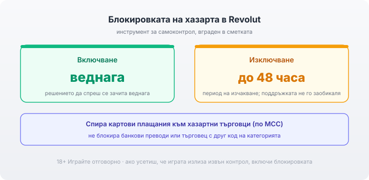

Title tag: Revolut в казино: депозити, тегления и блокировка
Meta description: Как работи Revolut в онлайн казино: моментален депозит, бързо теглене и вградената блокировка на хазарта като инструмент за самоконтрол с период на изчакване до 48 часа.

---

# Revolut в онлайн казино: депозити, тегления и контрол на хазартните разходи

Revolut отдавна не е просто приложение за превод на пари. За мнозина у нас то е основната сметка, а картата зад него върши работа навсякъде, включително за депозит в онлайн казино. Като платежен метод Revolut се държи предвидимо: парите влизат бързо, тегленето е сред по-бързите, а таксите са ниски. Най-интересното при него обаче не е скоростта, а един инструмент за самоконтрол, който другите методи нямат. Преди всичко останало проверявам лиценза на казиното в публичния регистър на НАП; платежният метод е удобство, лицензът е защитата.

## Какво представлява Revolut в касата

На практика Revolut е необанка, която живее в телефона ти. Държиш сметка и карта в приложението, а в касата на казиното плащаш с тази карта или директно през Revolut, където методът се поддържа. Познатата логика на картовото плащане важи и тук, но с добавка: приложението ти дава контроли върху парите в реално време, за които малко по-надолу. Как се нарежда Revolut спрямо класическата карта и останалите методи съм описал в [прегледа на методите за плащане](/blog/casino-payments/).

## Депозит и теглене

Депозитът е моментален: избираш Revolut или картата в касата, потвърждаваш в приложението и балансът е готов за игра. На изхода Revolut също се представя добре, повечето тегления се получават до 24 часа, което е по-бързо от типичното връщане по банкова карта. Първото теглене минава през верификация на самоличността (KYC) както при всеки метод, затова я правя предварително. Повече за игра директно от телефона има в [раздела за мобилните казина](/mobilni-kazina/).

## Таксите

При казино плащания Revolut обикновено не начислява собствена такса за депозит или теглене. Мястото, където може да се появи разход, е валутното конвертиране: ако плащаш във валута, различна от тази на сметката ти, извън безплатните лимити на плана или през уикенда Revolut може да добави надценка при обмяната. Колко точно зависи от плана ти и от деня, затова проверявай условията в приложението преди голям депозит, а не разчитай на памет: точните такси за конвертиране и безплатните лимити се менят според плана на Revolut и деня на транзакцията. Плащанията в българските казина са в евро, така че евро сметка в Revolut обикновено минава без конвертиране.

## Истински различното: блокировката на хазарта

Ето защо Revolut заслужава отделен разговор. В приложението има вградена блокировка на хазарта, която спира картовите плащания към хазартни търговци. Работи през кода на категорията на търговеца (MCC): когато е включена, плащанията към казина, букмейкъри и бетинг приложения просто не минават. Това не е маркетинг, а реален инструмент за самоконтрол, какъвто банка рядко ти дава толкова достъпно. За играч, който иска да държи хазарта в рамка или да спре напълно за известно време, това е най-прякото средство: не разчиташ на воля в момента на изкушението, а на настройка, която вече е казала „не".

*Блокировката на хазарта: включва се веднага, изключва се с период на изчакване до 48 часа. Спира картови плащания към хазартни търговци (по MCC); не блокира банкови преводи.*

## 48-часовото изчакване е защита, не пречка

Детайлът, който прави блокировката сериозна, е асиметрията ѝ. Включването става веднага. Изключването обаче минава през период на изчакване до 48 часа, който дори поддръжката на Revolut не може да заобиколи. На пръв поглед звучи неудобно, но точно това е смисълът: решението да спреш се зачита веднага, а решението да започнеш отново е нарочно забавено, за да не се взема под напора на момента или в опит да се гонят загуби. Ако някога ти се стори досадно, че блокът не се маха веднага, спомни си, че тъкмо тази пауза работи за теб, не срещу теб.

## Къде спира блокировката

Инструментът е силен, но не е всеобхватен и е честно да се знаят границите му. Блокировката хваща картовите плащания с хазартен MCC, но не спира банкови преводи, нито плащания, при които търговецът е класифициран под друг код. Ако някой оператор се представя под нехазартна категория, плащането може да мине въпреки блока. Отделно, възможно е конкретно казино да не приема Revolut, защото е блокирало неговите BIN диапазони; това се проверява с поддръжката на казиното. Затова гледам на блокировката като на силна първа линия, не като на непробиваема стена, и когато целта е пълно спиране, я комбинирам с другите средства за самоизключване.

## Сигурност, лиценз и кратка равносметка

Revolut събира на едно място бърз депозит, бързо теглене и контрол върху разходите, какъвто малко методи предлагат. Това не отменя основните проверки. Лиценз от НАП първо, защото без него няма кой да отговаря за парите ти. Заключи приложението с биометрия и код, задай лимити за депозит и за загуба преди първото захранване, не след него, и гледай на сумата като на пари за развлечение, които можеш да загубиш изцяло. 18+ Хазартът може да пристрасти. Играйте отговорно. Ако усетиш, че играта излиза извън контрол, включи блокировката на хазарта и виж [инструментите за отговорна игра](/otgovorna-igra/). Като платежен метод Revolut е сред удобните. Но ако трябва да изтъкна една причина да го предпочетеш пред обикновена карта, тя не е скоростта, а че носи спирачка, вградена в самата сметка. Пълната картина по захранване и изплащане стои в [раздела за депозити и теглене](/depoziti-i-teglenia/).

---

**Георги Тодоров**
Публикувано: 01.10.2026 · Последна редакция: 01.10.2026

[About Всички Казина boilerplate]

**Отговорна игра.** 18+ Хазартът може да пристрасти. Играйте отговорно. Ако усетиш, че играта излиза извън контрол или искаш да я ограничиш, виж [инструментите за отговорна игра](/otgovorna-igra/) и възможността за самоизключване чрез националния регистър на уязвимите лица към НАП (подава се писмено само от засегнатото лице). Национална информационна линия за наркотиците, алкохола и хазарта („Солидарност") 0888 99 18 66, делнични дни 10:00–17:00.

**Разкриване на партньорства.** Всички Казина съдържа партньорски (афилиейт) връзки; когато отвориш оферта през такава връзка, това може да финансира сайта, без да променя цената за теб и без да влияе на оценките ни. От 1 август 2026 г. дейността на афилиейт оператори в България се лицензира съгласно Закона за държавния бюджет за 2026 г. (ДВ, бр. 69 от 31.07.2026 г.). Всички Казина е подало заявление за лиценз пред Националната агенция по приходите и очаква издаването му.
