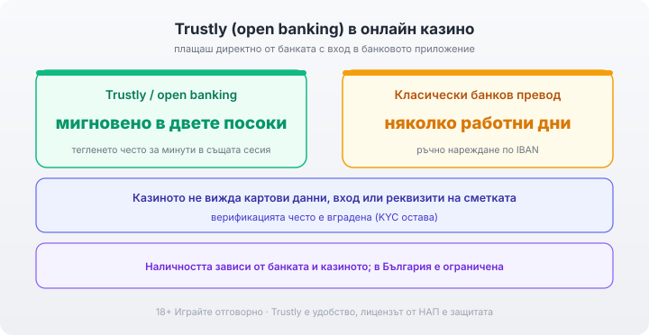

Title tag: Trustly в казино: мигновено плащане от банката
Meta description: Trustly и open banking в казино: плащаш директно от банковата сметка с вход като в банковото приложение, мигновено в двете посоки, без картови данни.

---

# Trustly и мигновените банкови плащания (open banking) в онлайн казино

Trustly е доставчик за т.нар. open banking, или „pay-by-bank": плащане в онлайн казино директно от банковата ти сметка, без карта като междинно звено и без отделен портфейл за откриване. Вместо да въвеждаш данни от карта или да нареждаш превод по IBAN, потвърждаваш плащането със същия вход, с който отваряш банковото си приложение. Голямата разлика спрямо класическия банков превод е скоростта: при Trustly парите се движат мигновено в двете посоки, докато обикновеният превод се брои в работни дни. Колкото и гладко да тече самото плащане, то е толкова сигурно, колкото е и операторът зад него, затова първата ми проверка винаги е името на казиното в публичния регистър на НАП. Как се нарежда Trustly спрямо картата и останалите начини за захранване, съм описал в [прегледа на методите за плащане](/blog/casino-payments/).

## Какво е open banking и защо го наричат „pay-by-bank"

При open banking банката ти отваря сигурен, регулиран достъп (през API) до лицензиран доставчик като Trustly. Но това става само след твое изрично разрешение за конкретното плащане. „Pay-by-bank" е точно това на практика: плащаш направо от разплащателната си сметка, все едно теглиш карта на място, само че онлайн и без самата карта. Trustly стои като посредник между твоята банка и касата на казиното и инициира плащането от твое име, след като ти се оторизираш в банката си. Мрежата е голяма, Trustly е свързан с над 3 000 банки в Европа, но кои точно от тях работят за българския пазар е въпрос, който се проверява в самата каса на оператора.

## Как тече плащането през твоята банка

В касата избираш Trustly и банката си от списъка, влизаш както в банковото си приложение, често с биометрия или еднократен код, и потвърждаваш сумата; оттам нататък Trustly придвижва парите. Самото потвърждение минава през силната автентикация на банката, двуфакторното одобрение, което по подразбиране важи за всяко по-голямо плащане от приложението. Затова плащането е толкова сигурно, колкото обичайния ти превод от телефона. Казиното в нито един момент не вижда номера на картата ти, данните за вход или пълните реквизити на сметката. Няма и преписване на IBAN и номер за основание, нито ръчно нареждане, съобразено с крайни часове и работни дни: оторизацията в банката върши цялата работа вместо теб.

## Мигновено в двете посоки

Депозитът влиза веднага: оторизираш в банката и балансът е готов за игра, стига операторът да потвърди постъплението. При теглене разликата е още по-осезаема: класическият банков превод отнема няколко работни дни, докато при open banking плащането е от сметка към сметка и парите често се получават за минути, понякога в рамките на същата сесия. За разлика от нареждане, което чака следващия работен ден, оторизацията работи и вечер, и през уикенда, стига банката да поддържа мигновените плащания. Скоростта обаче не зависи само от инфраструктурата: първото теглене пак минава през верификация (KYC), а някои оператори държат изходящите суми в срок на вътрешна проверка, който стои между теб и парите независимо колко бърз е преводът. Повече за плащанията в евро има в [материала за евро депозитите](/blog/evro-hazart-depoziti/).

*Плащаш директно от банката, без картови данни; тегленето често пада от няколко работни дни на минути, стига банката и казиното да поддържат метода.*

## Без отделна регистрация и с вградена верификация

Моделът, който Trustly популяризира (познат като Pay N Play), ти спестява отделния портфейл и втората регистрация. Не създаваш нов акаунт при доставчика и не пазиш още един набор данни за вход. При следващо връщане системата те разпознава по сметката, с която си плащал, така че не минаваш през регистрация отначало всеки път. Верификацията често е вградена, защото банката ти вече е проверила кой си при откриването на сметката, а Trustly потвърждава самоличността ти, като изтегля проверените данни от банката с твое разрешение. Това не отменя KYC, то просто се случва по-гладко: самоличността пак се проверява, само че без да качваш отделно документи при всяко казино.

## Наличност, такси и дребният шрифт

Мигновено работи само ако банката ти е свързана с Trustly и казиното предлага метода в касата си. В България наличността е ограничена и се мени, затова единственият сигурен начин да разбереш е да видиш метода в касата на конкретния оператор. Ако банката ти не е в списъка или операторът не поддържа Trustly, оставаш на картата или на обикновения превод, колкото и удобен да звучи open banking на теория.

Таксите по open banking обикновено поема операторът или доставчикът, не играчът, но условията се различават и си струва да ги погледнеш в касата, преди да захраниш. Плащанията в българските казина са в евро, така че евровата сметка спестява разход за конвертиране.

## Сигурност и лиценз

Trustly е от по-прозрачните методи по простата причина, че всичко минава през регулирана банка, която вече знае кой си, и през лицензиран платежен доставчик. В казиното не оставяш данни от карта и не вкарваш допълнителен портфейл като още едно звено, което да пази парите ти. За разлика от картата тук няма механизъм за бърз chargeback; спорна транзакция се урежда по общия банков ред, което е още една причина да плащаш само в казино с валиден лиценз от НАП. Заключи банковото си приложение с биометрия и код, задай лимити за депозит и за загуба още преди първото захранване, не след него, и гледай на сумата като на пари за развлечение, които можеш да загубиш изцяло; хазартът е платено забавление, не източник на доход. 18+ Хазартът може да пристрасти. Играйте отговорно. Ако усетиш, че играта излиза извън контрол, виж [инструментите за отговорна игра](/otgovorna-igra/). Пълната картина по захранване и изплащане стои в [раздела за депозити и теглене](/depoziti-i-teglenia/).

---

**Георги Тодоров**
Публикувано: 01.10.2026 · Последна редакция: 01.10.2026

[About Всички Казина boilerplate]

**Отговорна игра.** 18+ Хазартът може да пристрасти. Играйте отговорно. Ако усетиш, че играта излиза извън контрол или искаш да я ограничиш, виж [инструментите за отговорна игра](/otgovorna-igra/) и възможността за самоизключване чрез националния регистър на уязвимите лица към НАП (подава се писмено само от засегнатото лице). Национална информационна линия за наркотиците, алкохола и хазарта („Солидарност") 0888 99 18 66, делнични дни 10:00–17:00.

**Разкриване на партньорства.** Всички Казина съдържа партньорски (афилиейт) връзки; когато отвориш оферта през такава връзка, това може да финансира сайта, без да променя цената за теб и без да влияе на оценките ни. От 1 август 2026 г. дейността на афилиейт оператори в България се лицензира съгласно Закона за държавния бюджет за 2026 г. (ДВ, бр. 69 от 31.07.2026 г.). Всички Казина е подало заявление за лиценз пред Националната агенция по приходите и очаква издаването му.
