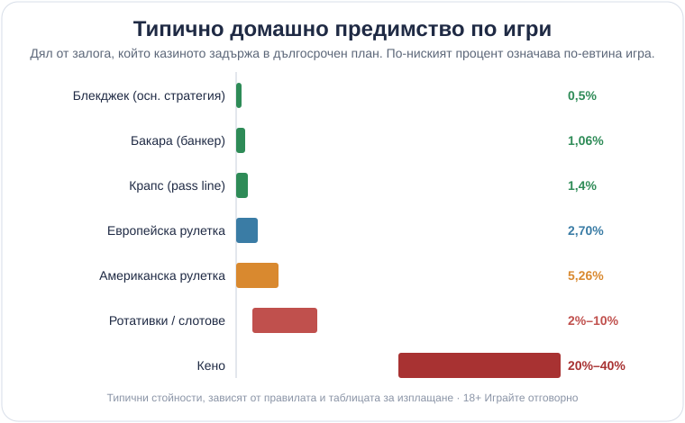

# 02 — Draft (Author, editorial) · vk-0237

Byline: Георги Тодоров (editorial "patient teacher") | Market: bg — guide, comparative hub.
CANON ADDITIONS: none.

---

# Кои казино игри дават най-добри шансове

Най-добрите шансове в казиното са там, където играта задържа най-малко от залога ти, усреднено върху много залози. По този признак подреждането е ясно и се повтаря от десетилетия: блекджек с основна стратегия и видеопокер на пълна таблица са най-евтините, бакара и крапс ги следват отблизо, рулетката седи по средата, а ротативките и особено кено са най-скъпите на дълга писта. Числото зад това подреждане се нарича домашно предимство. Разбереш ли го веднъж, спираш да избираш игра по това как изглежда на екрана. Различните [казино игри](/kazino-igri/) дават коренно различна цена за един и същ €1 залог.

## Домашно предимство на прост език

Домашното предимство е делът от всеки заложен €, който казиното задържа за себе си в дългосрочен план. RTP е същото число, погледнато отзад напред: RTP = 100% − домашно предимство. Игра с 2,70% предимство връща 97,30% RTP; игра с 10% предимство връща 90%. Едното казва колко губиш средно, другото колко ти се връща, но сочат към един и същ факт. На €100 оборот тези 2,70% са около €2,70, които остават в казиното.

Как се чете точното RTP на една-единствена ротативка, заедно с волатилността ѝ, е отделна тема със свое ръководство. Тук гледаме сравнението между самите игри, не разчитането на числото за една от тях.

## Игрите с най-ниско предимство отблизо

Блекджек е единствената голяма игра, в която твоите решения местят числото осезаемо. С вярна основна стратегия предимството пада към 0,5%; играеш ли по усет, то скача многократно и таблиците в ръководствата вече не описват твоята игра. Видеопокерът работи по подобен начин, само че „стратегията" е да знаеш коя карта да задържиш при всяка раздадена ръка, а таблицата 9/6 Jacks or Better е тази, която сваля предимството под 1% при перфектна игра. Бакара няма такова изискване: залагаш на банкера, домашното предимство е около 1,06% и толкова, без никакво умение, което я прави разумен избор за човек, който иска ниска цена без да учи схеми. Крапс стои наблизо с pass line около 1,4%, стига да стоиш далеч от шарените странични залози в средата на масата, някои от които минават 10%.

## Домашно предимство по игри

Ето типичните стойности при коректна игра. Приеми ги като ориентир, не като гаранция: всяка зависи от конкретните правила, варианта и таблицата за изплащане, затова едно и също заглавие може да играе с различно число на две различни места.

| Игра | Домашно предимство (типично) | RTP (≈) | Бележка |
|---|---|---|---|
| Блекджек (основна стратегия) | ~0,5% | ~99,5% | само при вярна основна стратегия |
| Видеопокер (9/6 Jacks or Better) | под 1% | над 99% | при перфектна игра и пълна таблица |
| Бакара (банкер) | 1,06% | 98,94% | залогът на играча е 1,24% |
| Крапс (pass line / come) | ~1,4% | ~98,6% | някои странични залози са много по-лоши |
| Европейска рулетка (една нула) | 2,70% | 97,30% | |
| Американска рулетка (двойна нула) | 5,26% | 94,74% | втората нула почти удвоява цената |
| Ротативки / слотове | 2%–10% | ~90%–98% | огромна разлика между заглавията |
| Кено | ~20%–40% | ~60%–80% | едно от най-скъпите; има отделно ръководство |
| Бакара (равенство) | ~14% | ~86% | висок страничен залог, за избягване |

*Типични стойности на домашното предимство по игри; зависят от правилата и таблицата за изплащане.*

## Защо по-ниското предимство не е покана да играеш

Ниското число мами по два начина. Първо, то важи само при перфектна игра. Блекджек стига до около 0,5% единствено ако следваш основната стратегия ръка по ръка, а видеопокерът дава под 1% само на пълна таблица и с безгрешни решения; щом играеш по интуиция, реалното предимство срещу теб е в пъти по-голямо от красивото число в таблицата. Второ, дори перфектните 0,5% са разход, който плащаш. RTP е статистика върху милиони залози, не обещание за твоята вечер: една добра серия не отменя предимството, а един лош час не значи, че играта е „студена". Казиното печели дълго, защото математиката е от негова страна при всеки залог, и това важи еднакво за най-евтината и за най-скъпата игра в залата.

При ротативките няма стратегия, която да свали числото. RTP е зашит в заглавието от доставчика и се движи от около 90% до 98%, тоест две ротативки една до друга спокойно играят с двойна разлика в цената. Кено остава най-солено дори онлайн и има отделно ръководство за таблиците му. Когато оценяваме една игра, точно това число тежи в сметката, и как го правим е описано в [методологията ни](/kak-ocenyavame/). А всички тези проценти означават нещо само при лицензиран оператор, чиито игри се тестват независимо; дали казиното е [законно в България](/zakonno-li-e/) е първото, което проверяваме, преди изобщо да стигнем до RTP.

## €100, завъртени през различни игри

Европейската рулетка задържа статистически около €2,70 на всеки €100 оборот, американската около €5,26 заради втората нула, а блекджек с основна стратегия оставя в казиното към €0,50 от същата сума. Кено с тежка таблица може да глътне €20 до €40 от тези €100. Един и същ бюджет, съвсем различно колко дълго ще ти стигне.

## Защо еднакво предимство не значи еднакво усещане

Две игри с един и същ процент домашно предимство могат да се играят напълно различно. Ротативка с висока волатилност държи същото предимство, но ти го взима на дълги сухи серии с рядък голям удар, докато нисковолатилна игра топи баланса бавно и равномерно, с чести дребни печалби. Домашното предимство ти казва колко струва играта на дълго; волатилността казва по какъв път ще минеш дотам. За едни и същи €100 едната версия може да свърши за десетина завъртания, а другата да те разходи цял час. Кое от двете понасят бюджетът и нервите ти е личен въпрос, затова го разглеждаме поотделно, число по число, в ръководството за RTP и волатилност. За подреждането по шансове тук стига да помниш, че по-ниското предимство е по-евтина игра, не по-спокойна.

## Кое си струва

Ако търсиш къде стотинката ти издържа най-дълго, изборът не е сложен: блекджек с научена основна стратегия или видеопокер на пълна таблица, следвани от банкера в бакара за някого, който не иска да учи схеми. Рулетка играй само в европейския вариант; американската с двете нули няма причина да я избираш, когато еднонулевата е на съседната маса. Кено и повечето ротативки са за кратки, евтино купени тръпки, не за дълги сесии на малък бюджет. И най-ниското предимство обаче си остава цена за забавлението. Хазартът не е финансова стратегия и нито една от тези игри не е печеливша в дългосрочен план, колкото и малко да е числото срещу теб. Сложи си лимит на депозита, преди да седнеш, и ако усетиш, че гониш изгубеното, [инструментите за отговорна игра](/otgovorna-igra/) са мястото да спреш навреме.

18+ Хазартът може да пристрасти. Играйте отговорно.

**Георги Тодоров**
Публикувано: 02.10.2026 · Последна редакция: 02.10.2026

[About Всички Казина boilerplate]

[RG footer — template]

[Affiliate footer — template]
