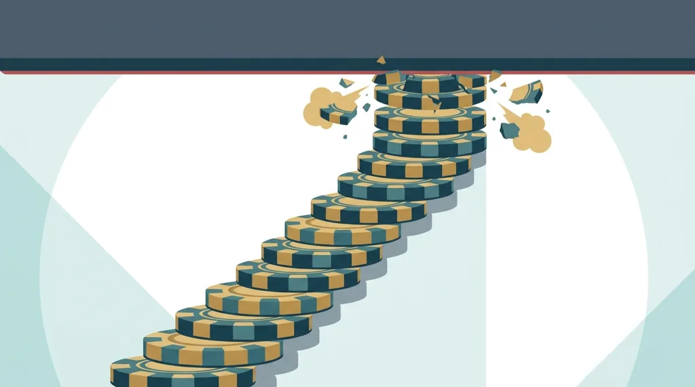
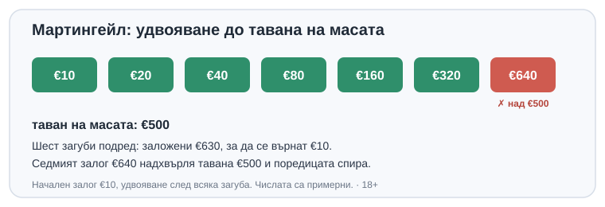

Title tag: Лимити на масата в казиното: мин и макс залог
Meta description: Защо казино масите имат минимален и максимален залог, как таванът спира системи като Мартингейл и какво значи диапазонът за вашия бюджет. Сметка в €.

---

# Лимити на масата в казино игрите: какво са и защо съществуват

Всяка маса в казиното има долна и горна граница на залога, и горната е причината „удвоявай, докато спечелиш" да не работи. На маса с таван €500 поредицата от удвоявания опира в стената още преди седмата загуба, колкото и пари да носите. Лимитите изглеждат като дребен технически детайл в ъгъла на масата, но тъкмо те определят кои стратегии са безсмислени и коя маса изобщо пасва на бюджета ви.

## Какво представляват лимитите

Лимитът на масата е диапазонът между най-малкия и най-големия позволен залог на един кръг. Пише го на самата маса или в информацията на играта: например от €1 до €100 на една маса и от €10 до €500 на друга. Една и съща игра върви на няколко маси с различни граници, за да събере на едно място играчи с подобни бюджети, а не едрите залози с дребните.

При рулетката и блекджека на живо границата е обявена и видима, а крупието я следи. При игрите с генератор на случайни числа същото ограничение седи в настройката на залога: имате минимална стъпка и максимум на завъртане, само че без човек насреща. Разликата е във вида, не в принципа.

Често има и отделни лимити по вид залог. На рулетката външните залози (червено/черно, чифт/тесте) обикновено имат по-висок таван от вътрешните върху едно число, защото изплащат по-малко и рискът за казиното на кръг е по-нисък. Затова „таван €500" невинаги важи за цялата маса: за директен залог на число горната граница може да е доста по-ниска. Числото, което ви интересува, е таванът за конкретния залог, който смятате да правите, а не общото число на масата.

## Защо казиното ги слага

Първата причина е управление на риска. Горният лимит ограничава колко може да загуби казиното на един кръг срещу един играч, което държи приходите му предвидими от маса на маса. Долният лимит пази масата жива откъм другата страна: твърде ниски залози не си струват разходите по крупие, стрийминг и поддръжка.

Втората причина е по-интересна за играча. Таванът обезсмисля прогресивните системи, при които залогът расте след всяка загуба. Най-известната е Мартингейл: удвоявате след всяка загуба, за да покриете натрупаното с една печалба. На теория звучи безотказно. На практика опира в горния лимит далеч преди да ви свършат парите.

## Как таванът убива Мартингейл

Започвате с €10 на червено и губите. Удвоявате на €20, после €40, €80, €160, €320. Шестата загуба иска седми залог от €640, а масата приема най-много €500. Поредицата умира тук, със загуба от €630 на ръка, която трябваше да върне €10 печалба. Банкрол от €5 000 нямаше да помогне: спира ви не липсата на пари, а стената на масата.

*Мартингейл на маса с таван €500: седмият залог €640 е невъзможен. Числата са примерни.*

Системата се крепи на три допускания, които никога не са верни едновременно: безкраен банкрол, маса без таван и игра без домашно предимство. Падне ли дори едно от тях, схемата се разпада, а таванът на масата маха точно него. Дори без домашно предимство и с милион в банката, горната граница сама слага край на удвояването след шепа загуби.

Замислете се и върху съотношението риск и печалба: залагате €630, за да спечелите €10. Шест поредни загуби на червено не са екзотика, при единична нула идват в около 1,8% от случаите, а при двойна нула още по-често. Отгоре на всичко домашното предимство тежи върху всеки отделен залог в поредицата, не само върху първия, така че очакваната стойност остава отрицателна на всяка стъпка. Останалите прогресивни системи, Labouchere, Д'Аламбер, Фибоначи, се блъскат в същия таван по различен път: щом залогът трябва да расте, за да гони загубите, рано или късно опира в горната граница на масата.

## Минималният залог също има тежест

Долната граница рядко попада в заглавията, но решава колко дълго издържа бюджетът ви. Маса с минимум €10 изгаря €100 за десет кръга в най-лошия случай; маса с минимум €1 разтяга същите пари десет пъти по-дълго. Високият минимум на „луксозните" маси означава по-голяма волатилност за портфейла ви, без да подобрява шансовете.

## Какво значи това за вас

Проста сметка помага за избора: бюджет, разделен на минималния залог, дава грубо колко кръга ви стигат, преди късметът изобщо да влезе в сметката. С €100 на маса с минимум €1 това са около сто кръга игра; на маса с минимум €10 са само десет. Колкото по-висок е минимумът спрямо бюджета ви, толкова по-къса е сесията и толкова по-голяма тежест има една лоша серия.

Диапазонът на масата е първото, което гледате, преди да седнете. Минимумът показва дали една сесия изобщо се вписва в бюджета ви, а максимумът ви напомня, че никоя система за растящи залози няма да надбяга стената. Изберете маса, чийто минимален залог можете да повтаряте спокойно десетки пъти, а не такъв, който ви изпразва за няколко кръга. Повече за отделните игри има в [раздела казино игри](/kazino-igri/), а конкретно за [рулетката](/kazino-igri/ruletka/) и [казиното на живо](/kazino-igri/kazino-na-zhivo/), където лимитите са най-видими.

Горният лимит не е там, за да ви ограничи печалбата, а за да предпази казиното, и точно затова е толкова неподатлив. Бюджетът и лимитът на загубата се определят преди първия залог, а [инструментите за отговорна игра](/otgovorna-igra/) са за вечерта, в която удвояването започне да прилича на изход от дупката.

Лимитите на масата не са настроени във ваша полза. Но прочетени навреме, те ви казват две честни неща наведнъж: коя маса можете да си позволите и коя „сигурна система" да подминете.

18+ Хазартът може да пристрасти. Играйте отговорно.

**Георги Тодоров**
Публикувано: 02.10.2026 · Последна редакция: 02.10.2026

[About Всички Казина boilerplate]

**Отговорна игра.** 18+ Хазартът може да пристрасти. Играйте отговорно. Ако усетиш, че играта излиза извън контрол или искаш да я ограничиш, виж [инструментите за отговорна игра](/otgovorna-igra/) и възможността за самоизключване чрез националния регистър на уязвимите лица към НАП (подава се писмено само от засегнатото лице). Национална информационна линия за наркотиците, алкохола и хазарта („Солидарност") 0888 99 18 66, делнични дни 10:00-17:00.

**Разкриване на партньорства.** Всички Казина съдържа партньорски (афилиейт) връзки; когато отвориш оферта през такава връзка, това може да финансира сайта, без да променя цената за теб и без да влияе на оценките ни. От 1 август 2026 г. дейността на афилиейт оператори в България се лицензира съгласно Закона за държавния бюджет за 2026 г. (ДВ, бр. 69 от 31.07.2026 г.). Всички Казина е подало заявление за лиценз пред Националната агенция по приходите и очаква издаването му.
