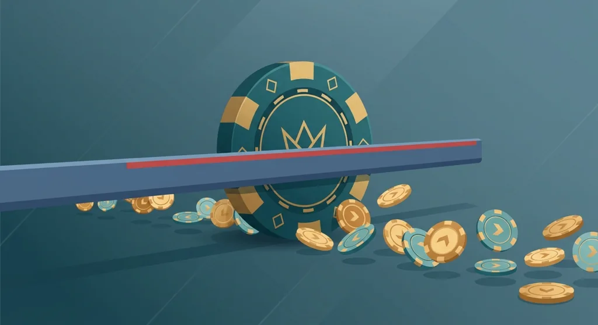
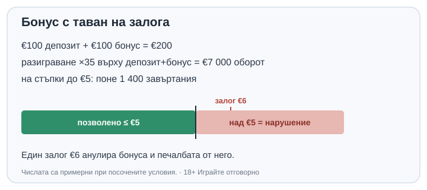

Title tag: Максимален залог при бонус: защо анулира печалбата
Meta description: Правилото за максимален залог (често €5) при активен бонус: защо съществува, как се нарушава по невнимание и как анулира бонуса и печалбата. Сметка в €.

---

# Максимален залог при активен бонус: защо голям залог анулира печалбата

Взимате бонус, въртите спокойно на €1, после решавате да ускорите и вдигате залога на €8. Три завъртания по-късно печелите прилично, подавате заявка за теглене и тя се връща: бонусът и печалбата от него са анулирани. Причината е един ред в условията, който почти никой не чете, правилото за максимален залог, и тази вечер той ви струва цялата сесия.

## Какво казва правилото

Докато имате активен бонус с неизпълнено изискване за разиграване, залогът ви на едно завъртане или на една ръка е таванен. Най-честата граница е €5, някъде €2, по-рядко до €10, а някои оператори я записват като процент, например 15% от стойността на бонуса, или по-малкото от €5 и 15% от първоначалния бонус. Числото е различно навсякъде и живее в общите условия на офертата, не на видно място.

Този таван е отделен от две други неща, с които лесно се бърка. Не е изискването за разиграване, тоест колко пъти трябва да завъртите сумата, и не е максималната сума за теглене от бонуса. Трите клаузи работят едновременно и всяка може да спъне тегленето поотделно.

## Защо операторите го налагат

Без таван бонусът щеше да е покана за една голяма атака. Слагате целия бонус на един залог с висока волатилност, удряте веднъж и излизате, преди домашното предимство да е успяло да изяде парите. Един голям залог зависи изцяло от късмета и доста често завършва добре за играча. Разпределен на хиляда малки залога, същият оборот вече се подчинява на статистиката и клони към очакваната загуба. Таванът затваря бързия изход и ви оставя в бавния, където математиката на играта работи дълго срещу вас.

Казината налагат правилото, за да ограничат риска си. [Как работи самото разиграване](/blog/kak-raboti-razigravaneto/) сме описали отделно, но накратко: колкото повече завъртания изисква бонусът, толкова по-дълго предимството на казиното ви стърже, и таванът гарантира, че ще минете през тези завъртания, вместо да прескочите целия процес с един едър залог.

## Колко лесно се нарушава по невнимание

Играчите рядко нарушават правилото нарочно. Автоматичните завъртания, оставени на по-висока сума от предишна сесия, минават лимита, без да ги гледате. Залозите със „ante" или с купуване на бонус удвояват или умножават основната ставка и често я изхвърлят над тавана за миг. Функции, които залагат процент от баланса, правят същото, когато балансът порасне. А при някои оператори купуването на бонус рунд изобщо е забранено при активен бонус, не само ограничено.

Повечето системи просто анулират бонуса и печалбата от него в мига на нарушението и ви оставят депозита. Други задържат заявката за теглене и я разглеждат ръчно. И в двата случая аргументът „не видях" не помага: редът е в условията, които сте приели при взимането на бонуса.

## Сметката

Депозирате €100 и получавате €100 бонус. При изискване за разиграване x35 върху депозит+бонус дължите €7 000 оборот, преди да можете да теглите. При таван €5 това са поне 1 400 завъртания по €5, направени, без нито веднъж да прескочите петте евро. Едно-единствено завъртане на €6 е достатъчно да отмени всичко натрупано до момента.

*€200 депозит и бонус, x35 върху депозит+бонус, таван €5. Числата са примерни при посочените условия.*

Числото 15% променя тавана в движение. Ако лимитът е 15% от бонус плюс депозит, в началото това са €30, но щом балансът спадне до €40, таванът става €6, а продължите ли да залагате по €15 от навик, вече сте в нарушение. Затова плаващите тавани са по-опасни от фиксираните: лимитът спада заедно с баланса и лесно изпреварва залога, който сте оставили по навик.

Към всичко това се добавя и приносът на игрите. Ротативките обикновено броят 100% към разиграването, но масите и казиното на живо често дават 10% или нула, а някои заглавия са напълно изключени при активен бонус. Ако въртите €7 000 оборот на игра, която брои 10%, реалната работа става десет пъти по-голяма, при това под същия таван от €5. Комбинацията от нисък таван и намален принос е начинът, по който едно щедро на вид число се превръща в оборот, който почти никой не докарва докрай.

## Ако вече сте го нарушили

При автоматично анулиране печалбата от бонуса обикновено не се връща, а депозитът ви остава. Писмо до поддръжката си струва, защото някои оператори разглеждат ситуацията ръчно, особено ако нарушението е дошло от техническа функция. Операторът може да обясни решението си, но рядко го отменя. Ако смятате бонуса за твърде обвързващ, винаги можете да го откажете и да играете с депозита си без разиграване и без таван.

## Как да не го нарушите

Преди първото завъртане се отваря информацията за офертата и се намира точното число, не се предполага, че е €5. Залогът се нагласява на или под тази граница и се проверява дали автоматичните завъртания не носят по-стара, по-висока стойност. Купуването на бонус и залозите с „ante" се оставят за игра без бонус. Ако условията са написани така, че лимитът се мени с баланса, най-простото е да държите залога нисък през цялото разиграване.

Правило, което може да изтрие печалбата ви с едно завъртане, се чете, преди да депозирате. Лимитите на депозита и на сесията се слагат по същото време, а [инструментите за отговорна игра](/otgovorna-igra/) са за момента, в който гоненето на разиграването спре да е приятно. Повече за това как изглеждат началните оферти има в [бонуса при регистрация](/blog/bonus-pri-registraciya/) и в [офертите за добре дошли](/bonus-category/welcome-bonus/).

Максималният залог защитава парите на казиното, а не вашите. Единственото, което зависи от вас, е да намерите точното число в условията и да държите залога под него от първото до последното завъртане на разиграването.

18+ Хазартът може да пристрасти. Играйте отговорно.

**Георги Тодоров**
Публикувано: 02.10.2026 · Последна редакция: 02.10.2026

[About Всички Казина boilerplate]

**Отговорна игра.** 18+ Хазартът може да пристрасти. Играйте отговорно. Ако усетиш, че играта излиза извън контрол или искаш да я ограничиш, виж [инструментите за отговорна игра](/otgovorna-igra/) и възможността за самоизключване чрез националния регистър на уязвимите лица към НАП (подава се писмено само от засегнатото лице). Национална информационна линия за наркотиците, алкохола и хазарта („Солидарност") 0888 99 18 66, делнични дни 10:00-17:00.

**Разкриване на партньорства.** Всички Казина съдържа партньорски (афилиейт) връзки; когато отвориш оферта през такава връзка, това може да финансира сайта, без да променя цената за теб и без да влияе на оценките ни. От 1 август 2026 г. дейността на афилиейт оператори в България се лицензира съгласно Закона за държавния бюджет за 2026 г. (ДВ, бр. 69 от 31.07.2026 г.). Всички Казина е подало заявление за лиценз пред Националната агенция по приходите и очаква издаването му.
