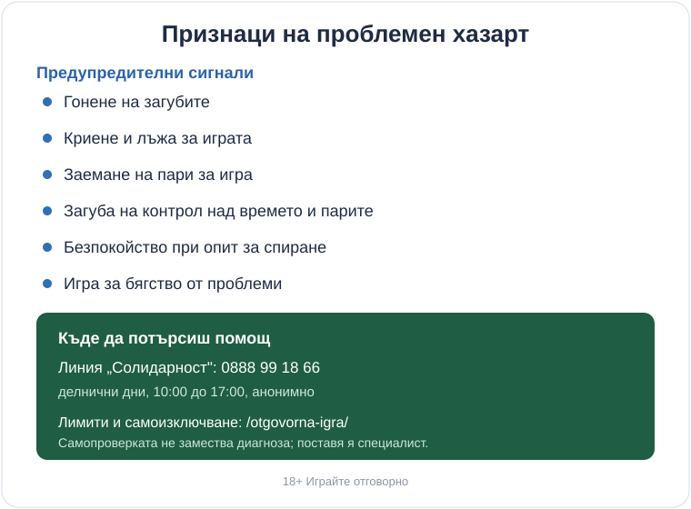

Title tag: Признаци на проблемен хазарт и къде да потърсиш помощ
Meta description: Признаци на проблемен хазарт: гонене на загубите, криене, заемане на пари. Къде да потърсиш помощ при хазартна зависимост в България.

---

# Признаци на проблемен хазарт и къде да потърсиш помощ

Повечето хора, които залагат, остават в рамките на развлечението: харчат сума, която са заделили за това, спират, когато свърши, и не мислят за играта между сесиите. При част от играчите границата се измества бавно и почти незабележимо. Въпросът, който има значение, не е колко често или колко голямо залагаш, а дали още държиш контрол над това кога спираш и колко оставяш на масата. Изместването рядко се усеща отвътре, затова си струва да знаеш как изглежда отстрани и какво можеш да направиш, ако го разпознаеш у себе си или у близък човек.

## Кога забавлението спира да е забавление

Разликата между забавление и проблем не е в сумата. Човек с висок доход може да заложи стотици евро за вечер, без това да му създаде проблем, докато друг изпада в затруднение с много по-малко. Критерият е ефектът върху останалата част от живота. Докато играта е едно от нещата, които правиш, с предварителен бюджет, който можеш да загубиш изцяло, без да опре до сметки, сън или отношения, тя си остава платено развлечение. Проблемна става, когато започне да измества тези неща: играеш с пари, отделени за друго, мислиш за следващата сесия, докато трябва да си другаде, настроението ти за деня зависи от резултата снощи.

Хазартът не е финансова стратегия. Всяка игра е устроена така, че операторът печели в дългосрочен план, и това е заложено в математиката. Докато държиш това наум, залогът е цена на забавление. Щом започнеш да го възприемаш като начин да си върнеш пари или да избягаш от нещо, рамката вече се е счупила.

## Признаци, които си струва да разпознаеш

Сигналите рядко идват наведнъж. Трупат се по малко и всеки поотделно изглежда обясним. Събрани на едно място, се разпознават по-лесно.

*Чеклист на предупредителните сигнали и първата стъпка за помощ: линията „Солидарност" 0888 99 18 66.*

Гонене на загубите е най-честият и най-подвеждащ сигнал: след като изгубиш, увеличаваш залога или продължаваш да играеш с една цел, да си върнеш изгубеното. Криене и лъжа за играта идват скоро след това, когато започнеш да омаловажаваш пред близки колко време или пари отиват. Заемане на пари за игра, от кредит, от приятели или от средства, предвидени за друго, показва, че бюджетът отдавна не е заделена за развлечение сума. Към тях се нареждат загуба на контрол над времето и парите (сядаш за половин час, ставаш след три), безпокойство при опит за спиране или намаляване (ставаш нервен и неспокоен след няколко дни без игра) и игра за бягство от проблеми, стрес или лошо настроение.

Емоционалната страна често се вижда преди финансовата: тревожност, раздразнителност, проблеми със съня, чувство на вина след игра, което бързо отстъпва пред желанието да се играе пак. Разпознаването на няколко от тези неща у себе си не е признание за слабост. То е първата полезна стъпка.

## Кратка самопроверка

Има бърз ориентир, който специалистите наричат Lie/Bet: два въпроса, извлечени от клиничните критерии, защото предсказват проблема най-добре. Чувствал ли си нужда да залагаш все повече пари? И случвало ли ти се е да излъжеш важни за теб хора колко играеш? Утвърдителен отговор дори само на единия е достатъчен, за да си струва да погледнеш по-внимателно. Онлайн ще срещнеш и по-подробни варианти под името тест за пристрастяване към хазарт.

По-дългите инструменти работят на същия принцип, с повече въпроси. Двайсетте въпроса на Анонимните комарджии и деветте критерия за хазартно разстройство в наръчника DSM-5 (нужда от все по-големи залози, неуспешни опити за спиране, безпокойство при отказване, гонене на загубите, игра за бягство, лъжа за мащаба, застрашени отношения, разчитане на чужди пари) очертават същата картина по-подробно. Нито един от тях не е изпит, който можеш да си „издържиш" или „скъсаш" сам у дома, и попълването му не е диагноза. Те помагат да назовеш това, което усещаш, преди да говориш с човек, който може да помогне. Диагноза поставя само специалист.

## Защо гоненето на загубите е капан

Гоненето на загубите стои отделно, защото логиката му звучи убедително отвътре. Изгубил си €200, следващият голям залог може да ги върне, и тогава спираш. Всеки нов залог обаче носи същото вградено предимство за казиното като предишния: миналата загуба не прави следващата печалба по-вероятна. Резултатът обикновено е по-голяма дупка. Така една вечер за развлечение най-лесно се превръща в нещо, което тежи със седмици. Ако се хванеш, че залагаш, за да се оправиш финансово, моментът е да спреш, а увеличаването на залога е последното, което ще помогне.

## Къде да потърсиш помощ в България

Първата конкретна стъпка не струва нищо и не изисква да решиш нещо предварително. Национална информационна линия за наркотиците, алкохола и хазарта („Солидарност") 0888 99 18 66 работи в делнични дни от 10:00 до 17:00 и там можеш да говориш анонимно с човек, който разбира от хазартна зависимост. Разговорът не те обвързва с нищо.

Ако искаш сам да ограничиш достъпа си, инструментите за това (лимит на депозита, на загубата и на времето, както и самоизключване) са описани на [страницата за отговорна игра](/otgovorna-igra/). Самоизключването може да е за конкретен оператор или веднъж завинаги през националния регистър на уязвимите лица към НАП, който се подава писмено само от засегнатото лице и не може да се отмени предсрочно с обаждане до поддръжката. Тази необратимост е заложена нарочно.

Лицензираните в България казина изобщо са длъжни да предлагат тези лимити и самоизключване, което е част от смисъла да играеш само на оператор с [лиценз от НАП](/zakonno-li-e/). Офшорен сайт без такъв лиценз няма това задължение и често няма към кого да се обърнеш. Извън България същата роля играят организации като GamCare и Анонимните комарджии, с телефонни линии, онлайн чат и групи за взаимопомощ.

## Ако близък човек има проблем

Същите сигнали се виждат и отстрани: пари, които изчезват без обяснение, потайност около телефона и сметките, рязка смяна на настроението според това дали е спечелил. Упреците и моралът рядко помагат и обикновено тласкат човека към още по-голямо криене. По-полезно е да говориш спокойно за конкретни последици и да посочиш, че линията „Солидарност" 0888 99 18 66 приема обаждания и от близки, не само от самия играч.

Разпознаването на проблема рядко е драматичен момент. По-често е тихо осъзнаване, че играта е престанала да бъде нещо, което избираш. Ако си стигнал дотам да четеш признаците и да се разпознаваш в тях, най-трудната част вече е зад гърба ти. Остава да вдигнеш телефона.

18+ Хазартът може да пристрасти. Играйте отговорно.

**Георги Тодоров**
Публикувано: 02.10.2026 · Последна редакция: 02.10.2026

[About Всички Казина boilerplate]

**Отговорна игра.** 18+ Хазартът може да пристрасти. Играйте отговорно. Ако усетиш, че играта излиза извън контрол или искаш да я ограничиш, виж [инструментите за отговорна игра](/otgovorna-igra/) и възможността за самоизключване чрез националния регистър на уязвимите лица към НАП (подава се писмено само от засегнатото лице). Национална информационна линия за наркотиците, алкохола и хазарта („Солидарност") 0888 99 18 66, делнични дни 10:00–17:00.

**Разкриване на партньорства.** Всички Казина съдържа партньорски (афилиейт) връзки; когато отвориш оферта през такава връзка, това може да финансира сайта, без да променя цената за теб и без да влияе на оценките ни. От 1 август 2026 г. дейността на афилиейт оператори в България се лицензира съгласно Закона за държавния бюджет за 2026 г. (ДВ, бр. 69 от 31.07.2026 г.). Всички Казина е подало заявление за лиценз пред Националната агенция по приходите и очаква издаването му.
