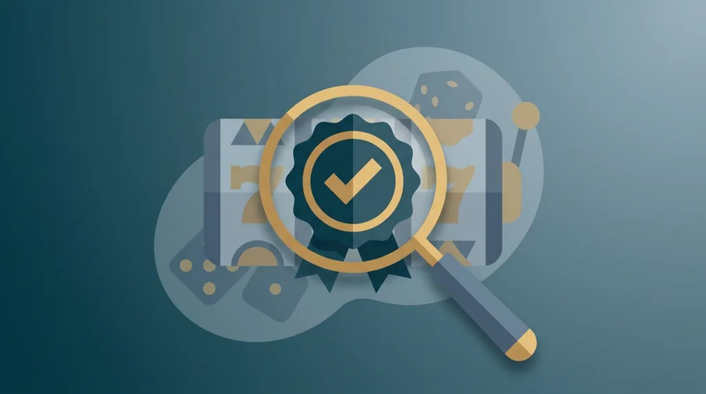
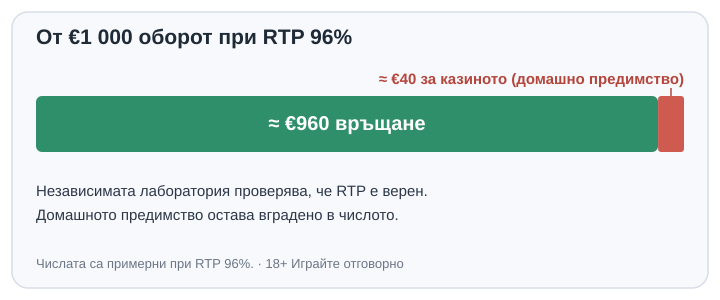

Title tag: Сертифициране на казино игри: eCOGRA, iTech Labs, GLI
Meta description: Какво проверяват независимите лаборатории eCOGRA, iTech Labs и GLI, какво гарантира печатът за честност и какво не: RTP, домашно предимство и лиценз.

---

# Независимо тестване и сертифициране на казино игрите: какво проверяват eCOGRA, iTech Labs и GLI

Логото на eCOGRA или GLI в долния край на казиното изглежда като гаранция и повечето играчи го подминават със спокойствие. То наистина означава нещо, само че не това, което се предполага. Печатът на независима лаборатория доказва, че резултатите на играта са случайни и че тя връща обявения процент в дългосрочен план. За това дали играта е изгодна за вас не казва нищо. Сертифицираната ротативка с RTP 96% задържа около 4% от всеки заложен лев също толкова сигурно, колкото несертифицираната, само че при нея знаете, че числото е вярно. „Честно" и „в твоя полза" са различни неща, а операторите рядко го уточняват, когато слагат логото на [доставчика на играта](/blog/games-providers/) на сайта.

## Какво проверява една лаборатория

Две неща интересуват лабораторията, защото играчът не може да ги провери сам: дали генераторът на случайни числа е наистина случаен и дали играта връща обявеното. За първото се пускат милиони завъртания и се гледа дали изходите са непредвидими и равномерно разпределени. Търси се обратното на закономерност. Ако някоя комбинация излиза по-често, отколкото чистата случайност позволява, или ако поредицата се повтаря при едни и същи начални условия, генераторът пада на теста.

Математиката на играта е другата половина. Таблицата с изплащания трябва да плаща точно каквото обявява, а реалната възвръщаемост от милионите рундове трябва да съвпада с теоретичния RTP, който доставчикът е декларирал. Разминаване тук значи или грешка в играта, или подвеждащо число в рекламата ѝ.

Проверява се конкретна версия на софтуера в конкретен момент. Ако доставчикът промени играта, версията се тества наново. eCOGRA отива и една стъпка по-нататък при някои оператори: освен игрите, одитира и поведението на казиното, тоест разделянето на парите на играчите от оборотните средства и мерките за отговорна игра. Повечето сертификати обаче са за играта, не за оператора, и това различие се оказва важно по-нататък.

## Кои са големите лаборатории

Няколко имена се срещат най-често в долния колонтитул на казината и в информационния панел на игрите. GLI (Gaming Laboratories International) е основана през 1989 г. в Томс Ривър, Ню Джърси, и е сред най-старите и най-големите: тествала е оборудване за над 480 юрисдикции и поддържа собствени стандарти, например GLI-19 за онлайн игри с генератор на случайни числа. eCOGRA работи от 2003 г. със седалище в Лондон и е позната с печата си за честност и с периодичните доклади за реалната възвръщаемост на някои оператори.

iTech Labs тества онлайн игрални системи от 2004 г. от Австралия и през 2023 г. влезе в групата на GLI. Най-старата от всички е BMM Testlabs, основана през 1981 г. в Лас Вегас. Самите лаборатории също са проверявани отвън: акредитират се по международния стандарт ISO/IEC 17025 за компетентност на изпитвателните лаборатории, което значи, че методите им се одитират от трета страна, а не си пишат домашното сами.

## Какво не гарантира печатът

Сертификатът потвърждава, че RTP е верен, не че е висок. Домашното предимство остава вградено в самото число. При RTP 96% от €1 000 оборот в дългосрочен план се връщат около €960, а около €40 остават за казиното, и тези €40 са цената на забавлението, която лабораторията по никакъв начин не маха. Тя гарантира само, че операторът не е махнал още от вашата страна.

*Какво проверява печатът: че RTP е верен. Какво остава: домашното предимство. Числата са примерни при RTP 96%.*

Един и същ слот често се пуска в няколко версии с различен RTP, например 96% и 94%, и доставчикът оставя операторът да избере коя да качи. Сертификатът покрива версията, която е тествана и качена, но вие рядко виждате коя е тя, преди да отворите информационния панел на играта. Печат за честност върху заглавие не ви казва автоматично, че гледате най-добрата му версия. RTP пък е статистика върху милиони завъртания, не обещание за вашата вечер: сертифицираната игра може да ви измие сметката за час и пак да е абсолютно честна.

## Сертификат на играта срещу лиценз на казиното

Разликата, която реално пази парите ви, е между сертификата на играта и лиценза на самото казино. Една игра може да е сертифицирана от GLI и въпреки това да се предлага в казино без лиценз от НАП за България. Печатът на доставчика е за софтуера и толкова. Лицензът е друго нещо: той решава дали има кой да ви защити при спор, дали парите ви са отделени от оборота на оператора и дали изобщо имате правна опора в страната. Сертифицираната игра в нелицензиран сайт си остава сертифицирана игра на място, което не ви дължи нищо.

Лицензираните за България казина са длъжни да предлагат тествани игри, така че при тях сертификатът идва като част от пакета, а не като отделен довод. Как се проверява самият лиценз сме описали в [отделно ръководство](/blog/proverka-licenz-kazino/), а как тежи законността в общата ни оценка личи от [методологията](/kak-ocenyavame/), където тя носи най-много точки.

## Как да проверите сами

Логата на лабораториите обикновено стоят в долния край на сайта или в информационния панел на конкретната игра, а по-сериозните печати водят към страница на самата лаборатория, където номерът на сертификата се сверява. Полезно е, когато искате да сте сигурни, че логото не е просто картинка. eCOGRA например публикува обобщени доклади за реалната възвръщаемост на някои оператори, по игри и по месеци, което е рядката възможност да видите не декларираното, а измереното число. Там, където го има, си струва да се погледне. По-надеждната котва за играч от България обаче остава лицензът от НАП: той изисква тествани игри, добавя надзор над оператора и ви дава адрес, на който да се оплачете.

Сертификатът е добра основа за доверие, но не е причина да играете повече. Домашното предимство, което печатът потвърждава, работи срещу вас при всяко завъртане, затова бюджетът и лимитите на депозита се слагат преди първия депозит, а [инструментите за отговорна игра](/otgovorna-igra/) са там за момента, в който сметката спре да е забавление.

Търсете печата на eCOGRA, iTech Labs или GLI, защото превръща „вярвай ни" в „проверено отвън". Но честността е най-малкото, което бива да искате от една игра. Коя версия въртите, го пише в информационния панел. А дали изобщо има кой да ви защити, когато нещо се обърка, зависи от лиценза от НАП, не от логото в долния ъгъл.

18+ Хазартът може да пристрасти. Играйте отговорно.

**Георги Тодоров**
Публикувано: 02.10.2026 · Последна редакция: 02.10.2026

[About Всички Казина boilerplate]

**Отговорна игра.** 18+ Хазартът може да пристрасти. Играйте отговорно. Ако усетиш, че играта излиза извън контрол или искаш да я ограничиш, виж [инструментите за отговорна игра](/otgovorna-igra/) и възможността за самоизключване чрез националния регистър на уязвимите лица към НАП (подава се писмено само от засегнатото лице). Национална информационна линия за наркотиците, алкохола и хазарта („Солидарност") 0888 99 18 66, делнични дни 10:00-17:00.

**Разкриване на партньорства.** Всички Казина съдържа партньорски (афилиейт) връзки; когато отвориш оферта през такава връзка, това може да финансира сайта, без да променя цената за теб и без да влияе на оценките ни. От 1 август 2026 г. дейността на афилиейт оператори в България се лицензира съгласно Закона за държавния бюджет за 2026 г. (ДВ, бр. 69 от 31.07.2026 г.). Всички Казина е подало заявление за лиценз пред Националната агенция по приходите и очаква издаването му.
