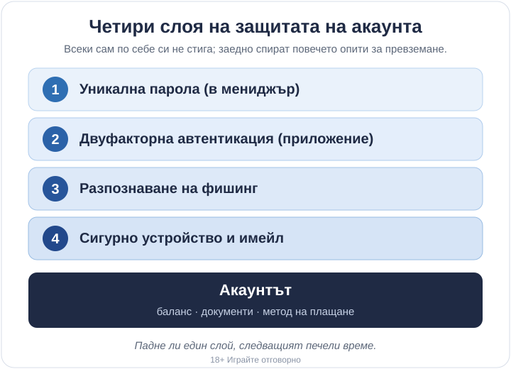

Title tag: Сигурност на акаунта в казино: парола и 2FA
Meta description: Сигурност на акаунта в онлайн казино: силна уникална парола, двуфакторна автентикация и как да разпознаете фишинг, преди да изгубите достъпа.

---

# Сигурност на акаунта в онлайн казино: паролата, 2FA и фишингът

Акаунтът в онлайн казино събира на едно място пари, сканирани документи от верификацията и често запазена банкова карта или портфейл. За крадеца това е по-примамливо от обикновена пощенска кутия: вътре го чака баланс за теглене, готов метод на плащане и цяла самоличност. Лицензираното казино пази своята част от системата, но входът към акаунта остава във вашите ръце. Защитата на този вход зависи изцяло от вас. Най-честите пробиви минават през слаба или повторена парола, през липсващ втори фактор и през фишинг, а не през разбит сървър.

## Какво пази казиното и какво оставате да пазите вие

Операторът отговаря за сървърите, за съхранението на данните и за това да забелязва подозрителни влизания. [Легитимният, лицензиран оператор](/zakonno-li-e/) е длъжен да държи тези системи в ред и обикновено разполага с ресурса да го прави. Вашата отговорност е една: самоличността, с която се влиза. Ако някой разполага с верните ви данни за вход, системата го пуска, защото за нея той е вие.

Затова сигурността на акаунта стъпва на няколко слоя, които се подпират взаимно. Падне ли един, следващият печели време и често спира превземането на акаунта, преди да стигне до баланса.

*Четирите слоя на защита на акаунта. Всеки сам по себе си не стига; заедно спират повечето опити за превземане.*

## Паролата: дълга, уникална и скрита в мениджър

Най-честата причина за кражба на акаунт не е хитра атака, а повторно използвана парола. Изтича база данни от някой несвързан форум или магазин, където сте се регистрирали преди години със същата комбинация, и крадците я пробват една по една по десетки сайтове, казината включително. Ако паролата ви в казиното е същата, входът е отворен, без да е разбит нито един сървър.

Дължината върши повече работа от екзотичните символи. Дълга фраза от няколко несвързани думи се помни по-лесно от човек и се разбива по-трудно от машина, отколкото къса парола с разбъркани знаци. Дванайсет знака са разумен минимум, повече е по-добре.

Уникална за всеки сайт е другото условие и точно него никой не го удържа наум. Мениджърът на пароли решава двете наведнъж: генерира дълга случайна парола за казиното, помни я вместо вас и я попълва само на верния адрес. Самия мениджър заключвате с една силна главна парола, която си заслужава да запаметите добре.

## Двуфакторна автентикация: приложение или SMS

Двуфакторната автентикация добавя втора стъпка след паролата: еднократен код, който се сменя на всеки няколко десетки секунди. Дори някой да знае паролата ви, без този код не влиза. Ако казиното предлага опцията, включете я веднага от настройките на профила.

Не всички втори фактори са еднакво здрави. Код през приложение за автентикация се генерира на самия ви телефон и не пътува никъде, затова не може да бъде прихванат по пътя. Код през SMS е по-добър от нищо, но има позната слабост: при т.нар. SIM swap измамник прехвърля номера ви на своя карта и кодовете започват да идват при него. За вход към пари приложението е по-сигурният избор.

При включването на двуфакторна автентикация обикновено получавате и резервни кодове за случаите, когато телефонът не е под ръка. Запишете ги някъде офлайн, не в същия имейл, който пазите с тях.

## Как изглежда фишингът при казино

Дори най-силната парола и код не помагат, ако сами дадете достъп. Точно на това залага фишингът: убеждава ви сами да го направите. При казината най-честата форма е съобщение, което бърза, имейл или SMS за „замразен акаунт", „непотвърдена верификация" или „бонус, който изтича след час", с голям бутон за влизане. Бързината е номерът: искат да натиснете, преди да спрете да помислите.

Линкът води към огледален сайт, който изглежда като казиното до последното лого, но живее на малко по-различен адрес: разменена буква, добавена думичка, друго разширение. Въведете ли там данните си, те отиват право при крадеца, а понякога страницата иска и кода от двуфакторната автентикация в същия момент, за да влезе веднага.

Истинското казино няма да ви поиска паролата по имейл. Не влизайте през линк от съобщение; отворете сайта сами, през отметка или като напишете адреса ръчно. Преди да щракнете, погледнете истинския адрес на подателя и на линка, а не само показаното име. Усъмните ли се в някоя оферта, проверете я, като влезете в акаунта директно.

## Устройството и имейлът ви са част от акаунта

Имейлът, с който сте се регистрирали, е резервният вход към казино акаунта. През него минава възстановяването на парола, затова превземе ли някой пощата ви, казиното идва наготово след нея. Пазете този имейл поне толкова добре, колкото самия акаунт: отделна силна парола и включена двуфакторна автентикация.

Устройството е другото слабо място. Телефон или лаптоп без заключен екран дава достъп на всеки, който ги вземе за минута. Не влизайте в акаунта от чужд или публичен компютър, а по обществена Wi-Fi мрежа бъдете пестеливи с влизанията. Заключвайте екрана, пускайте обновленията навреме и излизайте от профила на устройство, което не е само ваше.

## Ако акаунтът ви вече е компрометиран

Понякога първият сигнал е известие за влизане, което не сте правили. Друг път са сменени данни за контакт, стопен баланс или заявка за теглене, която не разпознавате. Усетите ли нещо такова, бързината работи за вас.

Сменете паролата веднага, а ако подозирате и имейла, започнете от него. Прекратете активните сесии от настройките (опцията често се казва „излез от всички устройства"), за да изхвърлите чуждия достъп, който още стои вътре. Включете двуфакторна автентикация, ако не е била включена. Свържете се с поддръжката на казиното и поискайте акаунтът да бъде временно заключен; при съмнение за измама операторите спират тегленията и минават през нова верификация, а [как върви това с документите и плащанията](/depoziti-i-teglenia/) е добре да знаете предварително.

Сигурността на акаунта пази и инструментите, с които се пазите сами. Зададените лимити и самоизключването удържат само докато акаунтът е наистина ваш и никой друг не може да влезе и да ги махне. Ако усещате, че контролът над играта се изплъзва, [инструментите за отговорна игра](/otgovorna-igra/) са мястото да спрете навреме.

## Минимумът за вашата сигурност

Уникалната парола в мениджър и двуфакторната автентикация през приложение са минимумът. Те спират огромната част от опитите за превземане, защото повечето кражби залагат точно на повторена парола и липсващ втори фактор. Фалшивите имейли и огледалните сайтове идват после и се разбиват в същите два навика. Останалото е надстройка, полезна, но не тя решава.

18+ Хазартът може да пристрасти. Играйте отговорно.

**Георги Тодоров**
Публикувано: 02.10.2026 · Последна редакция: 02.10.2026

[About Всички Казина boilerplate]

**Отговорна игра.** 18+ Хазартът може да пристрасти. Играйте отговорно. Ако усетиш, че играта излиза извън контрол или искаш да я ограничиш, виж [инструментите за отговорна игра](/otgovorna-igra/) и възможността за самоизключване чрез националния регистър на уязвимите лица към НАП (подава се писмено само от засегнатото лице). Национална информационна линия за наркотиците, алкохола и хазарта („Солидарност") 0888 99 18 66, делнични дни 10:00–17:00.

**Разкриване на партньорства.** Всички Казина съдържа партньорски (афилиейт) връзки; когато отвориш оферта през такава връзка, това може да финансира сайта, без да променя цената за теб и без да влияе на оценките ни. От 1 август 2026 г. дейността на афилиейт оператори в България се лицензира съгласно Закона за държавния бюджет за 2026 г. (ДВ, бр. 69 от 31.07.2026 г.). Всички Казина е подало заявление за лиценз пред Националната агенция по приходите и очаква издаването му.
