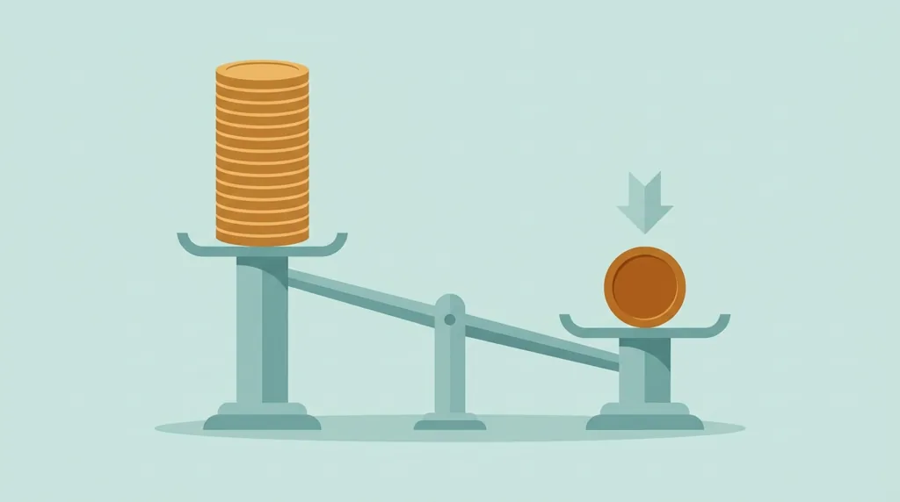
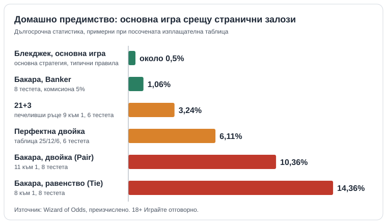

Title tag: Странични залози казино: струват ли си математически
Meta description: Перфектна двойка, 21+3 и равенство в бакарата: домашно предимство от 2,74% до 22,33% срещу около 0,5% в блекджека. Сметки в €.

---

# Странични залози в казино игрите: струват ли си математически

Страничен залог (side bet) от €1 върху Перфектна двойка (Perfect Pairs) в блекджек, при 6 тестета и таблица 25/12/6, има домашно предимство 6,11%. Основната игра с правилна основна стратегия струва около 0,5%, тоест всяко евро в страничния залог излиза около дванайсет пъти по-скъпо. Равенството (Tie) в бакарата при изплащане 8 към 1 стига до 14,36%. Домашното предимство е средната част от всеки заложен евро, която казиното задържа в дългосрочен план: над милиони ръце е точно, за една вечер не казва нищо. По-широк поглед върху масите има в [казино игрите](/kazino-igri/).

## Как работи страничният залог (side bet)

Страничният залог е отделен залог до основния, който се решава от първите две или три карти, и казиното го продава като допълнителен шанс към ръката, а не като самостоятелна игра. Перфектна двойка пита дали първите ви две карти са двойка. 21+3 събира двете ви карти с отворената карта на дилъра и търси покер ръка от три карти: флъш, стрийт, трипс или стрийт флъш. В бакарата можете да заложите, че първите две карти на Player или на Banker са двойка, или че ръката ще завърши наравно. Всички тези събития са редки и се плащат по фиксирана таблица "към 1", която стои под честния коефициент.

Двойка в първите две карти от 8 тестета се пада в 7,47% от ръцете (31 шанса от 415). Честният коефициент е около 12,4 към 1, масата плаща 11 към 1. Равенството в бакарата идва в около 9,52% от ръцете, честното изплащане е около 9,5 към 1, а плащат 8. Тези разлики са домашното предимство, и понеже в над 90% от ръцете залогът си остава при казиното, то се начислява почти върху всеки хвърлен жетон.

## Странични залози в казино: цифрите една до друга

| Залог | Условия | Домашно предимство |
|---|---|---|
| Блекджек, основна игра | основна стратегия, типични правила | около 0,5% |
| Бакара, Banker | 8 тестета, комисиона 5% (изплащане 0,95 към 1) | 1,06% |
| Бакара, Player | 8 тестета, изплащане 1 към 1 | 1,24% |
| Перфектна двойка | таблица 25/12/6, 8 тестета | 4,10% |
| Перфектна двойка | таблица 25/12/6, 6 тестета | 6,11% |
| Перфектна двойка | таблица 25/12/6, 4 тестета | 10,14% |
| Перфектна двойка | таблица 25/12/6, 2 тестета | 22,33% |
| 21+3 | всички печеливши ръце 9 към 1, 8 тестета | 2,74% |
| 21+3 | всички печеливши ръце 9 към 1, 6 тестета | 3,24% |
| 21+3 | всички печеливши ръце 9 към 1, 2 тестета | 7,26% |
| 21+3 | всички печеливши ръце 9 към 1, 1 тесте | 13,30% |
| 21+3 | по-строга таблица 30/20/10/5 (стрийт флъш, трипс, стрийт, флъш), 6 тестета | 13,39% |
| Бакара, Player Pair / Banker Pair | 11 към 1, 8 тестета | 10,36% |
| Бакара, равенство (Tie) | 8 към 1, 8 тестета | 14,36% |

Стойностите за страничните залози са примерни при посочената изплащателна таблица. Основата им е Wizard of Odds ([Perfect Pairs](https://wizardofodds.com/games/blackjack/side-bets/perfect-pairs/), [21+3](https://wizardofodds.com/games/blackjack/side-bets/21plus3/), [бакара](https://wizardofodds.com/games/baccarat/basics/), [въпроси за бакара](https://wizardofodds.com/ask-the-wizard/baccarat)), а всеки процент е преизчислен с точно комбинаторно смятане и съвпада до стотната. Около 0,5% за блекджека е закръглена средна стойност, защото зависи от правилата: Wizard of Odds дава 0,43% за правилата на Атлантик Сити и 0,28% за либералните правила на Вегас Стрип. В класическата рулетка всеки залог има едно и също предимство, 2,70% при единична нула и 5,26% при двойна нула; вариантите с допълнителни залози или множители имат собствени таблици и се смятат отделно.

*Домашно предимство на основните и страничните залози, примерни при посочената изплащателна таблица.*

## Таблицата и тестетата решават всичко

21+3 с всички печеливши ръце на 9 към 1 струва 13,30% при едно тесте и 2,74% при осем. По-строгата таблица 30/20/10/5 при 6 тестета връща 13,39%, колкото щедрата таблица при едно тесте. Перфектната двойка на осем тестета се движи от 2,17% при таблица 25/15/5 до 7,95% при 25/12/5, само според това колко плащат цветната и смесената двойка.

Две маси със същото име могат да плащат различно, така че таблицата се търси в правилата на играта още преди първия залог. Как четем правилата на оператора и игрите му е описано в [методологията ни](/kak-ocenyavame/).

Заглавното изплащане е най-примамливата част. При 6 тестета и 25/12/6 перфектната двойка (25 към 1) се пада в 1,61% от ръцете (5 шанса от 311), а всички печеливши двойки заедно в 7,40% (23 от 311). Седем попадения от сто ръце са прилична честота, но сборът от изплащанията остава под вложеното, затова и излиза 6,11%.

## Сто ръце по €1

Сто ръце блекджек по €10 са €1 000 оборот, а при около 0,5% очакваната загуба е €5,00. Добавете €1 Перфектна двойка на всяка ръка: още €100 оборот, които при 6 тестета и таблица 25/12/6 костват €6,11 очаквана загуба, а при 4 тестета €10,14. Стотината евро в страничния залог излизат по-скъпо от хилядата в основния. От общите €11,11 очаквана загуба €6,11 идват от залога, който е около 9% от парите върху масата. В една сесия от сто ръце реалният резултат може да е далеч от средния във всяка посока.

В бакарата сто пъти по €10 на Banker са €1 000 оборот и €10,60 очаквана загуба, като комисията вече е вътре в 1,06%. Сто пъти по €1 на равенство са €100 оборот и €14,36.

## Вердикт

Като стойност страничните залози не си струват. Най-евтиното в таблицата е 21+3 при 8 тестета с 2,74%, пак над пет пъти повече от основния блекджек, а от 6,11% нагоре цената е висока дори за забавление.

Ако ви харесват, платете за тях като за билет: отделна малка сума, определена преди сесията, извън парите за основната игра. Парите за него трябва да са такива, които можете да загубите изцяло, а един добър страничен залог не връща предишните загуби. Лимитите на депозита и на сесията се слагат преди първия депозит. [Инструментите за отговорна игра](/otgovorna-igra/) са за момента, в който "още един страничен залог" започне да става навик. Ниска цена на масата имат само основната стратегия в блекджека и Banker в бакарата. Равенството и двойките са за този, който съзнателно плаща за шанса.

18+ Хазартът може да пристрасти. Играйте отговорно.

**Георги Тодоров**
Публикувано: 02.10.2026 · Последна редакция: 02.10.2026

[About Всички Казина boilerplate]

**Отговорна игра.** 18+ Хазартът може да пристрасти. Играйте отговорно. Ако усетиш, че играта излиза извън контрол или искаш да я ограничиш, виж [инструментите за отговорна игра](/otgovorna-igra/) и възможността за самоизключване чрез националния регистър на уязвимите лица към НАП (подава се писмено само от засегнатото лице). Национална информационна линия за наркотиците, алкохола и хазарта („Солидарност") 0888 99 18 66, делнични дни 10:00-17:00.

**Разкриване на партньорства.** Всички Казина съдържа партньорски (афилиейт) връзки; когато отвориш оферта през такава връзка, това може да финансира сайта, без да променя цената за теб и без да влияе на оценките ни. От 1 август 2026 г. дейността на афилиейт оператори в България се лицензира съгласно Закона за държавния бюджет за 2026 г. (ДВ, бр. 69 от 31.07.2026 г.). Всички Казина е подало заявление за лиценз пред Националната агенция по приходите и очаква издаването му.
