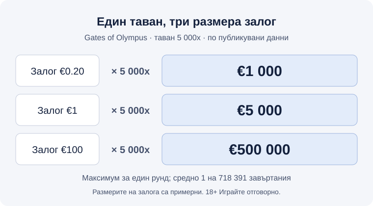

Title tag: Таван на печалбата в слотовете: какво е max win
Meta description: Какво е таванът на печалбата (max win) в слот: как се записва, колко рядко се достига, как се връзва с RTP и волатилността и къде да го намериш.

---

# Таван на печалбата в слотовете: какво е max win и какво не казва числото на корицата

Gates of Olympus рекламира максимална печалба от 5 000x залога, тоест €5 000 при залог от €1, а по публикувана оценка на OLBG до нея се стига средно на всеки 718 391 завъртания. Таванът на печалбата (max win) е най-голямата сума, която една ротативка може да изплати за един рунд, и почти винаги се записва като кратно на залога. Числото стои на видно място в описанието на всяка нова [слот игра](/kazino-igri/) и работи като реклама: показва върха на разпределението и нищо за всичко под него.

## Какво е таванът на печалбата и какво включва

Таванът се брои за целия рунд, не за отделна комбинация. В него влизат печалбите от основната игра, от безплатните завъртания, от каскадите и всички множители, натрупани по пътя. Щом сборът стигне лимита, играта спира рунда и плаща самия лимит, дори математиката да е щяла да изкара повече. Sweet Bonanza е с таван 21 100x, а според публикувания анализ на играта той се достига само във фазата с безплатни завъртания, защото множителите-бомби падат единствено там. Разработчиците го определят при тестването на модела, типичният диапазон е между 2 000x и 50 000x, а шепа екстремни заглавия стигат до 500 000x.

Лимитът е вграден в математическия модел и държи волатилността, RTP и разпределението на наградите в рамките, които провайдърът е заложил при тестването му. Без него верига от каскади и множители теоретично няма къде да спре. В Gates of Olympus случайните множители стигат до 500x, а във фазата с безплатни завъртания стойностите им се натрупват без вътрешно ограничение, така че единственото, което спира растежа, е самият таван на рунда. Това е и смисълът на термина множител таван: границата, при която натрупването спира да се брои.

Записан като множител, таванът се мащабира със залога. Gates of Olympus с таван 5 000x плаща най-много €1 000 при залог €0.20, €5 000 при €1 и €500 000 при €100, което е горната граница на залога в играта. Фиксирана сума в евро, например в условията на бонус, е друг механизъм: тя не расте със залога и се чете отделно.

*Един и същ таван от 5 000x при три примерни залога (Gates of Olympus, по публикувани данни).*

## Колко рядко се стига до него

Честотата на печалба в Gates of Olympus е 28.82%: някаква печалба пада на всеки 3.47 завъртания средно. Максималната е 1 на 718 391. При €1 на завъртане това са €718 391 заложени пари за един шанс към €5 000. При RTP от 96.50% очакваната загуба на тази дистанция е 3.5%, тоест около €25 144, а наградата си остава €5 000 и може да падне на първото завъртане или на нито едно през живота ти.

За Sweet Bonanza един публикуван анализ говори за „десетки хиляди бонус рундове" до достигане на 21 100x. При най-екстремните тавани редът е друг: Tombstone Slaughter на Nolimit City с 500 000x получава приблизителна оценка от 1 на 189 милиона завъртания. Вдигнеш ли залога до €100 в Gates of Olympus, наградата става €500 000, а заложеното до един такъв шанс при същата оценка е €71 839 100. Вероятността си стои, мащабът на парите е друг.

## Таванът, RTP и волатилността

RTP не издава тавана. Gates of Olympus е на 96.50% с таван 5 000x, Sweet Bonanza е на 96.51% с таван 21 100x, а Book of Dead е на 96.21% и отново 5 000x. Почти еднакво връщане, различни тавани, и от никое число не се чете другото.

| Игра | RTP (по подразбиране) | Таван | При залог €0.20 | При залог €1 | Волатилност |
|---|---|---|---|---|---|
| Gates of Olympus | 96.50% | 5 000x | €1 000 | €5 000 | висока |
| Sweet Bonanza | 96.51% | 21 100x | €4 220 | €21 100 | средна до висока |
| Book of Dead | 96.21% | 5 000x | €1 000 | €5 000 | висока |

Таблицата е по публикувани данни за версията с RTP по подразбиране, а сумите са пресметнати от тавана при примерни залози.

Връзката с волатилността е директна: висок таван върви с рядка и едра печалба, ниска честота на попадение и дълги суши. Таванът е груб показател за волатилност, а самата волатилност е въпрос на темперамент и бюджет и не оценява качеството на играта. Gates of Olympus се предлага и в три конфигурации на RTP: 96.50%, 95.51% и 94.50%. Операторът избира коя да пусне, затова провери коя версия върти твоето казино.

## Къде да намериш максималната печалба на ротативката

Информационният екран на играта (иконата „i" или менюто с правилата) казва какъв е таванът и как се прилага. Страницата на провайдъра и демо режимът позволяват да го видиш, без да залагаш пари, а там е и версията на RTP. Отделно от тавана на играта, общите условия на конкретно казино могат да слагат свои лимити върху печалби и тегления; за тях прегледай раздела за [депозити и тегления](/depoziti-i-teglenia/), преди да ти потрябват.

## Как да четеш числото на корицата

Таванът е реклама за опашката на разпределението и да избираш слот по него е като да избираш билет по най-голямата печалба в тиража. Полезни са други числа: RTP на версията, която върти твоето казино, волатилността и колко струва завъртането при твоя залог. Хазартът не е финансова стратегия, а ротативката е направена така, че дългосрочно да печели операторът. Задай лимит на депозита и на загубата преди първото завъртане и играй само с пари, които можеш да загубиш изцяло; инструментите са описани в [отговорна игра](/otgovorna-igra/). Как преценяваме игрите и операторите, е в [методологията ни](/kak-ocenyavame/). Ако подреждаш слотове по полезност, таванът отива най-накрая.

18+ Хазартът може да пристрасти. Играйте отговорно.

**Георги Тодоров**
Публикувано: 02.10.2026 · Последна редакция: 02.10.2026

[About Всички Казина boilerplate]

**Отговорна игра.** 18+ Хазартът може да пристрасти. Играйте отговорно. Ако усетиш, че играта излиза извън контрол или искаш да я ограничиш, виж [инструментите за отговорна игра](/otgovorna-igra/) и възможността за самоизключване чрез националния регистър на уязвимите лица към НАП (подава се писмено само от засегнатото лице). Национална информационна линия за наркотиците, алкохола и хазарта („Солидарност") 0888 99 18 66, делнични дни 10:00-17:00.

**Разкриване на партньорства.** Всички Казина съдържа партньорски (афилиейт) връзки; когато отвориш оферта през такава връзка, това може да финансира сайта, без да променя цената за теб и без да влияе на оценките ни. От 1 август 2026 г. дейността на афилиейт оператори в България се лицензира съгласно Закона за държавния бюджет за 2026 г. (ДВ, бр. 69 от 31.07.2026 г.). Всички Казина е подало заявление за лиценз пред Националната агенция по приходите и очаква издаването му.
