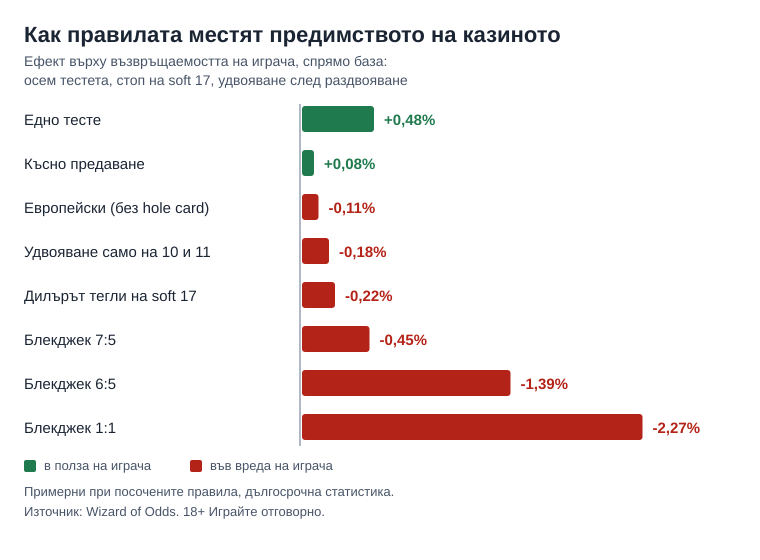

Byline: Георги Тодоров (persona) | Market: bg, guide, аналитичен глас

# Варианти на блекджек: кои правила наистина местят домашното предимство

Името на варианта обещава по-малко от таблицата с правилата. Преминаването от американски към европейски блекджек струва около 0,11 процентни пункта домашно предимство, а само една промяна, изплащането на блекджека от 3:2 на 6:5, добавя още 1,39. Затова преди да седнеш на маса сред [казино игрите](/kazino-igri/), прочети правилата, не етикета „европейски", „американски" или „single deck". Всички числа по-долу са примерни при посочените правила и са дългосрочна статистика, не прогноза за вечерта.

## Европейски и американски: една карта на дилъра

При американския блекджек дилърът взима втората си карта (hole card) в началото и, ако отгоре има туз или десетица, проверява за блекджек, преди да си направил нещо. При европейския вариант втората карта идва след като всички играчи са приключили. Разликата се усеща в един-единствен случай: удвоиш €20 до €40, а дилърът обърне блекджек. Американската маса вече е взела първоначалните €20 и не те е оставила да удвояваш, европейската взима и двете суми. Wizard of Odds оценява това на 0,11% срещу играча, а за европейски правила с шест тестета, стоп на soft 17, удвояване само на 9-11 и удвояване след раздвояване дава общо 0,62% домашно предимство. Сумата е малка и сама по себе си не е причина да избягваш европейска маса. Стратегията обаче е друга: Wizard of Odds води отделна таблица за европейски блекджек, така че схемата, научена за американската маса, не важи автоматично тук, а цифрите в тази статия приемат правилно изиграни ръце.

## Таблицата с правила

Wizard of Odds мери всяко правило спрямо стандартна американска база: осем тестета, дилърът стои на soft 17, удвояване след раздвояване е позволено. Плюсът е в полза на играча, минусът е във вреда.

| Правило | Ефект върху възвръщаемостта на играча |
|---|---|
| Едно тесте | +0,48% |
| Две тестета | +0,19% |
| Шест тестета | +0,02% |
| Късно предаване (late surrender) | +0,08% |
| Удвояване само на 9-11 | -0,09% |
| Европейски блекджек (без hole card) | -0,11% |
| Без удвояване след раздвояване | -0,14% |
| Удвояване само на 10 и 11 | -0,18% |
| Дилърът тегли на soft 17 | -0,22% |
| Блекджек 7:5 | -0,45% |
| Блекджек 6:5 | -1,39% |
| Блекджек 1:1 | -2,27% |

Ефектите не се събират съвсем точно и зависят от базата: при друга база, шест тестета без удвояване след раздвояване и без предаване, същият Wizard of Odds дава за стоп на soft 17 около 0,19% вместо 0,22%. Таблицата служи за сравнение на правила, не за изчисляване до стотната.

## 6:5 при блекджек

При залог €10 блекджекът плаща €15 при 3:2 и €12 при 6:5. Разликата от €3 се случва при около 4,73% от ръцете (шансът първите две карти да са туз и десетица е 8/169 при безкрайна колода), тоест 0,3 × 4,73% е около 1,4% от залога, което съвпада с 1,39% от таблицата. На €1 000 оборот това са около €13,90 допълнителна очаквана загуба. Една промяна в изплащането струва около 12,6 пъти повече от цялата разлика между европейски и американски блекджек. Междинното 7:5 струва 0,45%, около €4,50 на €1 000, а блекджек, платен 1:1, 2,27%, около €22,70. Умножи процента по оборота си, преди да приемеш едно „по-просто" изплащане.

## Тестета, soft 17 и предаване

Колкото повече тестета, толкова по-зле за играча, но кривата е плоска в горния край: едно тесте дава +0,48% спрямо осем, две тестета +0,19%, а шест само +0,02%, така че между шест и осем тестета разликата почти не се вижда. Предимството на single deck изчезва, щом масата плаща 6:5, защото +0,48 и -1,39 се събират до около -0,91, тоест по-зле от осем тестета с 3:2. Soft 17 е ръка с туз, броен за 11, например туз и шестица. Когато дилърът тегли на нея, понякога подобрява ръката си без риск да я надхвърли, и това струва около 0,2% (в таблицата 0,22%), около €2,20 на €1 000. Предаването ти връща половината залог срещу отказ от ръката: ранното, преди проверката за блекджек на дилъра, носи +0,24%, късното, по-често срещаното, само +0,08%, толкова малко, че рядко решава избора на маса.

## Какво се натрупва на една маса

Основна стратегия при добри правила държи предимството около 0,5%, тоест около €5 на €1 000 оборот. Маса с 6:5, дилър на soft 17 и удвояване само на 10 и 11 събира -1,39, -0,22 и -0,18, общо -1,79 пункта спрямо базата, и очакваната загуба скача към 2,3%, около €23 на €1 000. Сборът е груб, защото ефектите не се събират съвсем точно, а базата от 0,5% е кръгла стойност: Wikipedia я описва като „под 1%", Wizard of Odds дава 0,28% при либерални правила и 0,62% в европейския пример. Една сесия го скрива: при стандартно отклонение около 1,15 залога на ръка, 100 ръце по €10 се колебаят с около €115, докато разликата между 3:2 и 6:5 за същите ръце е около €13,90. Правилото се вижда само в дългата серия, затова лимитът за депозит се поставя преди първата ръка, със сума, която можеш да загубиш изцяло, а ниският процент не обещава нищо за конкретната вечер. Инструментите са в [отговорна игра](/otgovorna-igra/).

*Примерни при посочените правила: ефект върху възвръщаемостта на играча спрямо база от осем тестета, стоп на soft 17 и удвояване след раздвояване.*

## Кои маси да търсиш и кои да подминаваш

Търси 3:2, стоп на soft 17, удвояване на всякакви две карти и след раздвояване. Шест или осем тестета са наред, късното предаване е бонус. Европейският вариант с тези условия остава приемлив, защото 0,11% е цената на една карта. Single deck не е самоцел: ако пише 6:5, предимството му е изядено още преди първата ръка. 6:5 подмини при всеки брой тестета, защото 1,39% е единствената промяна в таблицата, която прави играта скъпа сама по себе си. Ако правилата не са изписани на масата, не сядай. Как четем условията на игрите, е описано в [методологията ни](/kak-ocenyavame/).

18+ Хазартът може да пристрасти. Играйте отговорно.

**Георги Тодоров**
Публикувано: 02.10.2026 · Последна редакция: 02.10.2026

[About Всички Казина boilerplate]

CANON ADDITIONS: none
