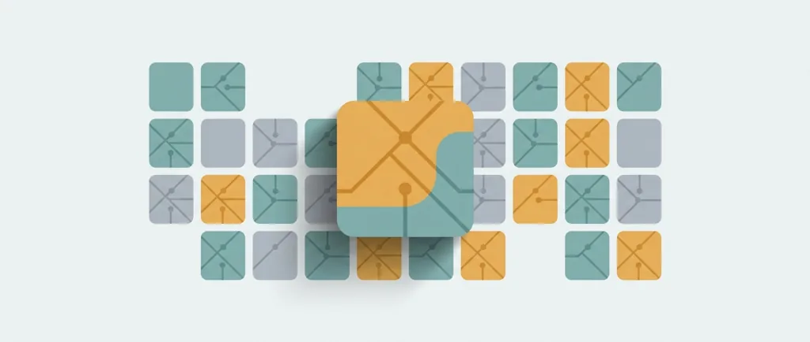
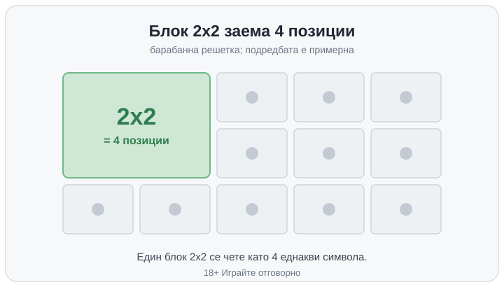

Title tag: Гигантски символи (colossal) в слотовете: как работят
Meta description: Гигантски/свързани символи (colossal / giant symbols): един символ покрива няколко позиции и се брои като няколко. Защо това вдига дисперсията, но не RTP.

---

# Гигантски символи (colossal) в слотовете: как работят свръхголемите символи

Гигантският символ, срещан и като colossal или giant symbol, е символ, по-голям от стандартния 1x1 квадрат: заема блок 2x2, 3x3, а понякога цял барабан наведнъж. Когато падне, той покрива няколко позиции едновременно и играта го чете като няколко отделни екземпляра от същия символ. Тоест един блок 2x2 стъпва на мястото на четири единични символа и се брои като четири за целите на печелившите комбинации. Визуално екранът изглежда по-едър и по-зрелищен, а няколко линии могат да се задействат от едно единствено падане на такъв блок.

## Как се брои един гигантски блок

Един голям блок участва в повече редове наведнъж, затова може да дооформи няколко печеливши линии от едно завъртане, което иначе би изисквало много повече единични попадения. Колкото по-едър е блокът, толкова повече от екрана запълва: 3x3 покрива цяло ъгълче, а символ, който хваща цял барабан, се държи като плътна колона от същия символ по всички редове. Различните разработчици наричат тази механика по свой начин, затова при непознато заглавие помага [речникът с казино термини](/blog/rechnik-kazino-termini/).

Някои игри имат фиксиран гигантски символ, който винаги е един и същ, при други блокът се избира на случаен принцип в началото на завъртането, а при трети гигантски може да стане само wild или само определен високоплатен символ. Точно кой вариант ползва играта пише в нейните правила.

## Защо по-голям символ не значи по-добри шансове

Въпреки внушителния си размер, гигантските символи не променят процента на връщане на играта. Големината е визуален и математически похват, а не бонус: RTP е дългосрочната теоретична статистика върху милиони завъртания, пресметната върху всички изходи, и в нея вече е вкарано колко често пада такъв блок. Колкото по-зрелищно е събитието на екрана, толкова по-рядко обикновено се случва, защото разработчикът нагласява честотата на блока точно толкова, че крайният RTP да излезе заложеният. Гигантските символи местят предимно дисперсията, тоест правят печалбите по-редки, но по-едри, когато дойдат, и засилват усещането за голям удар. Темпераментът на играта се мени, дългосрочната ѝ цена не.

Затова размерът на символите не е критерий коя игра връща повече. Числото, което казва това, е [RTP на играта](/slot-igri/visok-rtp/), а волатилността подсказва колко нервна ще е играта по пътя.

## Пример с илюстративни числа

Ако такъв блок 2x2 падне в лявата част на барабаните, той затваря цяло ъгълче от екрана и може да завърши комбинация на няколко линии наведнъж, вместо да чакате отделен символ за всяка. Изглежда като едър удар от едно падане, но таблицата с изплащания и честотата на блока са нагласени така, че средно по много завъртания сметката пак да излезе на заложения RTP. Друга игра спокойно може да ползва по-голям блок или съвсем различна честота, затова цифрите по-долу са само за илюстрация.

*Примерна схема: блок 2x2 заема 4 позиции и се чете като 4 символа. Подредбата е илюстративна.*

## С какво се бъркат гигантските символи

Гигантските символи лесно се слагат в един кюп с няколко съседни механики. Разширяващият се символ тръгва като единичен и чак след това се разтяга, за да покрие цял барабан, най-често в бонус рунд; гигантският пада голям още от самото начало. Wild символът замества други символи, за да дооформи комбинация, и може да бъде гигантски, но едно е функцията „заместване", друго е размерът. Megaways пък мени броя символи на всеки барабан от завъртане на завъртане и така вдига броя начини за печалба в десетки хиляди, без това да е свързано с големината на отделния символ. Повечето [ротативки](/kazino-igri/rotativki/) комбинират по няколко от тези идеи в едно и също заглавие, затова е полезно да четете правилата, вместо да съдите по това колко голям изглежда символът на екрана.

Хазартът не е финансова стратегия, а ротативката е платено забавление с предварително известна дългосрочна цена. Гигантските символи правят екрана по-зрелищен и ударите по-усещащи се, но колко връща играта в дълъг план е решено от RTP, не от размера на символите. 18+ Хазартът може да пристрасти. Играйте отговорно.

**Георги Тодоров**
Публикувано: 03.10.2026 · Последна редакция: 03.10.2026

[About Всички Казина boilerplate]

**Отговорна игра.** 18+ Хазартът може да пристрасти. Играйте отговорно. Ако усетиш, че играта излиза извън контрол или искаш да я ограничиш, виж [инструментите за отговорна игра](/otgovorna-igra/) и възможността за самоизключване чрез националния регистър на уязвимите лица към НАП (подава се писмено само от засегнатото лице). Национална информационна линия за наркотиците, алкохола и хазарта („Солидарност") 0888 99 18 66, делнични дни 10:00–17:00.

**Разкриване на партньорства.** Всички Казина съдържа партньорски (афилиейт) връзки; когато отвориш оферта през такава връзка, това може да финансира сайта, без да променя цената за теб и без да влияе на оценките ни. От 1 август 2026 г. дейността на афилиейт оператори в България се лицензира съгласно Закона за държавния бюджет за 2026 г. (ДВ, бр. 69 от 31.07.2026 г.). Всички Казина е подало заявление за лиценз пред Националната агенция по приходите и очаква издаването му.
