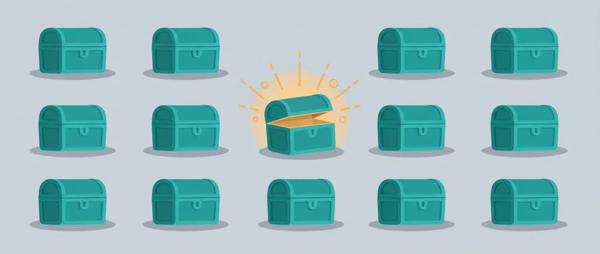
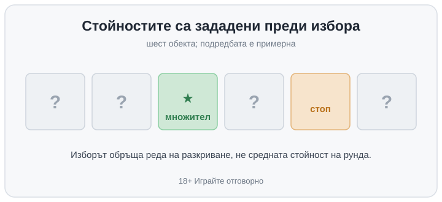

Title tag: Избор-бонус (pick and click) в слотовете: как работи
Meta description: Избор-бонус (pick and click / pick 'em): избираш скрити обекти за награда. Защо изборът не мени очакваната стойност и защо резултатът е RNG-калибриран.

---

# Избор-бонус (pick and click) в слотовете: как работи бонус играта с избиране

Избор-бонусът, познат и като pick and click или pick 'em, е бонус игра, в която пред вас излизат няколко еднакви на вид скрити обекта: сандъци, карти, кутии, и вие избирате един. Той разкрива моментална награда, най-често множител, брой безплатни завъртания или кешова стойност, и вие продължавате да избирате, докато не се паднете на символ „стоп" или „collect", който прибира натрупаното и връща основната игра. Усещането е, че вие държите юздите: кой сандък ще отворите, решавате вие. Точно затова си струва да се разбере какво реално стои зад избора.

## Кой избор какво решава

Резултатът не зависи от това дали сте бутнали левия или десния сандък. Разработчиците ползват два технически подхода, но изходът за вас е еднакъв и при двата. При единия всички награди зад обектите са предварително зададени още преди екранът да се зареди, тоест стойностите вече стоят по местата си и вашето докосване само ги обръща една по една. При другия генераторът на случайни числа решава стойността в мига, в който пипнете обекта. И в двата случая разпределението на наградите е фиксирано от математиката на играта, не от сръчността или интуицията ви. Ако понятието ви е ново, терминът е описан и в [речника с казино термини](/blog/rechnik-kazino-termini/).

## Защо изборът не мени очакваната стойност

Тук е честната част. Бонусът дава силно усещане за умение, защото има какво да бутнете и резултатът идва веднага след вашето действие. Очакваната стойност на рунда обаче е една и съща, независимо кой обект пипате: средната награда е усреднена върху всички възможни редове на разкриване и е вкарана предварително в RTP на играта. RTP е дългосрочната теоретична статистика върху милиони завъртания, пресметната върху всички изходи, включително този бонус. Разработчикът калибрира колко често се пада „стоп", колко големи са наградите зад обектите и колко стъпки издържа рундът точно толкова, че да излезе заложеният процент на връщане. Изборът ви мести кое число ще видите пръв, не колко ще спечелите средно. С две еднакви на вид кутии шансът и очакваната печалба са едни и същи, която и да отворите.

За сравнение на две игри полезното число пак е [RTP на играта](/slot-igri/visok-rtp/), а не колко „интерактивен" изглежда бонусът с избиране. Интерактивността е част от преживяването, не от сметката.

## Пример с илюстративни числа

Пред вас има шест еднакви сандъка и избирате един по един. Първият разкрива множител, вторият още един, третият показва „стоп" и рундът приключва със сбора на дотогавашните награди. Ако бяхте започнали от друг сандък, редът на разкриване щеше да е друг, но средната стойност на целия рунд остава същата, защото тя не зависи от пътя, а от това как са калибрирани наградите и честотата на „стоп". Числата тук са примерни: конкретната игра може да има повече или по-малко обекти, няколко нива на избиране или добавен множител към целия сбор.

*Примерна решетка: стойностите зад обектите са зададени преди избора. Подредбата е илюстративна.*

## С какво се бърка избор-бонусът

Избор-бонусът лесно се слага в един кюп с няколко съседни механики, които работят иначе. Мистерия символите се разкриват сами на барабаните в основната игра, без вие да избирате нищо. Scatter символите задействат бонуса с едно завъртане, пак без избор от ваша страна. Събирането на символи трупа прогрес между завъртанията към праг, вместо да ви дава моментален избор в отделен екран. Общото между всички тях е, че изходът е предрешен от сертифицирания генератор на случайни числа; разликата е само в опаковката и в това колко действие изисква от вас. Повечето [ротативки](/kazino-igri/rotativki/) комбинират по няколко такива елемента в един и същ бонус, затова е полезно да знаете кое е истински избор и кое просто изглежда така.

Хазартът не е финансова стратегия, а ротативката е платено забавление с предварително известна дългосрочна цена. Избор-бонусът прави това забавление по-ангажиращо, защото ви дава какво да натиснете, но наградата зад сандъка е сметната далеч преди пръстът ви да го докосне. Бонус игра, която създава усещане за контрол, е най-подвеждаща точно когато забравите, че контролът е върху реда на разкриване, не върху изхода. 18+ Хазартът може да пристрасти. Играйте отговорно.

**Георги Тодоров**
Публикувано: 03.10.2026 · Последна редакция: 03.10.2026

[About Всички Казина boilerplate]

**Отговорна игра.** 18+ Хазартът може да пристрасти. Играйте отговорно. Ако усетиш, че играта излиза извън контрол или искаш да я ограничиш, виж [инструментите за отговорна игра](/otgovorna-igra/) и възможността за самоизключване чрез националния регистър на уязвимите лица към НАП (подава се писмено само от засегнатото лице). Национална информационна линия за наркотиците, алкохола и хазарта („Солидарност") 0888 99 18 66, делнични дни 10:00–17:00.

**Разкриване на партньорства.** Всички Казина съдържа партньорски (афилиейт) връзки; когато отвориш оферта през такава връзка, това може да финансира сайта, без да променя цената за теб и без да влияе на оценките ни. От 1 август 2026 г. дейността на афилиейт оператори в България се лицензира съгласно Закона за държавния бюджет за 2026 г. (ДВ, бр. 69 от 31.07.2026 г.). Всички Казина е подало заявление за лиценз пред Националната агенция по приходите и очаква издаването му.
