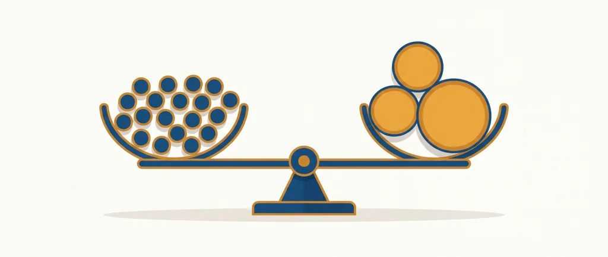
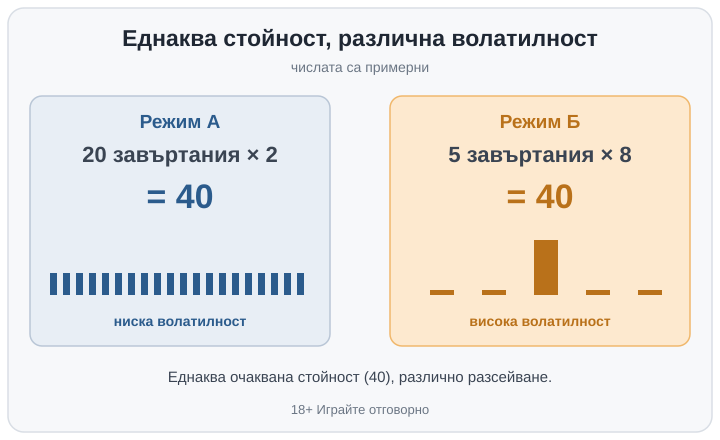

Title tag: Избор на режим безплатни завъртания: повече или множител
Meta description: Избор на режим на безплатните завъртания: повече завъртания при по-нисък множител или по-малко при по-висок. Кое мести RTP и кое само волатилността.

---

# Избор на режим на безплатните завъртания: повече завъртания или по-голям множител

Някои ротативки ви питат нещо, преди бонусът да тръгне: повече безплатни завъртания при по-скромен множител, или по-малко завъртания, но с по-едър множител върху всяка печалба. Това е изборът на режим на безплатните завъртания, размяна на количество за интензивност. Сведено до един въпрос: повече спинове или по-голям множител. Единият край ви дава дълъг, спокоен рунд с чести дребни попадения. Другият свива рунда и вдига залога на всяко завъртане.

## Трите режима на Dead or Alive 2

Dead or Alive 2 на NetEnt обикновено се сочи като учебникарския случай. Преди безплатните завъртания избирате между три режима: единият е нарочно по-равен, с по-ниска волатилност и по-чести дребни печалби, вторият седи по средата, а третият е крайният и най-резкият, в който се гони рядкото огромно попадение. Колко точно завъртания и какъв множител дава всеки режим е специфично за играта и стои разписано в правилата ѝ, затова го държа настрана. Разликата между трите е единствено във волатилността: колко резки излизат рундовете.

## Защо изборът не мести RTP

Ще ви спестя надеждата отрано: никой от режимите не ви дава предимство. RTP на играта е дългосрочният процент на връщане върху всички възможни изходи над милиони завъртания, а режимите са просто различни клонове на същата тази математика. Волатилността и RTP са две отделни неща, тоест една и съща игра може да е резка или равна при напълно еднакъв RTP. Разработчикът нагласява всеки режим така, че дългосрочното връщане да е близко или еднакво, докато усещането се различава; повечето завъртания при по-малък множител и малкото завъртания при по-голям множител се калибрират към един и същ обявен RTP. Дали стойността е идентична до последния цент зависи от конкретната игра, но посоката не се мени: разменяте разсейване, не очаквано връщане. Понякога единият режим излиза мъничко по-щедър или по-стиснат от другия; това личи единствено в правилата на играта. За самите високи стойности на RTP имаме и отделен [списък с ротативки с висок RTP](/slot-igri/visok-rtp/).

## Пример с илюстративни числа

Вземете две версии на един и същ бонус. Режим А: 20 безплатни завъртания с множител ×2. Режим Б: 5 завъртания с множител ×8. Числата са примерни. Умножите ли завъртанията по множителя, и двата опират до 40: 20 по ×2 и 5 по ×8 дават едно и също очаквано връщане, стига средната печалба на завъртане преди множителя да е еднаква. Разликата е в разсейването. Режим А ще ви връща по малко и често, режим Б ще мълчи дълго и после понякога ще удари едро.

*Примерни режими: 20 завъртания × ×2 и 5 завъртания × ×8 дават еднакво очаквано връщане (40), но различна волатилност. Числата са илюстративни.*

## Какво наистина се мести

Повече завъртания изглаждат резултата: дребните печалби зачестяват, голям скок става по-малко вероятен, балансът пада по-плавно. По-малко завъртания с по-висок множител правят обратното, с дълги празни серии, прекъсвани от рядко, но по-едро попадение. Това е самата волатилност, разликата между колко често и колко голямо, и е въпрос на темперамент и бюджет. Ако някои от термините ви убягват, в [речника с казино термини](/blog/rechnik-kazino-termini/) ги има описани едно по едно.

Затова и клиповете с огромните печалби почти винаги идват от крайния режим с високия множител, не от равния. Дългата поредица дребни попадения не става на видео, едно попадение по голям множител върху добра комбинация става. Това кара резкия режим да изглежда като по-печелившия избор, макар средното връщане да не трепва заради него. Същият режим в лоша вечер изпразва баланса далеч по-бързо, а такива клипове никой не качва.

## Кой режим за кого

Малък бюджет и желание да въртите по-дълго се разбират по-добре с по-равния режим: същото очаквано връщане, но по-малък риск рундът да свърши с едно празно разсейване. Търсите ли тръпката на рядкото голямо и ви е спокойно, че рундът може да приключи на нула, по-резкият режим ляга на този вкус. Нито едното не е по-умно от другото. Повечето [ротативки](/kazino-igri/rotativki/) впрочем изобщо нямат такъв избор и просто ви пускат в един режим; изборът се появява само при част от игрите. Този избор не е същото като ретригера, който удължава вече започнал рунд, нито като самия множител, чиято механика разглеждаме отделно; тук избирате профила на люшкането, преди изобщо да започнете да въртите.

## Как да го усетите, без да плащате

Ако не сте сигурни кой профил ви понася, пуснете играта в демо режим и я въртете достатъчно дълго без пари. Така виждате сами колко често всеки режим изобщо стига до бонуса и колко резки излизат рундовете. Демото е отделна тема, но остава най-честният начин да пробвате темпото, преди да заложите собствени пари. Режим, който почти не стига до бонуса, си личи за минути в демото, а на екрана за избор изглежда също толкова примамлив, колкото и останалите.

По-резкият режим гори бюджета по-бързо в лошите серии и точно там е лесно да се подмамите да догонвате. Задайте си лимит на загубата и на сесията преди първото завъртане, не по средата на рунда. Хазартът не е финансова стратегия, а ротативката е платено забавление с предварително известна дългосрочна цена. Изборът на режим мени колко е резка вечерта. Цената ѝ остава същата. Ако избирате режим с мисълта, че печелите предимство, избирате по грешната причина. 18+ Хазартът може да пристрасти. Играйте отговорно.

**Георги Тодоров**
Публикувано: 03.10.2026 · Последна редакция: 03.10.2026

[About Всички Казина boilerplate]

**Отговорна игра.** 18+ Хазартът може да пристрасти. Играйте отговорно. Ако усетиш, че играта излиза извън контрол или искаш да я ограничиш, виж [инструментите за отговорна игра](/otgovorna-igra/) и възможността за самоизключване чрез националния регистър на уязвимите лица към НАП (подава се писмено само от засегнатото лице). Национална информационна линия за наркотиците, алкохола и хазарта („Солидарност") 0888 99 18 66, делнични дни 10:00–17:00.

**Разкриване на партньорства.** Всички Казина съдържа партньорски (афилиейт) връзки; когато отвориш оферта през такава връзка, това може да финансира сайта, без да променя цената за теб и без да влияе на оценките ни. От 1 август 2026 г. дейността на афилиейт оператори в България се лицензира съгласно Закона за държавния бюджет за 2026 г. (ДВ, бр. 69 от 31.07.2026 г.). Всички Казина е подало заявление за лиценз пред Националната агенция по приходите и очаква издаването му.
