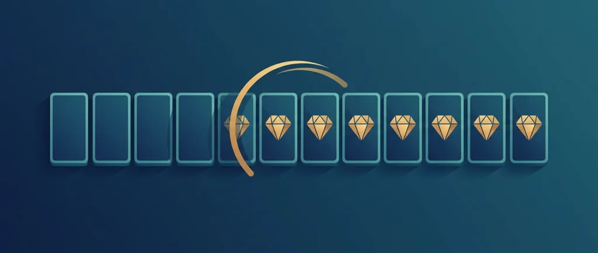
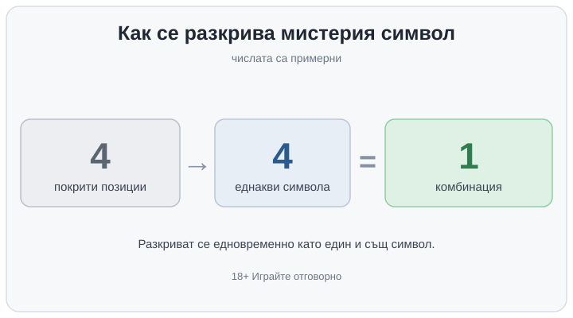

Title tag: Мистерия символи в слотовете: как се разкриват
Meta description: Мистерия символите падат покрити и се разкриват едновременно като един и същ символ. Как работи механиката, защо не мести RTP и шансовете, с пример.

---

# Мистерия символи в слотовете: как се разкриват и защо не местят шансовете

Мистерия символът, или скритият символ, пада на барабаните покрит, с лице надолу: въпросителна, запечатана плочка или просто празна икона, която още не показва каква е. В момента на разкриването покритите позиции се обръщат наведнъж и обикновено всички стават един и същ символ. Ако това е символ, който плаща, и позициите му се подредят по линия или в клъстер, на същия спин изскача комбинация, която допреди секунда я нямаше на екрана. Самото задействане на бонус с разпръснати (scatter) символи е друга механика със свой разбор; тук говорим какво прави покритата позиция на самите барабани.

## Какъв символ излиза зависи от играта

Тук няма едно правило за всички заглавия. Мистерия символът може да се разкрие като обикновен плащащ символ, като премиум, като нискостоен, понякога като wild или bonus, а дали всички покрити позиции се обръщат на един и същ символ или всяка се разкрива сама за себе си, също е въпрос на конкретната игра. Когато излезе wild, вече навлизаме в темата за дивите символи, която има свой отделен разбор. Всички тези подробности са разписани в правилата на играта, където разработчикът ги казва едно по едно.

## Къде се срещат мистерия символите

Скритите символи не са вързани за един тип ротативка. Падат в основната игра произволно или само в рунда с безплатни завъртания, а понякога и в двете. Срещат се при класически линии на печалба, при cluster pays с каскадни барабани, при Megaways и при scatter pays, тоест при почти всяка reel механика. Как изглежда конкретната [ротативка](/kazino-igri/rotativki/) и в кой режим се включват мистерия символите определя колко често изобщо ще ги виждате.

## Разкриването изглежда като избор, но е предрешено

Анимацията подвежда. Обръщането на плочките прилича на избор в последната секунда, но изходът е определен от генератора на случайни числа в мига, в който барабаните спрат; картинката само го показва по-ефектно. Мистерия символът не е гарантирана премия. Разкриването носи тегла и нискостойностен символ често излиза по-често от wild или bonus, точно както е заложено от разработчика.

## Защо не мести RTP и шансовете

Честотата, с която падат мистерия символи, и щедростта, с която се разкриват, са част от математическия модел на играта от самото начало. Затова мистерия механиката не подобрява шансовете ви и не мръдва RTP. RTP е дългосрочният процент на връщане, пресметнат върху всички възможни изходи на играта над милиони завъртания, и в тази сметка колко често се появява мистерия символ и колко често се разкрива щедро вече са включени. Ако държите да избирате по число, което наистина казва нещо, гледайте RTP на играта; за по-високите стойности имаме и отделен [списък с ротативки с висок RTP](/slot-igri/visok-rtp/).

## Пример с илюстративни числа

На един спин падат 4 покрити мистерия символа. Разкриват се едновременно и всичките 4 стават един и същ символ. Ако това е символ, който плаща от четири еднакви нагоре, се подрежда една комбинация. Числата са примерни: друга игра може да покрие две позиции или шест, да ги разкрие поотделно или да извади нискостоен символ, който не плаща нищо. Повече покрити позиции на един спин, да, но всяка от тях се подчинява на абсолютно същата математика като всяко друго завъртане.

*Примерен спин: 4 покрити мистерия символа се разкриват едновременно като един и същ символ, което подрежда една комбинация. Числата са илюстративни.*

## Какво всъщност мести мистерия символът

Повече подравнени разкрития на един спин разтягат резултата. Едрите спинове стават по-едри, когато четири или пет позиции се обърнат на един и същ висок символ, а празните спинове си остават празни. Дългосрочното очаквано връщане обаче е същото RTP. Това, което мистерия символът движи, е люшкането, а не очакваната стойност: при игра с висока волатилност той прави и без това резките рундове още по-резки. Затова и ефектните клипове почти винаги идват от един късметлийски спин с едновременно разкриване; стотиците спинове преди него, където мистерия символът е извадил нискостоен боклук, никой не ги качва.

## Да не се бърка с мистерия ДЖАКПОТ

Думата „мистерия" стои и на съвсем друга механика. Мистерия джакпотът, какъвто са Jackpot Cards или Clover Chance, е случайно награждаване на джакпот пул, което може да се задейства на всеки спин, независимо какви символи са на барабаните. Мистерия символът тук е reel механика: покрита позиция, която се разкрива като символ на самите барабани. Двете споделят само думата и нищо друго, затова не ги мерете с една мярка.

## Какво да проверите преди да въртите

Отворете правилата и вижте кои символи може да извади мистерия механиката и дали покритите позиции се разкриват заедно, или всяка поотделно, защото точно това решава колко често изобщо се подреждат комбинации. Демо режимът върши работа да усетите честотата, без да залагате пари: въртите го достатъчно дълго и картината се вижда сама. Ако в някакъв момент се чудите какво точно значи дадена дума от правилата, [речникът с казино термини](/blog/rechnik-kazino-termini/) е под ръка.

Ефектното разкриване държи окото на екрана и лесно изяжда представата колко всъщност сте заложили междувременно. Задайте си лимит на сесията и на загубата преди първото завъртане, не след петото. Хазартът не е финансова стратегия, а ротативката е платено забавление с предварително известна дългосрочна цена; мистерия символът прави момента по-ефектен, без да сваля тази цена. Ако избирате игра по това колко красиво се разкриват скритите символи, избирате по грешната причина. 18+ Хазартът може да пристрасти. Играйте отговорно.

**Георги Тодоров**
Публикувано: 03.10.2026 · Последна редакция: 03.10.2026

[About Всички Казина boilerplate]

**Отговорна игра.** 18+ Хазартът може да пристрасти. Играйте отговорно. Ако усетиш, че играта излиза извън контрол или искаш да я ограничиш, виж [инструментите за отговорна игра](/otgovorna-igra/) и възможността за самоизключване чрез националния регистър на уязвимите лица към НАП (подава се писмено само от засегнатото лице). Национална информационна линия за наркотиците, алкохола и хазарта („Солидарност") 0888 99 18 66, делнични дни 10:00–17:00.

**Разкриване на партньорства.** Всички Казина съдържа партньорски (афилиейт) връзки; когато отвориш оферта през такава връзка, това може да финансира сайта, без да променя цената за теб и без да влияе на оценките ни. От 1 август 2026 г. дейността на афилиейт оператори в България се лицензира съгласно Закона за държавния бюджет за 2026 г. (ДВ, бр. 69 от 31.07.2026 г.). Всички Казина е подало заявление за лиценз пред Националната агенция по приходите и очаква издаването му.
