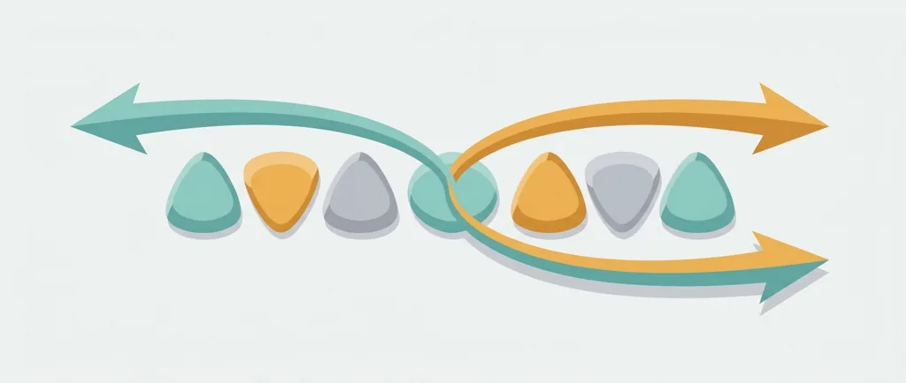
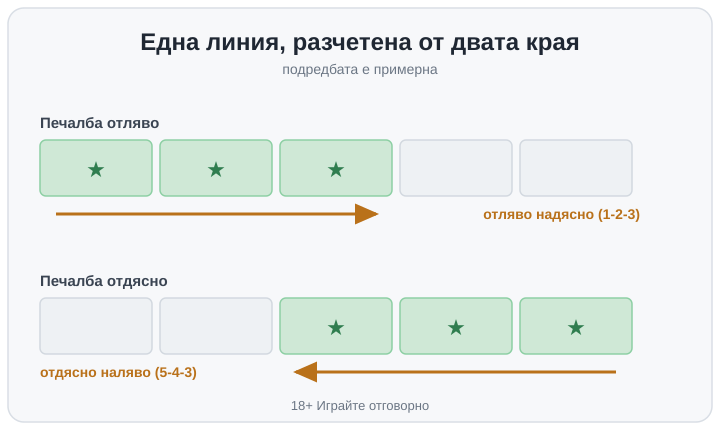

Title tag: Печалби в двете посоки в слотовете: как работят
Meta description: Печалби в двете посоки (win both ways): линията плаща и отляво надясно, и отдясно наляво. Защо това не е предимство и защо RTP вече го е сметнал.

---

# Печалби в двете посоки в слотовете: как работи двупосочното изплащане

При повечето ротативки печелившата комбинация се чете в една посока: от най-левия барабан надясно. Три еднакви символа на барабани 1, 2 и 3 плащат, но същите три символа на барабани 3, 4 и 5 не се броят за нищо, защото не тръгват от левия край. Механиката „печалби в двете посоки" маха точно това ограничение. Линията се чете и от двата края: комбинация, която тръгва отляво надясно, плаща, и комбинация, която тръгва отдясно наляво, също плаща. Самата линия не се мести и не се огледалва, играта просто я разчита в двете посоки.

## Какво реално се променя на барабаните

Условието за съседство остава: символите пак трябва да паднат на последователни барабани, за да се броят. Разликата е откъде може да започне броенето. На пет барабана три еднакви символа на 1-2-3 правят печалба отляво, а три еднакви на 5-4-3 правят печалба отдясно по същата линия. Заради това една и съща визуална редица понякога изплаща два пъти, ако краищата ѝ съвпаднат. Най-известният пример за този модел е [Starburst](/blog/starburst/), но принципът е общ и не е вързан за конкретно заглавие. Преди да заложите реални пари на игра с такова изплащане, си струва да отворите нейните правила и да видите черно на бяло как се четат линиите.

## Защо това не е по-щедра игра

На хартия двупосочното изплащане звучи като удвоени шансове за ред, и в някакъв смисъл е точно това: имате два начина една редица да плати вместо един. Капанът е да го приемете като подарък. Процентът на връщане, RTP, е дългосрочната теоретична статистика върху милиони завъртания и се смята върху всички възможни изходи на играта. Когато разработчикът пусне двупосочно изплащане, тази допълнителна честота на печалби вече е вкарана в сметката: обикновено се компенсира с по-ниски изплащания на символ, по-малко активни линии или по-рядко падащи едри символи. Крайният RTP излиза какъвто е решено да бъде, не по-висок, защото линиите плащат в две посоки. С други думи двупосочността мести структурата на печалбите, не тяхната дългосрочна сума.

Затова, ако сравнявате две игри, посоката на изплащане не ви казва коя връща повече. Числото, което казва нещо, е [RTP на играта](/slot-igri/visok-rtp/), а него го гледате отделно, независимо дали линиите са едно- или двупосочни.

## Пример с илюстративни числа

Да приемем слот с 10 линии и един символ, който плаща за три в редица. Пада ви редица, в която барабани 1, 2 и 3 носят еднакъв символ: това е класическа печалба отляво. В същото завъртане на друга линия еднакви символи стоят на барабани 5, 4 и 3: при едностранна игра тази втора редица не плаща нищо, при двупосочна носи втора печалба. Изглежда като бонус, но таблицата с изплащания за този символ е калибрирана така, че средно по много завъртания балансът да излезе на заложения RTP. Числата тук са примерни и служат само да покажат разликата в четенето, конкретната игра може да има съвсем друг брой линии и друга таблица.

*Примерна линия: една и съща редица се чете от двата края. Подредбата е илюстративна.*

## С какво се бърка двупосочното изплащане

Двете посоки често се слагат в един кюп с „начините за печалба" (ways to win), но това са различни неща. При ways-to-win няма фиксирани линии: брои се всяка комбинация от съседни барабани, независимо на кой ред стои символът, затова се говори за 243 или 1024 начина. При двупосочното изплащане линиите са си фиксирани, просто се четат и от двата края. Megaways пък е трети отделен модел, при който броят символи на всеки барабан се мени от завъртане на завъртане и затова общият брой начини скача в десетки хиляди. Повечето [ротативки](/kazino-igri/rotativki/) комбинират по няколко от тези идеи, затова паролата винаги е една: вижте в правилата как точно се броят печалбите на конкретната игра, преди да решите, че разбирате къде отиват парите ви.

Хазартът не е финансова стратегия, а ротативката е платено забавление с предварително известна дългосрочна цена. Двупосочното изплащане прави редиците по-чести и играта по-жива, но колко връща тя в дълъг план е решено от RTP, не от това в колко посоки се чете една линия. Игра, избрана защото „плаща и в двете посоки", е избрана по усещане, не по число. 18+ Хазартът може да пристрасти. Играйте отговорно.

**Георги Тодоров**
Публикувано: 03.10.2026 · Последна редакция: 03.10.2026

[About Всички Казина boilerplate]

**Отговорна игра.** 18+ Хазартът може да пристрасти. Играйте отговорно. Ако усетиш, че играта излиза извън контрол или искаш да я ограничиш, виж [инструментите за отговорна игра](/otgovorna-igra/) и възможността за самоизключване чрез националния регистър на уязвимите лица към НАП (подава се писмено само от засегнатото лице). Национална информационна линия за наркотиците, алкохола и хазарта („Солидарност") 0888 99 18 66, делнични дни 10:00–17:00.

**Разкриване на партньорства.** Всички Казина съдържа партньорски (афилиейт) връзки; когато отвориш оферта през такава връзка, това може да финансира сайта, без да променя цената за теб и без да влияе на оценките ни. От 1 август 2026 г. дейността на афилиейт оператори в България се лицензира съгласно Закона за държавния бюджет за 2026 г. (ДВ, бр. 69 от 31.07.2026 г.). Всички Казина е подало заявление за лиценз пред Националната агенция по приходите и очаква издаването му.
