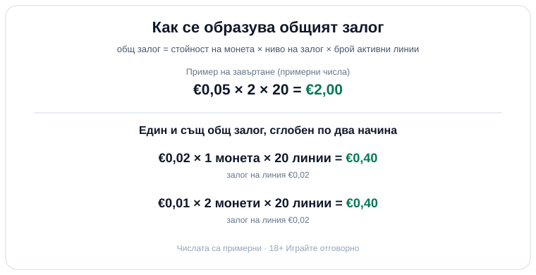

Byline: Георги Тодоров (persona) | Market: BG - guide on how the total slot stake is composed; tester voice in education register.

# Размер на залога в слота: как трите контрола правят общия залог

Отваряте ротативка и на екрана светят три неща: стойност на монета, ниво на залог и брой линии. От сметката ви обаче се маха само едно число на завъртане, а то не е нито едно от трите поотделно. Общият залог е произведението им: стойност на монета по ниво на залог по брой активни линии. Монетата в ъгъла е витрината, общият залог е цената, която плащате. Ако гледате само дребното число до бутона за завъртане, гледате грешната цифра.

## Трите контрола и какво точно умножавате

Стойността на монета е колко пари струва една монета: €0,01, €0,05, €0,20, според играта. Нивото на залог (в някои игри го пише „монети на линия") е колко такива монети слагате на всяка линия. Линиите са пътищата, по които машината проверява за съвпадения, и в част от слотовете сами решавате колко от тях да включите. Когато линиите са фиксирани, плащате за всички на всяко завъртане и не можете да ги намалите; когато са избираеми, изключването на част от тях сваля общия залог, но маха и пътища, по които играта може да ви плати.

Съберете ги и получавате залога на завъртане. При монета €0,05, ниво 2 и 20 линии плащате €0,05 × 2 × 20, тоест €2,00 на завъртане. Вдигнете ли до монета €0,05, ниво 3 и 25 линии, същата сметка дава €3,75. Числата са илюстративни, но механиката е една и съща във всяка ротативка: три множителя, един резултат.

## Един и същ общ залог, сглобен по два начина

Понеже е произведение, до едно и също число се стига по няколко пътя. Монета €0,02 на едно ниво по 20 линии прави €0,40. Монета €0,01 на две нива по 20 линии също прави €0,40, при това със същия залог на линия от €0,02 и същите изплащания. Двете настройки изглеждат различно на екрана, а за портфейла ви са идентични. Затова стойността на монета сама по себе си не ви казва почти нищо: докато не я умножите по нивото и по линиите, не знаете колко всъщност залагате. Някои игри дори стартират на най-ниската монета, но с всички линии включени, и дребната цифра на монетата спокойно подвежда за реалната цена на завъртането.

*Общият залог = стойност на монета × ниво × линии. Долу: €0,40 се сглобява по два различни начина със същия залог на линия (числата са примерни).*

## Къде са тези бутони и как да четете общия залог

При повечето ротативки трите контрола са скрити в едно меню „залог" или зад плюс и минус до стойността на монета и нивото. Търсете полето, което пише „общ залог", „залог на завъртане" или „total bet"; то показва готовото произведение и е единственото, което трябва да проверите, преди да натиснете завъртане. Внимавайте с бутона „максимален залог" (max bet): той вдига и трите скали докрай с едно докосване и може да качи завъртането от €0,40 на няколко евро, без да усетите кога. Ако не сте сигурни кой надпис какво значи, [речникът с казино термини](/blog/rechnik-kazino-termini/) разписва всеки от тях.

## По-голям залог не значи по-добри шансове

Резултатът от завъртането идва от генератора на случайни числа и не се интересува как сте наместили трите скали. Вдигането на залога не подобрява шансовете ви; то увеличава заложената сума, а с нея и размера на евентуалното изплащане. При нормална [ротативка](/kazino-igri/rotativki/) с фиксирано RTP начинът, по който разпределяте залога между монета, ниво и линии, не мести RTP-то изобщо. Малка част от игрите с променливо RTP публикуват диапазон, в който максималното ниво на монетата отключва по-високия процент, но това се проверява в таблицата с изплащанията на конкретната игра, не се предполага. Как четем RTP като дългосрочно число, а не като обещание за сесията, сме описали в [метода си на оценяване](/kak-ocenyavame/); тук важното е по-просто: по-големият залог носи по-едри люшкания в двете посоки, не по-добра математика. Има и обратна страна, за която банерът мълчи: средната очаквана загуба също расте с общия залог, защото предимството на казиното се начислява върху всяка заложена стотинка. По-скъпото завъртане значи по-скъпа средна цена на час игра, а не по-голям шанс.

## Числото, което изпразва сметката

Дължината на сесията ви зависи от общия залог, не от монетата. С бюджет от €40 и залог €2,00 на завъртане имате около 20 завъртания, преди да стигнете дъното, ако нищо не падне; с €0,40 на завъртане същият бюджет държи пет пъти по-дълго. Затова числото, което гледам, преди да завъртя, е общият залог, и спрямо него си задавам лимит на загубата предварително. Добавете и темпото: на автоматични завъртания по няколко в минута дори скромен общ залог се трупа бързо, затова лимитът на сесията върши повече работа от взирането в стойността на монета. Ако подбирате игри и по процента на връщане, [слотовете с високо RTP](/slot-igri/visok-rtp/) са отделен филтър; размерът на залога обаче важи за всяка ротативка, независимо от RTP-то ѝ.

Ротативката е платено забавление с предварително известна дългосрочна цена, не начин да си върнете пари. Трите контрола съществуват, за да наместите тази цена на ниво, което можете да загубите спокойно, нищо повече. Прочетете общия залог, преди да завъртите, не стойността на монета. 18+ Хазартът може да пристрасти. Играйте отговорно.

**Георги Тодоров**
Публикувано: 03.10.2026 · Последна редакция: 03.10.2026

[About Всички Казина boilerplate]

**Отговорна игра.** 18+ Хазартът може да пристрасти. Играйте отговорно. Ако усетиш, че играта излиза извън контрол или искаш да я ограничиш, виж [инструментите за отговорна игра](/otgovorna-igra/) и възможността за самоизключване чрез националния регистър на уязвимите лица към НАП (подава се писмено само от засегнатото лице). Национална информационна линия за наркотиците, алкохола и хазарта („Солидарност") 0888 99 18 66, делнични дни 10:00–17:00.

**Разкриване на партньорства.** Всички Казина съдържа партньорски (афилиейт) връзки; когато отвориш оферта през такава връзка, това може да финансира сайта, без да променя цената за теб и без да влияе на оценките ни. От 1 август 2026 г. дейността на афилиейт оператори в България се лицензира съгласно Закона за държавния бюджет за 2026 г. (ДВ, бр. 69 от 31.07.2026 г.). Всички Казина е подало заявление за лиценз пред Националната агенция по приходите и очаква издаването му.

CANON ADDITIONS: none.
[DATA NEEDED]: none.
