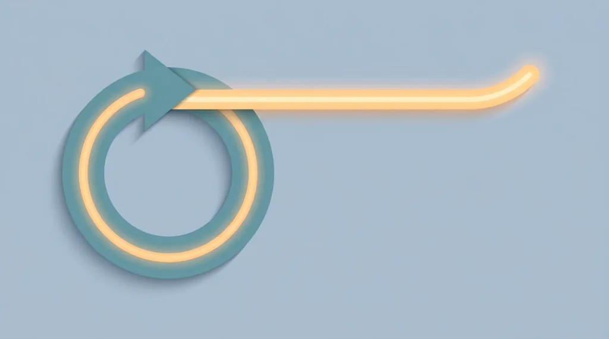
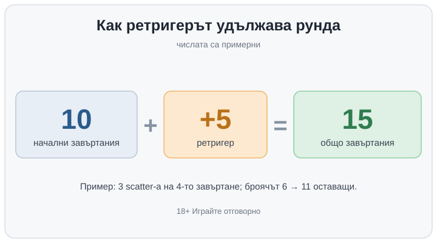

Title tag: Ретригер на безплатни завъртания: променя ли шансовете
Meta description: Ретригерът удължава безплатните завъртания, когато паднат още scatter символи по време на бонуса, но не мени RTP и шансовете. Как работи, с пример.

---

# Ретригер на безплатни завъртания: удължава бонуса, не и шансовете

Ретригерът е повторно задействане на безплатните завъртания, докато рундът още тече. Въртите спечелените завъртания и на екрана пак падат scatter символите, които отключиха бонуса. Играта добавя още завъртания към онези, които ви остават, и рундът продължава, вместо да приключи. Нищо отделно не се стартира: същият бонус просто става по-дълъг. Как се задейства самият бонус от нулата е отделна тема, която разглеждаме в наръчника за scatter символите и задействането; тук говорим какво става, след като вече сте вътре в рунда.

## Колко завъртания добавя зависи от играта

Тук няма едно число, което да важи навсякъде. Някои заглавия дават приблизително толкова завъртания, колкото при първоначалното задействане. Други слагат фиксиран, обикновено по-малък брой. Трети нулират брояча и рундът тръгва отначало. Понякога за ретригер стигат по-малко scatter-а, отколкото за старта: ако са ви трябвали три символа, за да влезете в бонуса, два вътре в рунда може да го удължат. Колко точно пише в правилата на конкретната игра, където тези неща се разписват едно по едно. Разработчикът нагласява и честотата, и щедростта на ретригера точно толкова, колкото да се получи обявеният RTP и желаната волатилност, затова две иначе сходни ротативки може да ретригват съвсем различно.

## Какво се пренася в удължените завъртания

Ако играта трупа нарастващ множител или държи sticky wild символи по барабаните, тези натрупвания обикновено остават и при добавените завъртания. Затова дълъг, няколко пъти ретригнат рунд в игра с нарастващ множител може да изглежда съвсем различно от първите няколко завъртания. Самите множители са отделна тема, която разглеждаме в наръчника за множителите; тук те са важни само защото ретригерът им дава повече време да се трупат.

## Повече завъртания не значат по-добри шансове

Ретригерът удължава рунда и усилва усещането за „голям" бонус. Шансовете ви обаче не се подобряват и RTP не мръдва. RTP е дългосрочният процент на връщане, пресметнат върху всички възможни изходи на играта над милиони завъртания, и тази сметка вече включва колко често падат scatter-и, колко често се задейства бонусът и колко често се ретригва. Възможността за ретригер е зашита в математиката от самото начало. Не е бонус върху бонуса, който сте надхитрили. Ако държите да избирате по число, което наистина казва нещо, гледайте RTP на играта, а не колко щедро обещава да ретригва; за по-високите стойности имаме и отделен [списък с ротативки с висок RTP](/slot-igri/visok-rtp/).

## Пример с илюстративни числа

Рундът започва с 10 безплатни завъртания. На четвъртото завъртане падат три scatter-а и играта добавя още 5. Броячът, който показваше 6 оставащи, скача на 11, а целият рунд ще изиграе 15 завъртания вместо 10. Ако пък играта е от тези, които нулират брояча, той няма да стане 11, а ще се върне на 10 и ще въртите десет нови завъртания от този момент нататък, тоест рундът се разтяга още повече. Числата са примерни и конкретната игра може да добави съвсем друг брой. Повече завъртания за същия вход, да, но всяко от тях се подчинява на абсолютно същата математика като всяко друго завъртане.

*Примерен рунд: 10 начални завъртания, ретригер добавя 5, общо 15. Числата са илюстративни.*

## Какво всъщност мести ретригерът

Повече завъртания в един рунд разтягат резултата. Дребните печалби зачестяват, а шансът за един наистина едър рунд се повишава, когато ретригерите се трупат върху висок множител. Дългосрочното очаквано връщане обаче си остава същото RTP. Това, което ретригерът движи, е люшкането, а не очакваната стойност: при игра с висока волатилност той прави и без това резките рундове още по-резки, в двете посоки.

Затова и клиповете с огромни печалби от ротативки почти винаги идват от рундове, ретригнати по няколко пъти; дългата серия просто дава повече последователни шансове едрите символи да се подредят. Това кара ретригера да изглежда като пряк път към голямото, макар средното връщане да не мръдва заради него. Същата дълга серия в лоша вечер пък не ви връща почти нищо и също е ретригер. Паметта запомня първото и забравя второто, което е добре да се има предвид, когато една игра се рекламира с това колко щедро удължава бонуса си.

## Две проверки преди да въртите

Първо, вижте дали има таван. Част от игрите ограничават колко пъти може да се ретригва или колко завъртания може да събере рундът общо, а понякога практически таван няма. Когато таван съществува, той е записан в правилата на играта. Второ, при ротативки с обявен таван на печалбата дълъг ретригнат рунд може да опре в този таван и стойността над него просто да не се изплати, колкото и да се е проточил рундът. Как претегляме тези неща, когато оценяваме една игра, сме описали в [метода си на оценяване](/kak-ocenyavame/).

И едно, което не важи, колкото и да изглежда примамливо: ретригерът не е „назрял". Изходите идват от генератора на случайни числа и двата почти-паднали scatter-а преди малко не правят следващия ретригер капка по-вероятен. Ако искате да усетите колко често дадена игра изобщо ретригва, без да залагате пари, демо режимът върши работа: въртите го достатъчно дълго и честотата се вижда сама.

По-дълъг рунд значи повече време пред екрана и по-лесно изгубена представа колко всъщност сте заложили междувременно. Задайте си лимит на сесията и на загубата преди първото завъртане, не след петото. Хазартът не е финансова стратегия, а ротативката е платено забавление с предварително известна дългосрочна цена; ретригерът удължава забавлението, без да сваля тази цена. Ако избирате игра по това колко лесно ретригва, избирате по грешната причина. 18+ Хазартът може да пристрасти. Играйте отговорно.

**Георги Тодоров**
Публикувано: 03.10.2026 · Последна редакция: 03.10.2026

[About Всички Казина boilerplate]

**Отговорна игра.** 18+ Хазартът може да пристрасти. Играйте отговорно. Ако усетиш, че играта излиза извън контрол или искаш да я ограничиш, виж [инструментите за отговорна игра](/otgovorna-igra/) и възможността за самоизключване чрез националния регистър на уязвимите лица към НАП (подава се писмено само от засегнатото лице). Национална информационна линия за наркотиците, алкохола и хазарта („Солидарност") 0888 99 18 66, делнични дни 10:00–17:00.

**Разкриване на партньорства.** Всички Казина съдържа партньорски (афилиейт) връзки; когато отвориш оферта през такава връзка, това може да финансира сайта, без да променя цената за теб и без да влияе на оценките ни. От 1 август 2026 г. дейността на афилиейт оператори в България се лицензира съгласно Закона за държавния бюджет за 2026 г. (ДВ, бр. 69 от 31.07.2026 г.). Всички Казина е подало заявление за лиценз пред Националната агенция по приходите и очаква издаването му.
