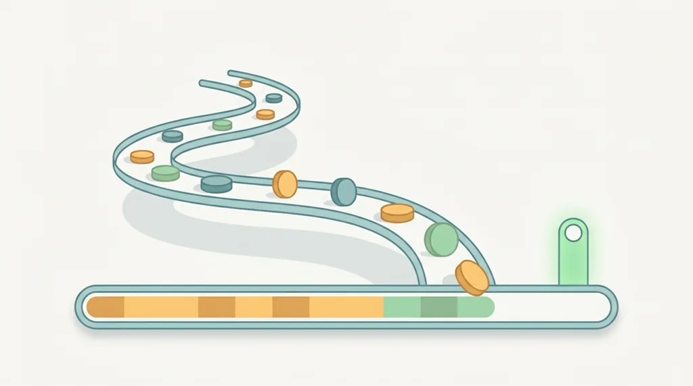
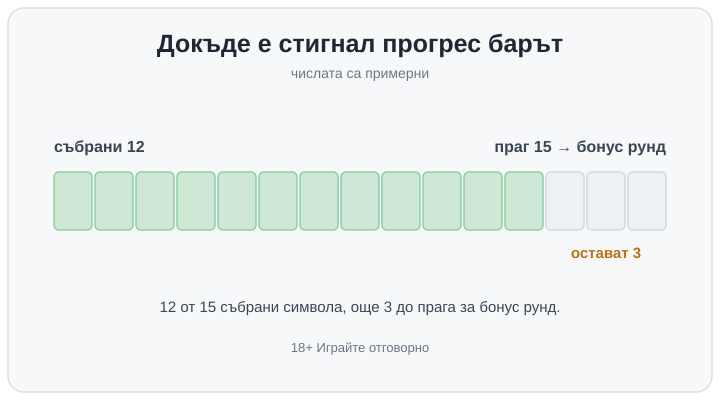

Title tag: Събиране на символи в слотовете: как работи механиката
Meta description: Събиране на символи (collection механика): символите се трупат в брояч на екрана и при праг дават бонус. Защо пълнещият се бар не мести RTP и шансовете.

---

# Събиране на символи в слотовете: как работи натрупването на прогрес

Механиката на събиране работи така: определени символи или монети падат по време на завъртанията и вместо да платят веднага самостоятелно, се трупат в брояч на екрана. Този брояч не се изчиства след всяко завъртане, а стои и расте, тоест играта пази персистентно състояние и го пренася от завъртане на завъртане. Когато събраното стигне предварително зададен праг, се отключва награда: бонус рунд, безплатни завъртания, надградени барабани или по-висок множител. Прогрес барът над барабаните е просто визуализация колко близо сте до този праг.

## Какво се събира и къде се пази

Поведението се разписва в правилата на конкретната игра. При част от заглавията прогресът се нулира в мига, в който отключите бонуса или затворите сесията, тоест на следващото влизане броячът е празен. Другаде събраното се пренася между сесии и заварвате барчето там, където сте го оставили: това е вече истински персистентен прогрес, който доста играчи подценяват. Колко добавя всеки символ, къде е прагът и каква е наградата се описва на същото място, затова две ротативки с почти еднакъв на вид прогрес бар може да се държат съвсем различно. Ако не сте сигурни коя от двете логики ползва играта, терминът си струва да се провери в [речника с казино термини](/blog/rechnik-kazino-termini/), преди да заложите реални пари.

## Това е класът механики, не разбор на отделна игра

Тук говоря за принципа, общ за всички игри, които го ползват. Конкретни заглавия като Duck Hunters, Gems Bonanza и Pirots 2 имат свои отделни разбори, в които точните им числа, праг и тип награда се проверяват едно по едно. Тази страница е общият „как работи", а не ревю на нито една от тях.

## Пълнещият се брояч не е „назряла" печалба

Барът изглежда като напредък към нещо спечелено, но прагът и наградата са сметнати в RTP на играта от самото начало. RTP е дългосрочният процент на връщане върху всички възможни изходи над милиони завъртания, и в тази сметка вече влизат колко често пада символът за събиране, колко бързо се пълни барът и колко често се стига до наградата. Всяко завъртане го определя генераторът на случайни числа поотделно. Да сте на 12 от 15 не прави следващото завъртане по-склонно да пусне нужния символ, отколкото когато сте били на 2 от 15, защото барът отчита какво е паднало досега, а не какво предстои. Разработчикът нагласява честотата на символа и височината на прага точно толкова, колкото да излезе обявеният RTP и желаната волатилност, така че по-бавното пълнене обикновено значи по-едра награда накрая, не по-лоша игра. Ако държите да избирате по число, което казва нещо, гледайте [RTP на играта](/slot-igri/visok-rtp/), а не колко приятно изглежда пълненето.

## Пример с илюстративни числа

Прагът е 15 събрани символа, а наградата е бонус рунд. В момента сте събрали 12 и ви остават 3. Усещането „само три още" е силно, обаче шансът символ за събиране да падне на следващото завъртане е същият, какъвто беше на първото: механиката брои паданията, не ги прави по-чести, колкото по-пълен е барът. Числата са примерни и конкретната игра може да иска съвсем друг праг или да добавя повече от един символ наведнъж.

*Примерен брояч: 12 от 15 събрани символа, още 3 до прага за бонус рунд. Числата са илюстративни.*

## Какво всъщност мести натрупването

Събирането разтяга преживяването. Вместо едно завъртане да реши всичко, напредъкът идва бавно и наградата се пада на скокове, което мени усещането за ритъм и дисперсията, но не и очакваното връщане. Пълнещ се бар е направен да държи окото на екрана именно защото показва цел, която е почти достигната. Оттук идва и практичната предпазливост: когато играете „докато напълня бара", лесно изпускате колко завъртания и колко пари са минали дотам. Задайте си лимит на сесията и на загубата преди първото завъртане, не когато барът е на три четвърти.

## С какво се бърка събирането

Събирането често се слага в един кюп с няколко съседни механики, които всъщност работят иначе. При Hold & Win персистентните символи се заключват в рамките на отделен respin рунд, вместо да се трупат в основната игра между нормалните завъртания. Има и по-бърз вариант, при който collector символ и символи със стойност трябва да паднат в едно и също завъртане, за да се приберат стойностите веднага: това е еднократно събиране, без да се пази нищо за по-късно, и не бива да се бърка с персистентния брояч, който е темата тук. Scatter символът пък задейства бонуса с едно завъртане и също не е персистентно състояние: или е на екрана сега, или го няма, нищо не се пренася. Прогресивният джакпот също расте пред очите ви, но пулът му се пълни от оборота на цялата мрежа играчи, а не е брояч на вашите събрани символи към фиксиран праг. Повечето [ротативки](/kazino-igri/rotativki/) комбинират по няколко такива елемента, затова си струва да знаете коя част от екрана какво точно прави.

Хазартът не е финансова стратегия, а ротативката е платено забавление с предварително известна дългосрочна цена. Пълнещият се бар прави това забавление по-въвличащо; колко струва то обаче, е решено далеч преди да падне и първият символ за събиране. Игра, избрана заради това колко удовлетворяващо се пълни барът, е избрана по усещане. 18+ Хазартът може да пристрасти. Играйте отговорно.

**Георги Тодоров**
Публикувано: 03.10.2026 · Последна редакция: 03.10.2026

[About Всички Казина boilerplate]

**Отговорна игра.** 18+ Хазартът може да пристрасти. Играйте отговорно. Ако усетиш, че играта излиза извън контрол или искаш да я ограничиш, виж [инструментите за отговорна игра](/otgovorna-igra/) и възможността за самоизключване чрез националния регистър на уязвимите лица към НАП (подава се писмено само от засегнатото лице). Национална информационна линия за наркотиците, алкохола и хазарта („Солидарност") 0888 99 18 66, делнични дни 10:00–17:00.

**Разкриване на партньорства.** Всички Казина съдържа партньорски (афилиейт) връзки; когато отвориш оферта през такава връзка, това може да финансира сайта, без да променя цената за теб и без да влияе на оценките ни. От 1 август 2026 г. дейността на афилиейт оператори в България се лицензира съгласно Закона за държавния бюджет за 2026 г. (ДВ, бр. 69 от 31.07.2026 г.). Всички Казина е подало заявление за лиценз пред Националната агенция по приходите и очаква издаването му.
