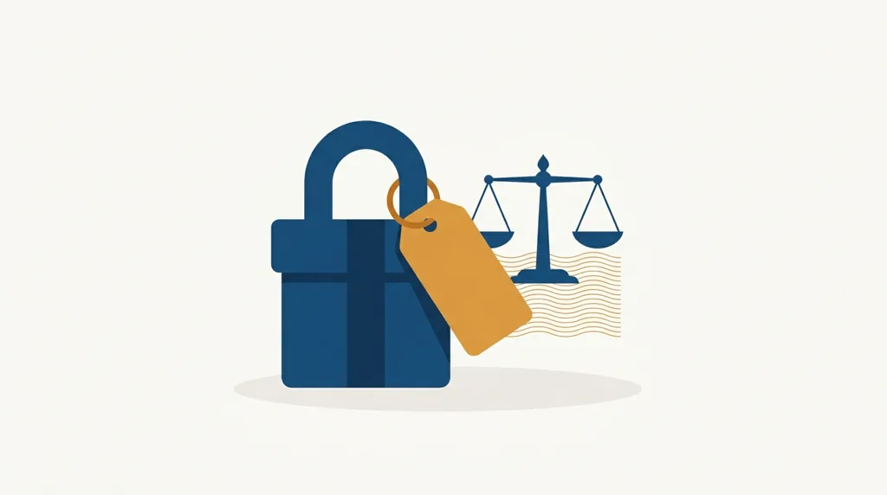
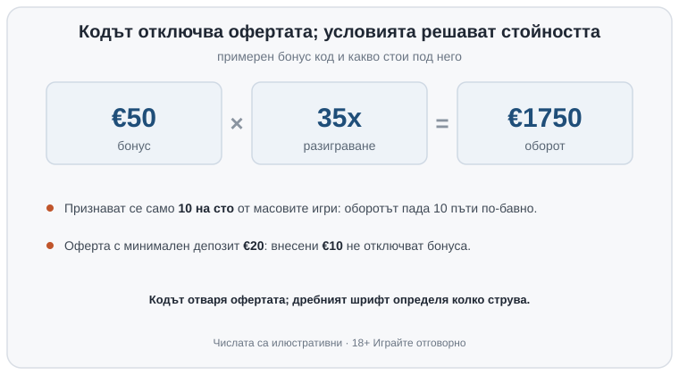

Title tag: Казино бонус код: как работи и къде се въвежда
Meta description: Бонус кодът отключва оферта, но не е стойността ѝ. Виж къде се въвежда (регистрация, каса, „Моите бонуси") и защо условията решават колко струва.

---

# Казино бонус код и промо код: как работи и къде се въвежда

Бонус кодът е инструкция към системата на казиното: закачи към този профил ето тази конкретна оферта. Понякога го срещате като промо код или ваучер код, но функцията е една, да отвори определена врата, и то само когато условието зад нея е изпълнено. Затова „имам код" и „имам бонус" описват две различни неща. Кодът е поканата; какво ще получите реално зависи от текста под офертата.

## Къде се въвежда кодът

Полето за код се появява на различни места по пътя на играча. Най-рано във формата за регистрация, където до данните за профила стои поле „бонус код" или „промо код"; попълвате го, преди да завършите записването. По-късно изскача в касата при депозит: избирате сума, въвеждате кода в полето за оферта и чак тогава потвърждавате внасянето, защото много оферти искат кодът да е активен точно в момента на депозита. А вече регистриран играч пуска текуща промоция направо от раздела „Бонуси" или „Промоции" в профила. След като кодът мине, отворете „Моите бонуси". Там се вижда дали офертата е закачена, какъв оборот остава по нея и до коя дата. Ако кодът не фигурира там, обикновено не се признава със задна дата и единственият път напред е през поддръжката.

## Когато липсва поле за код

Не всяка оферта изисква код. Част от бонусите се активират автоматично, щом изпълните условието: регистрирате се, внасяте минималната сума или отваряте промоцията и натискате „участвам". Липсващото поле тогава не значи, че няма бонус, а че казиното е вързало офертата направо към действието. Класически пример е [бонусът без депозит](/bonusi/bez-depozit/), който на едни места пада сам след верификация, а на други иска точно определен код. Преди да решите, че „нищо не се е случило", проверете в „Моите бонуси" какво е начислено.

## Кодът отваря вратата, парите стоят зад условията

Тук е несъответствието, върху което разчита рекламата. Кодът отваря офертата, но колко струва тя се решава от дребния шрифт под нея. Един и същ код „100% до €200" тежи различно според [изискването за разиграване](/blog/kak-raboti-razigravaneto/), минималния депозит, срока на валидност, кои игри се признават, какъв е максималният залог по време на бонуса и има ли таван на тегленето. Разиграването е най-тежката клауза и затова го разглеждаме поотделно; тук стига да помните, че множителят винаги върви с база и че базата мени крайната сметка в пъти.

Числата по-долу са илюстративни. Код за €50 бонус с разиграване 35x върху бонуса означава €1750 оборот. Ако масовите игри се признават само с 10 на сто, същият оборот, въртян на блекджек, сваля от изискването десет пъти по-бавно. А код без изпълнено условие не носи нищо: при оферта, която иска депозит €20, внесени €10 не отключват бонуса, колкото и валиден да е кодът.

*Примерен код: €50 × разиграване 35x = €1750 оборот. Кодът отваря офертата; условията решават колко струва. Числата са илюстративни.*

## Изтекъл, грешен или „намерен" отнякъде код

Кодовете имат срок. Изтеклият просто не се приема, а сгрешен символ връща грешка, без да хаби опит. По-същественото е откъде идва кодът. Такива, събрани от форуми, коментари под видеа или сайтове с обещания за нереалистични суми, често са остарели, вързани за друга държава или изцяло измислени. Доверявайте се само на код, който идва направо от страницата на самия лицензиран оператор или от негово писмо до вас. Код, който иска да платите, за да го „отключите", или да въведете данни за карта извън касата на казиното, не е оферта.

## Прочетете офертата, преди да въведете кода

Въвеждането на кода отнема секунди, но условията под него искат внимание. Преди да го поставите, вижте множителя и базата му, минималния депозит, срока, приноса на игрите, които ще играете, и тавана на тегленето. Липсва ли някое или е написано мъгляво, това само по себе си е оценка за офертата, независимо колко щедро изглежда числото до кода. Ако кодът идва с начален пакет, сравнявайте реалната тежест, а не рекламната цифра; как се чете такава оферта сме показали при [бонуса при регистрация](/blog/bonus-pri-registraciya/).

Най-разумният ход, ако сметката за оборота излезе над онова, което бихте заложили за удоволствие, е да откажете бонуса и да играете с чист депозит. Заложете си лимит за загуба и за време преди първия депозит, не след него. 18+ Хазартът може да пристрасти. Играйте отговорно. Ако усетите, че гоните оборот само заради кода или заради изтичащия срок, спрете и вижте [инструментите за отговорна игра](/otgovorna-igra/).

---

**Георги Тодоров**
Публикувано: 04.10.2026 · Последна редакция: 04.10.2026

[About Всички Казина boilerplate]

**Отговорна игра.** 18+ Хазартът може да пристрасти. Играйте отговорно. Ако усетиш, че играта излиза извън контрол или искаш да я ограничиш, виж [инструментите за отговорна игра](/otgovorna-igra/) и възможността за самоизключване чрез националния регистър на уязвимите лица към НАП (подава се писмено само от засегнатото лице). Национална информационна линия за наркотиците, алкохола и хазарта („Солидарност") 0888 99 18 66, делнични дни 10:00–17:00.

**Разкриване на партньорства.** Всички Казина съдържа партньорски (афилиейт) връзки; когато отвориш оферта през такава връзка, това може да финансира сайта, без да променя цената за теб и без да влияе на оценките ни. От 1 август 2026 г. дейността на афилиейт оператори в България се лицензира съгласно Закона за държавния бюджет за 2026 г. (ДВ, бр. 69 от 31.07.2026 г.). Всички Казина е подало заявление за лиценз пред Националната агенция по приходите и очаква издаването му.
