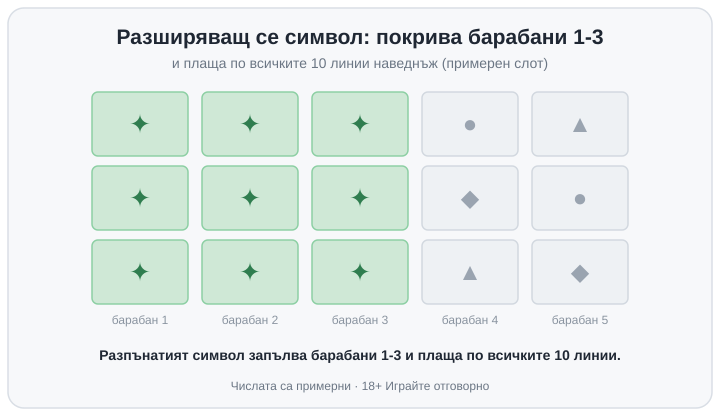

Title tag: Разширяващи се символи в слотовете: как работят
Meta description: Разширяващият се символ покрива целия барабан и плаща по всички позиции в безплатните завъртания. Защо е зрелищно, но RTP вече го е сметнал.

---

# Разширяващи се символи (expanding symbols) в слотовете: как работят

Разширяващият се символ е специален символ, който при падане се разпъва нагоре и надолу, докато покрие целия барабан, и после плаща все едно стои на всяка позиция по него. Вместо една кутийка на екрана заема цяла колона, което в точния момент превръща едно попадение в печалба по няколко линии наведнъж.

## Как се задейства, най-често в безплатните завъртания

В повечето игри разширяването живее в бонус рунда, а класическият модел идва от book-слотовете. Там, преди да започнат безплатните завъртания, играта избира на случаен принцип един символ и точно той става разширяващ за целия рунд. Паднат ли три book символа, обикновено получаваш десет завъртания. Когато избраният символ се появи по време на тях, се разпъва по барабана и се брои по всяка своя позиция, без да му трябва съседство по активна линия, почти както би действал scatter. Ако по време на рунда отново паднат три такива символа, завъртанията се подновяват със същия избран символ. Тези правила ги намираш в [речника с казино термини](/blog/rechnik-kazino-termini/) и в правилата на самата игра, които винаги си струва да отвориш преди първия залог.

## Къде се обърква с други механики

Разширяващият се символ лесно се бърка с разширяващия се wild, но двете работят различно. Wild-ът замества други символи, за да дооформи комбинации, и когато е от разпъващ се вид, прави това по цяла колона; разширяващият специален символ в book-слотовете не замества нищо, а плаща за себе си по целия барабан. Различен е и от [гигантските символи](/kazino-igri/rotativki/) (colossal), които падат като голям блок още от началото и покриват няколко позиции наведнъж, без да тръгват от размер едно на едно. Трите водят до усещане за едри печалби по различен път.

## Защо щедростта вече е в числото

Разпъването изглежда като чист бонус, но процентът на връщане, RTP, вече го е отчел. RTP е дългосрочната теоретична статистика върху милиони завъртания и се смята върху цялата игра, включително ефекта на разширяването в бонус рунда. Когато един символ може да покрие цял барабан и да плати по всички линии, тази рядка експлозия се балансира другаде: по-ниски базови изплащания, един-единствен избран символ вместо всички, по-рядко влизане в самите безплатни завъртания. Крайният RTP излиза какъвто е заложен, не по-висок заради зрелищния момент. Разширяването мести по-голямата част от [възвръщаемостта](/slot-igri/visok-rtp/) към бонус рунда и прави резултатите по-разхвърляни във времето.

## Пример с илюстративни числа

Да речем слот с 10 линии и един избран символ за безплатните завъртания. Пада ти на барабани 1, 2 и 3 и всеки от тях се разпъва по цялата си височина. Сега символът стои на всяка позиция от тези три барабана и играта плаща по всичките 10 линии едновременно, вместо по една или две. Изглежда огромно за този спин, но игра с такъв момент обикновено носи по-скромни печалби в основния режим, за да излезе сметката. Числата тук са примерни и служат само да покажат ефекта; конкретната игра може да има друг брой линии и друга таблица.

*Примерен слот с 10 линии: избраният символ се разпъва на барабани 1-3 и плаща по всички линии наведнъж. Числата са илюстративни.*

## Как да гледаш на разширяващия символ

Разширяването е добре измислен начин една игра да събере рядко, но ефектно плащане в бонус рунда. Прави безплатните завъртания напрегнати и зрелищни, и точно затова се продава толкова лесно. Дългосрочната възвръщаемост зависи от RTP на играта, докато разпъването управлява само усещането по време на рунда. Избирай слот заради темпото и бюджета, който ти понася; зрелището на една светнала колона не е причина само по себе си. Хазартът е платено забавление с предварително известна цена, затова залагай пари, които можеш да изгубиш цели, и си сложи лимит преди първия спин. Усетиш ли, че гониш точно този голям рунд, време е да спреш и да погледнеш [инструментите за отговорна игра](/otgovorna-igra/). 18+ Хазартът може да пристрасти. Играйте отговорно.

**Георги Тодоров**
Публикувано: 04.10.2026 · Последна редакция: 04.10.2026

[About Всички Казина boilerplate]

**Отговорна игра.** 18+ Хазартът може да пристрасти. Играйте отговорно. Ако усетиш, че играта излиза извън контрол или искаш да я ограничиш, виж [инструментите за отговорна игра](/otgovorna-igra/) и възможността за самоизключване чрез националния регистър на уязвимите лица към НАП (подава се писмено само от засегнатото лице). Национална информационна линия за наркотиците, алкохола и хазарта („Солидарност") 0888 99 18 66, делнични дни 10:00–17:00.

**Разкриване на партньорства.** Всички Казина съдържа партньорски (афилиейт) връзки; когато отвориш оферта през такава връзка, това може да финансира сайта, без да променя цената за теб и без да влияе на оценките ни. От 1 август 2026 г. дейността на афилиейт оператори в България се лицензира съгласно Закона за държавния бюджет за 2026 г. (ДВ, бр. 69 от 31.07.2026 г.). Всички Казина е подало заявление за лиценз пред Националната агенция по приходите и очаква издаването му.
