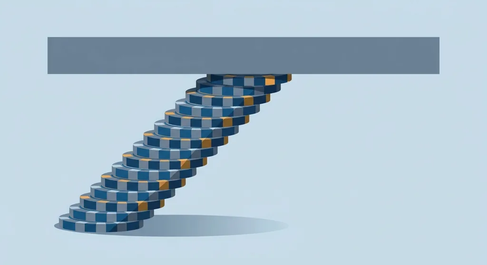
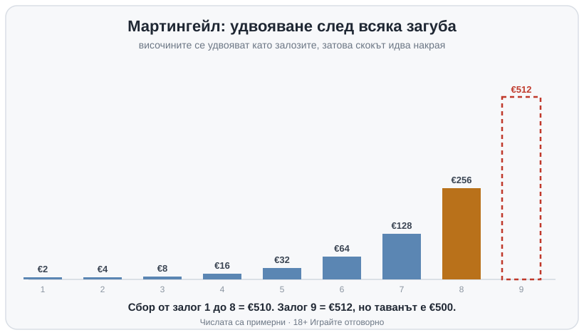

Title tag: Системи за залагане: бият ли казиното?
Meta description: Мартингейл, Фибоначи, Д'Аламбер и Пароли: защо системите за залагане не променят домашното предимство и къде се чупят на практика.

---

# Системи за залагане: защо Мартингейл, Фибоначи и Д'Аламбер не бият казиното

Системите за залагане са правила колко да заложиш на следващия кръг според това какво се е случило на предишния. Повечето се делят на две фамилии: едните вдигат залога след загуба, другите след печалба. И двете обещават едно и също на пръв поглед: върнати загуби или заключена печалба по предварителен план. Само че нито едно от тези правила не пипа предимството, с което казиното влиза във всеки отделен залог.

## Негативните прогресии: вдигаш залога, за да гониш загубата

Най-известната е Мартингейл и логиката ѝ е проста до грубост: удвояваш след всяка загуба, докато дойде печалба, и тогава си прибрал обратно всичко изгубено дотук плюс една стартова единица отгоре. Д'Аламбер смекчава удара, вместо да удвоява, качва с една единица след загуба и сваля с една след печалба. Фибоначи пък се води по прочутата редица (1, 1, 2, 3, 5, 8, 13 и нататък), като след загуба пристъпваш една крачка напред по нея, а след печалба се връщаш две назад. На хартия темпото им е различно, но при трите целта е една и съща: да качиш залога достатъчно, че една печалба да покрие всичко изгубено наведнъж. Най-често ще ги видиш на [рулетката](/kazino-igri/ruletka/), защото там има залози близо до 50/50, върху които прогресията изглежда най-подредена.

## Пароли: същата логика, обърната наопаки

Пароли обръща посоката, качваш след печалба, не след загуба. Удвояваш, докато серията държи, и прибираш след няколко поредни печалби или в мига, в който една загуба те връща на стартовата единица. Рискът тук е друг: залагаш спечеленото, докато основният ти банкрол стои настрани, затова единичната загуба боли по-малко и мнозина я предпочитат заради това. Предимството на казиното обаче си стои непокътнато върху всеки залог, точно както при негативните прогресии, само че сега се начислява върху печалбата ти.

## Защо математиката изобщо не помръдва

Колкото и системи да сменяш, едно число не помръдва: домашното предимство. То се начислява върху всеки залог поотделно, а рулетковото колело и генераторът на случайни числа нямат памет, какво е паднало последните осем пъти не казва нищо за деветото завъртане. Големият залог не носи по-малко предимство на казиното, носи същия процент, само изчислен върху по-голяма сума, тоест по-голяма очаквана загуба в абсолютни пари. Събереш ли поредица залози, всеки от които е в полза на казиното, сборът им също е в негова полза. Прогресията само подрежда кога залагаш колко и нищо повече, а очакваният резултат от цялата серия излиза същият, както ако беше залагал една и съща сума всеки път. При [блекджека](/kazino-igri/blakdzhak/) разликата се вижда ясно, базовата стратегия наистина свива предимството, защото мени решенията в самата игра, но прогресията само върху размера на залога не прави за него нищо.

## Защо все пак изглежда, че работи

Уловката е в краткия срок. Негативните прогресии печелят малко и често, защото в повечето случаи печелившата ръка идва преди банкролът да се е изчерпал и връща дребната единица обратно. Точно тази върволица от дребни победи създава усещането, че залагателната система е открила нещо истинско. Голямата рядка загуба обаче е статистически неизбежна, рано или късно идва серия, достатъчно дълга да опре в тавана на масата или в дъното на банкрола, и тя сама изтрива десетките предишни малки печалби.

## Къде се чупи на практика

Най-лесно се вижда с едно примерно разиграване. Тръгваш с €2 на залог близо до 50/50 и удвояваш при всяка загуба: 2, 4, 8, 16, 32, 64, 128, 256. Осем поредни загуби, което за една вечер на [масата](/kazino-igri/) съвсем не е рядкост, и вече си заложил 510 евро. Деветият залог по правило трябва да е €512, но таванът на масата е €500 и ти просто не можеш да го направиш. Оставаш 510 евро минус, в преследване на 2 евро печалба. Числата са примерни, стартовата единица и таванът се менят от маса на маса, но аритметиката на удвояването е една и съща навсякъде.

*Примерна прогресия на Мартингейл: осем удвоявания от €2 правят €510 заложени, а деветият залог €512 опира в таван €500. Числата са илюстративни.*

## Какво всъщност купуваш със система

Системите за залагане ти продават усещане за контрол, докато колелото се върти само за себе си. За кратко вършат работа и точно това ги прави подвеждащи, нижат ти дребни победи, преди една серия да прибере всичко наведнъж. Затова, ако залагаш, залагай сума, която можеш да изгубиш цялата, задай си лимит още преди първия залог и гледай на всяка прогресия като на начин да похарчиш банкрола по-бързо, а не по-умно. Усетиш ли, че гониш загуба по план, това е моментът да спреш и да погледнеш [инструментите за отговорна игра](/otgovorna-igra/). 18+ Хазартът може да пристрасти. Играйте отговорно.

**Георги Тодоров**
Публикувано: 04.10.2026 · Последна редакция: 04.10.2026

[About Всички Казина boilerplate]

**Отговорна игра.** 18+ Хазартът може да пристрасти. Играйте отговорно. Ако усетиш, че играта излиза извън контрол или искаш да я ограничиш, виж [инструментите за отговорна игра](/otgovorna-igra/) и възможността за самоизключване чрез националния регистър на уязвимите лица към НАП (подава се писмено само от засегнатото лице). Национална информационна линия за наркотиците, алкохола и хазарта („Солидарност") 0888 99 18 66, делнични дни 10:00–17:00.

**Разкриване на партньорства.** Всички Казина съдържа партньорски (афилиейт) връзки; когато отвориш оферта през такава връзка, това може да финансира сайта, без да променя цената за теб и без да влияе на оценките ни. От 1 август 2026 г. дейността на афилиейт оператори в България се лицензира съгласно Закона за държавния бюджет за 2026 г. (ДВ, бр. 69 от 31.07.2026 г.). Всички Казина е подало заявление за лиценз пред Националната агенция по приходите и очаква издаването му.
