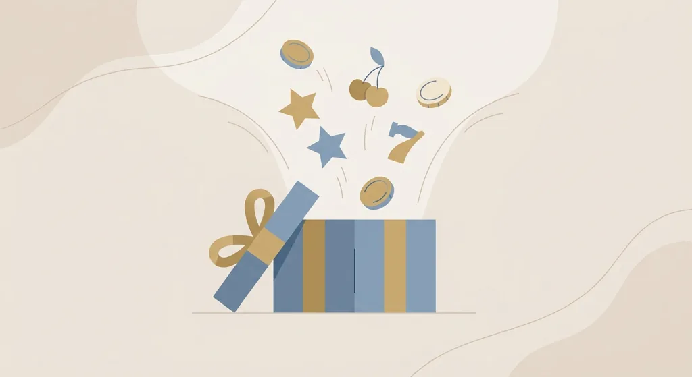
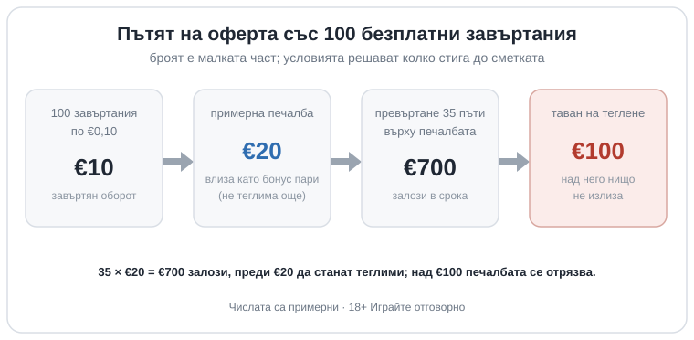

Title tag: Безплатни завъртания (free spins): видове и условия
Meta description: Безплатните завъртания са безплатни, но печалбата идва като бонус пари с превъртане и таван на теглене. Видовете, условията и къде е истинската уловка.

---

# Безплатни завъртания (free spins): видове, условия и къде е уловката

Безплатните завъртания са определен брой завъртания на избран слот, за които не плащаш от джоба си. Казиното задава кой е слотът и колко струва едно завъртане, а ти просто натискаш бутона уговорения брой пъти. Думата „безплатни" обаче се отнася само за самото завъртане. Печалбата, ако дойде, рядко е свободна за теглене веднага, и точно там се крие цялата оферта.

## Видовете, които ще срещнеш

Най-често безплатните завъртания идват след депозит или като част от бонуса за добре дошли: зареждаш сметката си и получаваш пакета заедно с парите. Има и завъртания без депозит, които казиното дава само за регистрация, но те обикновено носят таван колко можеш да спечелиш и почти винаги искат поне един депозит, преди каквато и да е печалба да напусне сметката. Релоуд завъртанията са периодични, за връщащи се играчи, и често стъпват на малко условие да си депозирал през деня. По-рядко се срещат и завъртания без залог (wager-free): при тях спечеленото е истински твое веднага, но пакетите са малки и срокът е кратък. Отделно стоят завъртанията, които печелиш вътре в самата игра чрез scatter символи. Те са част от механиката на слота, не бонус оферта, и не бива да се бъркат с промоционалните пакети.

## Колко струва едно завъртане

Стойността на завъртането я определя казиното, не ти. При €0,10 на завъртане сто безплатни завъртания означават €10 завъртян оборот, не €100 в брой. Голямото число в банера брои завъртания, а не левове, и затова рядко казва това, което изглежда, че казва.

## Печалбата е бонус пари, не твои пари още

Спечеленото от безплатните завъртания почти винаги влиза като бонус пари и подлежи на превъртане, преди да можеш да го изтеглиш. За завъртанията базата обикновено е само печалбата (winnings-only): ако изкараш €20 и превъртането е 35 пъти, трябва да заложиш 35 × €20, тоест €700, в рамките на срока, за да отключиш тези €20. Размерът варира: при безплатни завъртания 20 до 40 пъти е обичайно, а всичко до 10 пъти е наистина добра оферта. Към това вървят срок на валидност, който е от няколко часа до седмица, рядко до трийсет дни, и често таван на залога с бонус пари, някъде около €5 на завъртане, който анулира бонуса, ако го прескочиш. Как работи механизмът на превъртането в детайли си струва да се прочете отделно в [ръководството за разиграването](/blog/kak-raboti-razigravaneto/), защото той важи за всеки бонус, не само за завъртанията.

## Таванът на теглене, тихата граница

Дори да изкараш добра сума през превъртането, много оферти за безплатни завъртания слагат горна граница на това колко от нея изобщо може да излезе. Таван от €100 означава, че печалба над €100 просто се отрязва, колкото и да е голяма. Към това се добавя кои игри важат: безплатните завъртания често са само за един определен слот или кратък списък, а при превъртането слотовете броят към сто процента, докато масите и казиното на живо често дават десет процента или нула. Завъртанията без депозит са най-стегнати по всички тези линии наведнъж, което е и причината да ги видиш рекламирани най-шумно. Как изглеждат те в детайли е разгледано в [бонусите без депозит](/blog/bonus-bez-depozit-2026/).

## Пример с илюстративни числа

Сто безплатни завъртания по €0,10 дават €10 завъртян оборот, не повече. Ако от тях излязат €20 печалба и превъртането е 35 пъти върху печалбата, дължиш 35 × €20, тоест €700 залози, преди €20 да станат теглими. Ако офертата има и таван на теглене от €100, над тази сума нищо не излиза, дори да ти провърви през превъртането. Числата тук са примерни; реалните стоят в условията на конкретната оферта и почти винаги са по-малко щедри, отколкото звучи броят завъртания.

*Примерен път на оферта със 100 безплатни завъртания: броят е малката част, условията решават колко стига до сметката. Числата са илюстративни.*

## Как да четеш оферта с безплатни завъртания

Преди да приемеш пакет, виж стойността на едно завъртане, базата и размера на превъртането, срока, тавана на теглене и за кои игри важат. Тези пет реда казват повече от броя завъртания в заглавието. Актуалните оферти и условията им можеш да сравниш в раздела [безплатни завъртания](/bonusi/bezplatni-zavartania/), където числата са на едно място. Броят завъртания в банера е най-малко важното число в цялата оферта; стойността винаги е в дребния шрифт, не в едрия. Казиното е платено забавление с предварително известна цена, не начин за печалба, затова приемай завъртания само върху бюджет, който можеш да изгубиш цял, и си сложи лимит, преди да натиснеш първия бутон. Ако усетиш, че гониш отключването на всяка цена, спри и погледни [инструментите за отговорна игра](/otgovorna-igra/). 18+ Хазартът може да пристрасти. Играйте отговорно.

**Георги Тодоров**
Публикувано: 05.10.2026 · Последна редакция: 05.10.2026

[About Всички Казина boilerplate]

**Отговорна игра.** 18+ Хазартът може да пристрасти. Играйте отговорно. Ако усетиш, че играта излиза извън контрол или искаш да я ограничиш, виж [инструментите за отговорна игра](/otgovorna-igra/) и възможността за самоизключване чрез националния регистър на уязвимите лица към НАП (подава се писмено само от засегнатото лице). Национална информационна линия за наркотиците, алкохола и хазарта („Солидарност") 0888 99 18 66, делнични дни 10:00–17:00.

**Разкриване на партньорства.** Всички Казина съдържа партньорски (афилиейт) връзки; когато отвориш оферта през такава връзка, това може да финансира сайта, без да променя цената за теб и без да влияе на оценките ни. От 1 август 2026 г. дейността на афилиейт оператори в България се лицензира съгласно Закона за държавния бюджет за 2026 г. (ДВ, бр. 69 от 31.07.2026 г.). Всички Казина е подало заявление за лиценз пред Националната агенция по приходите и очаква издаването му.
