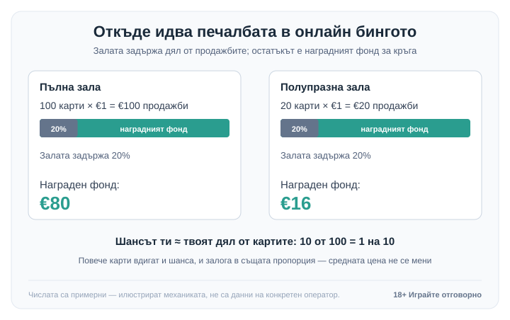

Title tag: Онлайн бинго: правила, видове и реалните шансове
Meta description: Как се играе онлайн бинго: правилата, разликата между 90 и 75 топки и откъде идва наградата. Защо една карта плаща различно според броя играчи в залата.

---

# Онлайн бинго: правила, видове карти и как всъщност се формира наградата

Бингото е лотария с компания. Теглят се числа, ти ги зачеркваш на картата си и първият, който запълни искания ред или шаблон, печели. Онлайн версията прави същото, само че топките ги вади генератор, а картите се маркират с едно докосване. Най-важната разлика с ротативката обаче не е на екрана: в бингото не играеш срещу „къщата", а срещу останалите в залата, и точно това мени сметката за парите ти. Правилата се усвояват за пет минути, ако тепърва избираш откъде да започнеш из [казино игрите](/kazino-igri/). По-коварна е частта за възвръщаемостта, която много хора четат погрешно.

## Как върви един кръг

Купуваш си една или няколко карти, системата започва да тегли числа едно по едно и всяко твое съвпадение се отбелязва. В онлайн залата обикновено има авто-маркиране, тоест софтуерът сам зачерква падналите ти числа, за да не изпуснеш печалба, докато гледаш настрани. Щом запълниш реда или фигурата, която печели в тази игра, „бингото" се обявява автоматично и печалбата се проверява без спорове на масата.

Кои числа стоят на картата ти няма значение за шанса. Тегленето е случайно и не помни предишния кръг, така че „щастливи" числа и теории за топли и студени топки няма. Единственото, което наистина мени шанса ти, е колко карти държиш спрямо останалите в залата.

## Двата основни формата: 90 и 75 топки

Повечето онлайн зали предлагат два варианта. Макар да ги събираме под едно име, правилата им се различават достатъчно, че да ги мислиш като отделни игри.

**90 топки** е британският формат. Билетът е решетка от 27 полета в 9 колони и 3 реда, но във всеки ред има само 5 числа и 4 празни полета, тоест 15 числа общо на билет. Числата са от 1 до 90, а билетите често се продават в лента от 6, в която се събират всичките 90 числа. В един кръг се печели на три нива: първо за **един ред** (петте числа на кой да е хоризонтален ред), после за **два реда** на същия билет и накрая за **пълна къща**, когато паднат всичките 15 числа. Трите награди обикновено стават все по-големи, като пълната къща е основната.

**75 топки** е американският формат и се играе на квадратна карта 5 на 5, тоест 25 полета, като централното е свободно и се брои за вече запълнено. Остават 24 числа от 1 до 75. Колоните носят буквите на думата B-I-N-G-O и всяка тегли от собствен обхват: B от 1 до 15, I от 16 до 30, N от 31 до 45, G от 46 до 60 и O от 61 до 75. Тук не гониш просто редове, а шаблон, който играта обявява предварително: хоризонтал, вертикал, диагонал, а в специалните игри четирите ъгъла или цялата карта, запълнена докрай (пълно покритие на 24-те числа). Затова при 75 топки първо проверяваш коя фигура печели, преди да започнеш.

Има и по-бързи варианти, например 30 топки на малка карта 3 на 3 или 80 топки на карта 4 на 4. По-малко топки значи по-кратък кръг и по-бързо темпо, което е приятно, но и по-лесно отнася баланса, защото залозите се трупат по-начесто.

## Откъде идва печалбата (и цената)

При ротативката има едно публикувано число, RTP, и то горе-долу ти казва колко се връща в дълъг план. Бингото работи иначе. Залата събира парите от продадените карти, задържа си дял за себе си (такса за участие), а останалото слага в награден фонд, който се поделя между печелившите в кръга. Твоето дългосрочно връщане зависи от две неща наведнъж: какъв дял задържа залата и колко души делят фонда.

Точният процент на тази такса варира силно според залата, оператора и формата, затова не вярвай на закръглено „RTP на бингото", извадено отникъде. Числата по-долу са примерни, колкото да се види механиката, а не данни на конкретен оператор, затова провери реалната такса и условията в самата зала, преди да играеш.

*Примерни числа: таксата на залата (тук 20%) е твоята реална цена, а не публикувано „RTP"; наградният фонд и шансът ти зависят и от това колко души делят печалбата.*

Числата по-долу са примерни, за да се види механиката. Да речем, че 100 играчи купуват по една карта за €1, което прави €100 продажби. Ако залата задържи 20%, в наградния фонд остават €80 и те се делят между печелившите онзи кръг. Дългосрочната ти цена е именно делът, който залата задържа, независимо кой прибира фонда. Пусни същата игра с 20 играчи и имаш €20 продажби и €16 фонд: единичната ти карта е доста по-вероятно да спечели, но наградата е по-малка. Делът на залата, тоест цената, остава пропорционално същият. Мени се само колко голяма и колко честа е печалбата. Точно затова едно число за връщане казва по-малко при бингото, отколкото при слота, и защо гледаме на цената на играта като на реална стойност в [методологията ни](/kak-ocenyavame/).

## Реалните шансове: твоят дял от картите

Щом фондът се дели, шансът ти да спечелиш конкретна награда в един кръг е горе-долу твоят дял от всички карти в игра. Държиш 10 от общо 100 карти, значи имаш около 1 на 10 за тази награда. Купиш ли повече карти, вдигаш шанса, но вдигаш и залога си в същата пропорция, така че средната сметка не се подобрява, само разсейването става по-голямо. В пълна зала с много играчи една карта печели рядко, докато в полупразна печалбата идва доста по-често — само че е по-малка, понеже фондът е по-тънък и се дели между по-малко хора.

Останалото е чиста случайност. Генераторът тегли без спомен за миналия кръг, редът на буквите B-I-N-G-O е само подредба на екрана, а авто-маркирането не ти дава предимство, то само пази да не изпуснеш съвпадение. Бързите кръгове и десетките карти наведнъж създават усещане за действие и контрол, но решението кое число ще падне не е твое в нито един момент.

## Темпото на игра и контролът над бюджета

Като социална игра с ниска входна цена бингото е сред по-безобидните неща в казиното: евтина карта, малко чакане, понякога чат отстрани. Проблемът идва от темпото — онлайн кръговете вървят бързо, авто-маркирането те кара да държиш все повече карти наведнъж, а няколко евро на кръг се събират в сериозна сума за вечер, без да усетиш кога. При бингото тази цена просто не стои изписана като едно число; тя е скрита в таксата на залата и в поделянето на фонда.

Сложи си лимит на депозита още преди първата карта и гледай на похарченото като на цена за забавление, а не като на начин да върнеш загубеното с още карти. Хазартът не е финансова стратегия. Ако усетиш, че играта престава да е забавление, [инструментите за отговорна игра](/otgovorna-igra/) са доброто място да спреш навреме.

18+ Хазартът може да пристрасти. Играйте отговорно.

**Георги Тодоров**
Публикувано: 09.10.2026 · Последна редакция: 09.10.2026

[About Всички Казина boilerplate]

**Отговорна игра.** 18+ Хазартът може да пристрасти. Играйте отговорно. Ако усетиш, че играта излиза извън контрол или искаш да я ограничиш, виж [инструментите за отговорна игра](/otgovorna-igra/) и възможността за самоизключване чрез националния регистър на уязвимите лица към НАП (подава се писмено само от засегнатото лице). Национална информационна линия за наркотиците, алкохола и хазарта („Солидарност") 0888 99 18 66, делнични дни 10:00–17:00.

**Разкриване на партньорства.** Всички Казина съдържа партньорски (афилиейт) връзки; когато отвориш оферта през такава връзка, това може да финансира сайта, без да променя цената за теб и без да влияе на оценките ни. От 1 август 2026 г. дейността на афилиейт оператори в България се лицензира съгласно Закона за държавния бюджет за 2026 г. (ДВ, бр. 69 от 31.07.2026 г.). Всички Казина е подало заявление за лиценз пред Националната агенция по приходите и очаква издаването му.
