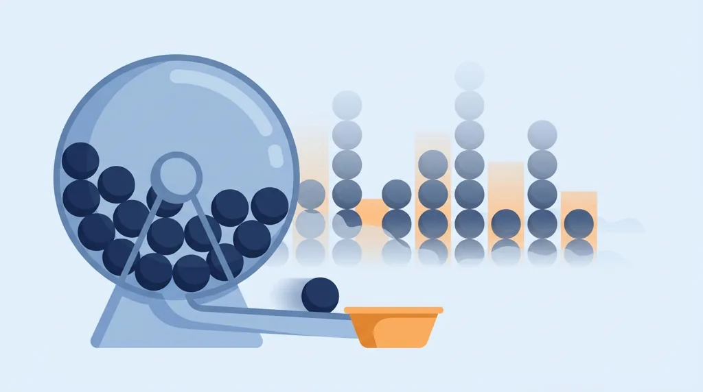
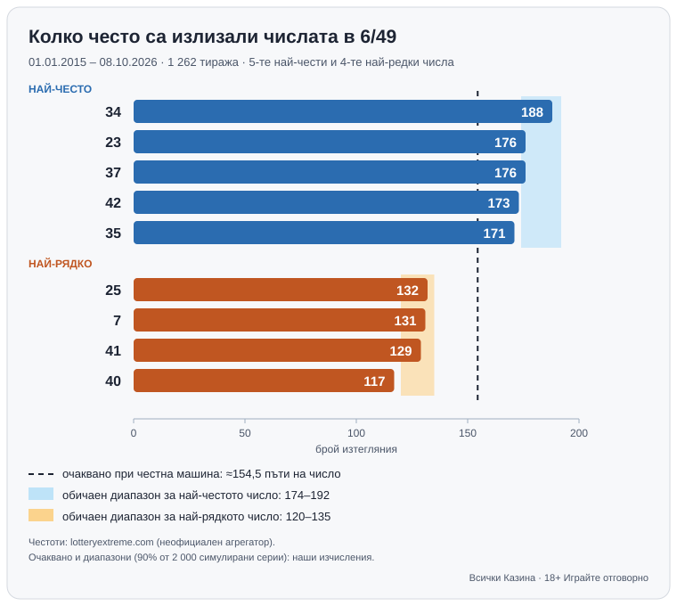

Title tag: Числата от тотото: статистика и митът за горещите числа
Meta description: Числата от тотото през статистиката: честотна таблица 6/49 за 1 262 тиража, „просрочени" числа и защо всяка комбинация има еднакъв шанс.
Slug: /blog/chislata-ot-toto-statistika/

Byline: Георги Тодоров | Market: BG | Type: guide (editorial voice, no anecdotes, no affiliate links)

---

# Числата от тотото: какво казва статистиката и защо няма „горещи" числа

Автор: Георги Тодоров · Публикувано: 10.10.2026 · Актуализирано: 10.10.2026
Данните са проверени към 10.10.2026.

Последните изтеглени числа от тотото гледайте в официалните резултати на [toto.bg](https://www.toto.bg/), ние не публикуваме тиражи.

В ТОТО 2 – 6/49 всяко число има шанс 6/49, около 12,24%, да попадне сред изтеглените, във всеки тираж поотделно. Дали е излизало миналата седмица, или не се е появявало от юни, за този процент няма никакво значение.

Тук ще намерите какво показва честотната таблица, защо „просрочените" числа не идват по-скоро и единственото, което изборът на числа наистина променя. Няма да намерите „числа за игра" или система, която бие тиража, защото такива не съществуват.

## Как се теглят числата в ТОТО 2

Българският спортен тотализатор (БСТ) провежда по два тиража седмично, нечетен и четен. Тегленията на ТОТО 2 – 6/49, 5/35 и 6/42 се излъчват на живо по БНТ в четвъртък и неделя от 18:45 ч.

В 6/49 се теглят 6 числа от 49, в 6/42 са 6 от 42. При 5/35 един тираж всъщност съдържа две отделни тегления, I-во и II-ро, всяко по 5 числа от 35, така че ако следите числа за тото 5/35, шансът конкретно число да е сред петте в едно теглене е 5/35, тоест 1/7 или около 14,29%.

Числата вади машина пред камера. Тя не помни какво е изтеглила миналия път.

## Честотната таблица на числата от тотото 6/49

Най-подробните данни, които открихме, са от неофициалния агрегатор lotteryextreme.com: таблица с честотата на всяко число в 6/49 за периода 01.01.2015 – 08.10.2026. Сборът от всички 49 честоти е 7 572 изтеглени числа, което при 6 числа на тираж прави 1 262 тиража. Данните не са сверени с официалния архив на БСТ, затова ги приемайте като ориентир от неофициален източник.

### Най-често и най-рядко падащите числа

| Число | Изтеглено (пъти) | Група |
|---|---|---|
| 34 | 188 | най-често |
| 23 | 176 | най-често |
| 37 | 176 | най-често |
| 42 | 173 | най-често |
| 35 | 171 | най-често |
| 25 | 132 | най-рядко |
| 7 | 131 | най-рядко |
| 41 | 129 | най-рядко |
| 40 | 117 | най-рядко |

*Честотите в таблицата са от неофициалния агрегатор и не са сверени с официалния архив на БСТ.*

Между 34 и 40 зейва разлика от 71 изтегляния, достатъчно голяма, за да мине за улика, че някои топки „обичат" да излизат.

### Колко голяма е разликата при напълно честна машина

При 1 262 тиража и вероятност 6/49 за всяко число очакваната честота е 1 262 × 6/49 ≈ 154,5 пъти на число, със стандартно отклонение около 11,6. Това са наши изчисления (python3, 10.10.2026), както и всичко останало в тази част. За да видим как изглежда „нормалният" разброс, симулирахме 2 000 серии по 1 262 напълно честни тиража 6/49 и във всяка серия записахме най-честото и най-рядкото число.

В типичната серия шампионът излиза около 181 пъти (в 90% от сериите между 174 и 192), а аутсайдерът около 129 пъти (в 90% от сериите между 120 и 135), така че дори идеално честна машина почти винаги оставя разлика от 60–70 пъти между върха и дъното на таблицата. Реалните 188 за числото 34 попадат точно в обичайния диапазон. С 117 числото 40 е малко под него. При 49 числа и 1 262 тиража някое все трябва да се окаже на ръба, този път се падна то.

Проверихме и цялото разпределение наведнъж с хи-квадрат тест, като p-стойността изчислихме от 3 000 симулирани серии. Получихме около 0,06, над обичайния праг 0,05, тоест таблицата не показва статистически значимо отклонение от равномерното разпределение. Идеално равна не е (и 0,06 не е далеч от прага), но разликите в нея случайността обяснява и сама, без „горещи" топки и без нагласени машини.

*Най-честите и най-редките числа в 6/49 спрямо очакваното при честна машина. Честоти: неофициален агрегатор; очаквано и диапазони: наши изчисления.*

## „Просрочените" числа и заблудата на играча

Към 08.10.2026, по данните на същия неофициален агрегатор, числото 40 не е излизало 33 поредни тиража, последно е изтеглено на 18.06.2026. Сайтовете със статистика тото наричат такива числа „просрочени" или „студени" и намекват, че скоро им идва редът.

Шансът конкретно число да пропусне 33 поредни тиража е (43/49)^33, около 1,3%. За едно-единствено число е рядко. В играта обаче има 49 числа, всяко носи този малък шанс по всяко време, и при толкова кандидати поне едно почти винаги изостава толкова дълго; таблица без нито едно „просрочено" число би била по-подозрителна от тази. А в следващия тираж 40 има 12,24% шанс да излезе, колкото и „горещото" 34.

Вярата, че след дълга пауза числото „трябва" да се появи, за да се изравни сметката, се нарича заблуда на играча (gambler's fallacy). Законът за големите числа действа, но чрез разреждане. Изоставане от двайсетина или трийсет тиража никой не наваксва с по-чести изтегляния на 40; когато тиражите станат хиляди, то просто тежи все по-малко в общия сбор. Число, изтеглено няколко пъти подред, пък нито е „в серия", нито се е „изчерпало", защото всеки тираж започва от нулата.

## Когато шестте числа се повториха (септември 2009)

На 06.09.2009 в тиража на българската лотария бяха изтеглени числата 4, 15, 23, 24, 35 и 42, вероятно в играта 6 от 42. Никой не позна шестицата.

На 10.09.2009, в следващия тираж, машината изтегли на живо по телевизията същите шест числа, в различен ред. Този път рекордните 18 души познаха всичките шест и всеки получи по 10 164 лв., около 5 197 € по фиксирания курс 1,95583 (наша сметка).

Тогавашният спортен министър Свилен Нейков разпореди проверка. Комисията с председател Константин Симеонов не откри нарушение („не можем да говорим за манипулация"), а организаторите определиха случилото се като „странно съвпадение". Математикът Михаил Константинов оцени шанса за такова повторение на „1 към над 4 милиона".

BBC и Reuters отразиха историята и у нас трудно ще се намери по-нагледен урок по независимост на тиражите. Ако машината помнеше какво е изтеглила преди четири дни, повторението би било невъзможно, а то се случи пред камерите и мина проверка. Случаят показва и как се дели печалбата: при 18 печеливши всеки взе само част от сумата за категорията. Защо толкова хора са имали точно тези числа, източниците не казват. Нашата хипотеза е, че мнозина просто са заложили числата от предишния тираж.

## Единственото, което изборът на числа променя

Каквито и числа за тото да изберете, шансът за печалба не мърда, а изборът влияе само на това с колко души ще делите печалбата, ако все пак спечелите.

Печалбите в ТОТО 2 по принцип се разпределят между всички печеливши комбинации в съответната категория, затова изплащанията се менят от тираж на тираж (точната формулировка е в правилата на БСТ). Осемнайсетте победители от 2009 г. са крайният пример. А много хора избират числата си по сходни начини: рождени дати (тоест числа от 1 до 31), „късметлийски" числа, геометрични шарки или линии върху фиша, последователни числа, числата от последния тираж.

Комбинация, която следва популярен модел, има точно същия шанс да спечели, просто при печалба е по-вероятно да я поделите с повече хора. По-„непопулярните" числа не ви доближават до джакпота с нищо и не са метод за печалба. В най-добрия случай влияят на дела ви, ако го ударите.

## 1-2-3-4-5-6 има същия шанс като всяка друга комбинация

Шансът за джакпот с един фиш в едно теглене е 1 към 13 983 816 за 6/49, 1 към 5 245 786 за 6/42 и 1 към 324 632 за 5/35.

Да, и за 1-2-3-4-5-6 е точно 1 към 13 983 816, колкото за всяка друга комбинация. Абсурдно изглежда само на фиша; машината не знае, че числата са подред.

## Числата като забавление

Любимата дата, рождените дни в семейството, числата, които попълвате от години: ритуалът е част от удоволствието от тотото и в него няма нищо лошо, докато остава игра.

Проблемът започва, когато ритуалът се превърне в „метод" и залозите растат, защото някоя таблица уж подсказва нещо. Тото и лото са числови лотарийни игри по българския [Закон за хазарта](/zakonno-li-e/), който забранява участие на непълнолетни, така че играта е само за 18+. НАП съветва бюджетът за хазарт да не надвишава 5% от нетния ви доход, да не гоните загубите и напомня, че „стратегиите за добър късмет" не увеличават шансовете. Ако играта престане да е забавление, можете да се впишете в националния регистър на уязвимите лица към НАП (чл. 10г от ЗХ), а информация получавате на 0700 18 700. Повече има на страницата [Отговорна игра](/otgovorna-igra/) и в раздела [Отговорен хазарт](/blog/responsible-gambling/) в блога на Всички Казина. Ако ви интересува друга игра с теглене на числа, вижте [правилата на кеното](/blog/keno-pravila/).

1 262 тиража 6/49 се държат точно като случайни числа, без статистически значимо отклонение. Сайтовете, които ви продават „горещи" числа, всъщност продават описание на миналото, а следващият тираж пак ще тегли всички топки с еднакъв шанс. Пропуснете ги и играйте с пари, които сте готови да изгубите.

---

**За автора:** Георги Тодоров тества лицензирани в България казино сайтове от 2024 г. със собствен бюджет и проверява лиценза в публичния регистър на НАП преди регистрация. Пише за Всички Казина за реалната цена на бонусите, скоростта на тегленията и математиката зад игрите.

**За Всички Казина:** Всички Казина е независим сайт за сравнение на онлайн казина с лиценз за българския пазар. Не сме оператор и не организираме игри. Сравняваме, проверяваме и обясняваме, за да избирате с отворени очи. Казината оценяваме по публична формула с шест претеглени критерия, а партньорските връзки, които финансират сайта, са обозначени. Тази статия не съдържа партньорски връзки.

**Отговорна игра:** *18+ Хазартът може да пристрасти. Играйте отговорно.* Насоки за лимити и самоизключване: [отговорна игра](/otgovorna-igra/). Самоизключване от всички лицензирани организатори в България: национален регистър на уязвимите лица към НАП (заявява се писмено от самия засегнат). Помощ: Национална информационна линия за наркотиците, алкохола и хазарта „Солидарност" 0888 99 18 66, делнични дни 10:00–17:00.

От 1 август 2026 г. дейността на афилиейт оператори в България се лицензира съгласно Закона за държавния бюджет за 2026 г. (ДВ, бр. 69 от 31.07.2026 г.). Всички Казина е подало заявление за лиценз пред Националната агенция по приходите и очаква издаването му.
