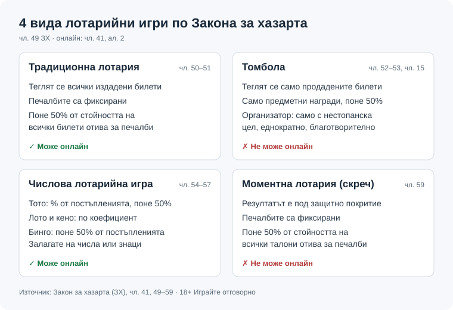
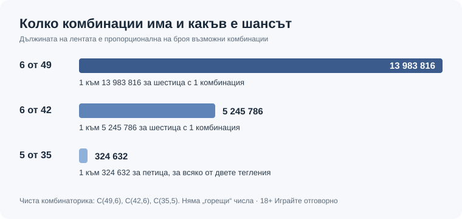

Title tag: Лотария в България: видове, кой я организира и онлайн игра

Meta description: Какво е лотария по Закона за хазарта, четирите вида лотарии, игрите на БСТ, законната онлайн лотария на toto.bg и как да познаете незаконна. 18+

---

# Какво е лотария по закона и какви видове лотарии има в България

Георги Тодоров · Публикувано: 10.10.2026 · Обновено: 10.10.2026

Лотарията е хазартна игра и Законът за хазарта познава четири нейни вида (чл. 41 и чл. 49), а лиценз за почти всички от тях може да получи само държавата, която ги провежда чрез ДП „Български спортен тотализатор" (БСТ) по чл. 4, ал. 3 и чл. 13а. Така е от 2020 г. Изключенията са томболата и бингото, заедно с техните разновидности.

## Четирите вида лотарийни игри според Закона за хазарта

Лотарийните игри са един от петте вида хазартни игри, които чл. 41, ал. 1 ЗХ разрешава (другите четири са залаганията върху спортни състезания и надбягвания с коне и кучета, залаганията върху случайни събития и познаване на факти, игралните автомати и игралното казино). Последното изречение на същата алинея гласи, че начинът и техническите средства, чрез които се предлага една игра, не променят вида ѝ, така че тото на хартиен фиш и тото в браузъра за закона са едно и също.

Разликата между четирите вида е в два въпроса: кои билети влизат в тегленето и от какво зависи печалбата.

**Традиционна лотария.** Всеки билет носи пореден номер, серия и номинал. В тегленето влизат всички издадени билети, включително непродадените. Печалбите са фиксирани по схема, утвърдена предварително от изпълнителния директор на НАП, и не зависят нито от броя продадени билети, нито от броя участници (чл. 50). Като парични и/или предметни печалби се разпределят поне 50% от стойността на всички билети (чл. 51).

**Томбола.** Публичен жребий само между продадените билети, с фиксирани награди, които могат да бъдат единствено предметни и струват поне половината от стойността на билетите (чл. 52).

**Числова лотарийна игра.** Залагате на цифри, комбинации, знаци или фигури и сверявате избора си с изтеглените. Чл. 54 изброява четири разновидности, като всяка изплаща по свое правило. При **тото** печалбите за всеки тираж са предварително определен процент от постъпленията, не по-малко от 50% (чл. 55, ал. 2 и чл. 56). При **лото и кено** печалбата се смята по предварително зададен коефициент и зависи от залога, без връзка с общите постъпления (чл. 55, ал. 3). **Бинго** се играе с талони с готови комбинации; поне 50% от постъпленията отиват за печалби, които се изплащат веднага след обявяването им (чл. 57).

**Моментна лотария.** Или скречът, както всички му казват. Всеки талон носи резултата си: символите стоят под защитно покритие и видът и размерът на печалбата се разкриват, когато го изтриете. Печалбите са фиксирани, общо поне 50% от стойността на всички талони (чл. 59).

*Четирите вида накратко: кои билети се теглят, как се плаща и кои не може да се играят онлайн (чл. 41, ал. 2 ЗХ).*

### Какво всъщност значи „поне 50%"

Ако постъпленията от един тираж на тото са €100 000, законът изисква поне €50 000 от тях да се разпределят като печалби; същото правило важи за бингото. При традиционната и моментната лотария базата е стойността на всички билети, съответно талони, а не сумата, която конкретни играчи са похарчили. Минимумът е за целия фонд. На отделния купувач законът не гарантира нищо от него, а цените на билетите, печелившите категории и данъкът върху печалбите са отделна тема, която този текст не засяга.

## Кой има право да организира лотарийни игри

Всяка хазартна игра в България се провежда само с лиценз от изпълнителния директор на НАП и лицензът покрива единствено играта, изрично посочена в него (чл. 3 ЗХ). Надзорът е при НАП от 8 август 2020 г.

При лотариите кръгът е стеснен до държавата. Чл. 4, ал. 3 (ред. ДВ бр. 14/2021) позволява лиценз за лотарийни игри да се издаде само на нея, с изключение на томбола, бинго и техните разновидности, а чл. 13а определя ДП „Български спортен тотализатор" към министъра на младежта и спорта като структурата, чрез която държавата организира традиционна лотария, числови игри и моментна лотария. На практика тото, лото, традиционната и моментната лотария са само на БСТ, докато бинго може да предлага и друг организатор с лиценз от НАП. Държавата получава лиценза само за подпомагане на спорта, културата, здравеопазването, образованието и социалното дело. С промените от 2020 г. (§ 9 ПЗР, ДВ бр. 14/2020) лицензите за лотарийни игри на организатори извън БСТ бяха прекратени, с изрично изключение за томбола, бинго и кено, като неизплатените печалби остават дължими.

Томбола може да организира само юридическо лице с нестопанска цел (чл. 53), и то еднократно и с благотворителна цел (чл. 15). Томболата на благотворителен бал е наред. Седмичната „томбола" на търговска фирма с парични награди не отговаря на закона.

С кеното положението е мътно. § 9 ПЗР (2020) го изключи от прекратяването на частните лицензи, но действащият чл. 4, ал. 3 (ред. 2021) не го изброява сред изключенията, а действащ частен лиценз за кено след 2020 г. не успяхме да потвърдим [VERIFY: действащ частен лиценз за кено след 2020 г. — регистрите на НАП]. Ако някой ви предложи кено извън БСТ, питайте първо за лиценза и чак после за [правилата за кено](/blog/keno-pravila/).

## Какви лотарии има в България и кои игри провежда БСТ

Когато някой търси „бг лотария", почти винаги има предвид игрите на БСТ. Тотализаторът работи от 12 май 1957 г. [VERIFY: дата — единствен източник bg.wikipedia] и провежда два тиража седмично, нечетен и четен.

Игрите от групата ТОТО 2:

- **6 от 49**: теглят се 6 числа.
- **6 от 42**: също 6 числа, от 42.
- **5 от 35**: две тегления по 5 числа.
- **Тото Джокер**: играе се с „печеливши позиции" и „печеливши числа".
- **Зодиак**: 5 числа плюс „печеливша зодия".
- **Рожден ден**: теглят се година, месец, дата и ден.

Към 6 от 49 и 5 от 35 върви и Втори Тото Шанс. Тегленията на ТОТО 2 заедно с Втори Тото Шанс се излъчват на живо по БНТ в четвъртък и неделя от 18:45 ч., а Рожден ден и Зодиак се теглят след 19:00 ч. във Facebook страницата на БСТ. В гишетата има и моментни (скреч) игри на БСТ, сред тях „Тото джакпот", „Златният билет", „Големият удар" и „Ези или тура".

### Шансовете в 6 от 49, 6 от 42 и 5 от 35

| Игра | Възможни комбинации | Шанс с 1 комбинация |
|---|---|---|
| 6 от 49 | 13 983 816 | 1 към 13 983 816 |
| 6 от 42 | 5 245 786 | 1 към 5 245 786 |
| 5 от 35 | 324 632 | 1 към 324 632 за всяко от двете тегления |

За 5 от 35 сметката е (35 · 34 · 33 · 32 · 31) / (5 · 4 · 3 · 2 · 1) = 38 955 840 / 120 = 324 632. Шестица в 6 от 49 излиза над 40 пъти по-рядко от петица в едно теглене на 5 от 35.

*Колкото по-дълга е лентата, толкова по-малък е шансът с една комбинация.*

„Горещи" или „студени" числа няма, тегленията са независими. Десет различни комбинации в 6 от 49 дават 10 шанса от 13 983 816 (на десетократна цена, разбира се).

## Къде се играе законна онлайн лотария

Онлайн законно се играят всички лотарийни игри без томболата и моментната лотария (чл. 41, ал. 2 ЗХ). За тото, лото и традиционната лотария единственият възможен организатор е БСТ (чл. 4, ал. 3 и чл. 13а), затова законният адрес за тях е toto.bg.

Регистрацията и идентификацията там минават по Наредбата, приета с ПМС № 50 от 15.02.2021 г., като данните се подават към сървър на НАП. Пари се внасят и теглят чрез ePay.bg или с карта през БОРИКА, а печалбите от онлайн фишове за ТОТО 2 и Тото Джокер се прехвърлят автоматично в сметката на играча. В четвъртък и неделя между 18:40 и 19:10 ч. сайтът е недостъпен.

Чуждите сайтове, които предлагат лотария онлайн, не стават законни заради интернет: средството не променя вида на играта (чл. 41), а без български лиценз тя е незаконна. От 01.08.2026 г. НАП спира достъпа до нелицензирани сайтове със собствено решение в рамките на 24 часа (чл. 17, ал. 6). Рискът не е само за сайта. Участието при нелицензиран организатор се наказва с глоба от 500 до 2000 лв. (чл. 9, ал. 14 и чл. 97а, ал. 2 ЗХ) [VERIFY: дали сумата вече е преизчислена в € в консолидирания текст], затова преди регистрация сверете адреса със списъците на НАП за лицензирани и нелицензирани сайтове, както е описано в [проверката на лиценз](/blog/proverka-licenz-kazino/) стъпка по стъпка.

## Как да познаете незаконна лотария

Най-грубата измама се познава от пръв поглед: „спечелихте лотария, платете такса, за да получите наградата".

При билет, фиш или талон на гише нещата са по-фини и си струва да проверите:

- **организатора**: за тото, лото, традиционна и моментна лотария законният организатор е само БСТ (чл. 4, ал. 3 и чл. 13а); томбола и бинго могат да имат и други лицензирани организатори, а кеното остава неизяснен случай;
- **обекта**: продажба само там, където е вписан и обозначен за съответната игра (чл. 9, ал. 9);
- **изплащането**: печалба само в тези обекти или в банка (чл. 9, ал. 10);
- **въпроса за възрастта**: продажбата на лица под 18 години и на поставени под запрещение е забранена (чл. 9, ал. 11), така че продавач, който не пита, е повод за съмнение;
- **кой стои зад „томболата"**: нужни са организатор с нестопанска цел, благотворителна кауза, еднократно провеждане и само предметни награди. Липсва ли едно от четирите, играта не е томбола по закона.

Сигнали за незаконен хазарт се подават на illegal_gambling@nra.bg; анонимните не се разглеждат. Същият имейл важи и когато нарушението не е лотария, а някоя от другите игри, чиито граници описваме в текста за [законността на хазарта](/zakonno-li-e/).

## Колко да харчите и къде да потърсите помощ

НАП препоръчва бюджетът за хазарт да не надхвърля 5% от нетния доход. При нетен доход €1 200 на месец това са до €60 за всички хазартни игри заедно, тотото включително. Загубите не се гонят, а според НАП „стратегиите за добър късмет" не увеличават шансовете.

Ако играта започне да ви контролира, от 12.12.2022 г. съществува регистърът на уязвимите лица (чл. 10г ЗХ). Вписването е за не по-малко от 12 месеца, с искане на хартия в офис на НАП или по имейл до nap@nra.bg с квалифициран електронен подпис. Информация на 0700 18 700. Повече практични стъпки има на страницата за [отговорна игра](/otgovorna-igra/). 18+ Хазартът може да пристрасти. Играйте отговорно.

Един фиш в четвъртък или неделя вечер ви купува шанс 1 към 13 983 816 за шестица. Плащайте го от парите за забавление и ако някога ви се стори, че тото може да е план за пари, препрочетете числото.

*Георги Тодоров*

---

**Отговорна игра.** 18+ Хазартът може да пристрасти. Играйте отговорно. Хазартът не е финансова стратегия: играйте само с пари, които можете да загубите изцяло. Лимити и самоизключване: страницата [Отговорна игра](/otgovorna-igra/) и националният регистър на уязвимите лица към НАП (чл. 10г ЗХ). Национална информационна линия за наркотиците, алкохола и хазарта („Солидарност"): 0888 99 18 66, делнични дни 10:00-17:00.

**Разкриване.** Тази статия няма партньорски връзки и не препоръчва оператор. На други страници Всички Казина се финансира от партньорски връзки, а партньорите са обозначени. От 1 август 2026 г. дейността на афилиейт оператори в България се лицензира съгласно Закона за държавния бюджет за 2026 г. (ДВ, бр. 69 от 31.07.2026 г.). Всички Казина е подало заявление за лиценз пред Националната агенция по приходите и очаква издаването му.

[СЛОТ: За Всички Казина, стандартен текст]

[СЛОТ: Биография на автора, Георги Тодоров]
