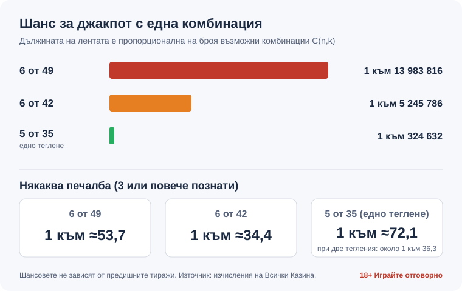

Title tag: Тото 6 от 49, 6/42 и 5/35: правила и шансове | Всички Казина
Meta description: Тото 6 от 49: джакпот 1 към 13 983 816. Сравняваме с 6 от 42 и 5 от 35, кога се тегли ТОТО 2 и коя игра дава най-добър шанс. Резултатите са на toto.bg.

---

Автор: Георги Тодоров · Всички Казина · Публикувано: 10.10.2026 · Последна редакция: 10.10.2026

# Тото 6 от 49, 6 от 42 и 5 от 35: правила, шансове и разлики

Една комбинация в тото 6 от 49 има шанс 1 към 13 983 816 да познае шестте числа. Толкова са всички възможни начини да се изберат 6 числа от 49, а джакпотът печели точно един от тях. В 6 от 42 същото събитие е 1 към 5 245 786, а в едно теглене на 5 от 35 пада до 1 към 324 632. Разликата между трите числови игри на ТОТО 2 е по-голяма, отколкото подсказват рекламите на фиша.

Последните изтеглени числа публикува официално Български спортен тотализатор на [toto.bg](https://www.toto.bg/); тук ги няма, както няма и „подходящи" числа за следващия тираж.

## Трите игри на една страница

| Игра | Колко числа | Тегления в тираж | Джакпот към тираж 79 от 08.10.2026 | Втори ТОТО Шанс |
|---|---|---|---|---|
| 6 от 49 | 6 от 1–49 | 1 | 5 060 115,42 € | да |
| 6 от 42 | 6 от 1–42 | 1 | 1 363 850,28 € | фигурира в списъка с печалби |
| 5 от 35 | 5 от 1–35 | 2 (I и II теглене) | няма натрупващ се джакпот | да |

Най-старата от трите е 6 от 49. БСТ започва дейност на 12 май 1957 г., а „Спорт тото 2 – 6 от 49" тръгва на 29 декември същата година; 5 от 35 се появява на 15 юли 1989 г., 6 от 42 е въведена през 1993 г. Една комбинация във фиша съдържа толкова числа, колкото тегли играта: шест в 6 от 49 и 6 от 42, пет в 5 от 35. В тото 6 49 и в 6/42 се печели при 3, 4, 5 или 6 познати числа. В 5 от 35 печелят 3, 4 или 5 познати, като всяко от двете тегления се брои отделно.

Предварително е обявен само джакпотът. Сумите за 3, 4 и 5 познати са паримутюелни: фондът на категорията се дели между всички, които са я уцелили, и затова се променя всеки тираж. В тиража от 04.10.2026 г. три познати в 6 от 49 са носили 3,30 €, четири 21,10 €, пет 1 051,60 € (по неофициалния агрегатор lotteryextreme.com, несверени с toto.bg). Шестиците в 6/49 и 6/42 тогава остават неспечелени.

## Кога се играе и кога се тегли

БСТ провежда два тиража седмично, нечетен и четен, и ТОТО 2 участва и в двата. Тегленията на 6/49, 6/42 и 5/35 се излъчват на живо по БНТ в четвъртък и неделя от 18:45 ч.

По графика, в сила от 08.12.2022 г., залозите за нечетния тираж се приемат от неделя 19:20 до четвъртък 18:00 ч., а за четния тираж на ТОТО 2 от четвъртък 19:20 до неделя 18:00 ч. Печалбите от нечетния тираж се определят в четвъртък, от четния в неделя. Резултатите се обработват и тиражът се пуска за изплащане до един час след края на телевизионното предаване. Онлайн сайтът пък е недостъпен в четвъртък и неделя от 18:40 до 19:10 ч., тоест точно около тегленето.

## Шансовете, сметнати докрай

C(n, k) е броят на начините да се изберат k числа от n, без значение от реда. Стойностите по-долу не зависят от предишните тиражи и важат еднакво за всеки.

### 6 от 49

Общо комбинации: C(49,6) = 13 983 816.

| Познати | Как се смята | Печеливши комбинации | Шанс |
|---|---|---|---|
| 6 | 1 | 1 | 1 към 13 983 816 |
| 5 | C(6,5)·C(43,1) = 6·43 | 258 | 1 към ≈54 201 |
| 4 | C(6,4)·C(43,2) = 15·903 | 13 545 | 1 към ≈1 032 |
| 3 | C(6,3)·C(43,3) = 20·12 341 | 246 820 | 1 към ≈56,7 |
| 3 или повече | сбор | 260 624 | 1 към ≈53,7 |

За „петица" комбинацията трябва да съдържа 5 от 6-те изтеглени числа (6 начина) и 1 от 43-те неизтеглени (43 начина), а по същия начин се получават и останалите редове.

### 6 от 42

Със седем топки по-малко в барабана C(42,6) дава 5 245 786 комбинации, почти три пъти по-малко от 6 от 49. От тях 216 (6·36) носят пет познати, или 1 към ≈24 286; четворките са 9 450 (15·630), 1 към ≈555, тройките 142 800 (20·7 140), 1 към ≈36,7, а някаква печалба (3+) идва от 152 467 комбинации, 1 към ≈34,4.

### 5 от 35

В едно теглене има C(35,5) = 324 632 комбинации, така че пет познати са 1 към 324 632. За четири познати сметката е C(5,4)·C(30,1) = 5·30 = 150, или 1 към ≈2 164, а за три C(5,3)·C(30,2) = 10·435 = 4 350, 1 към ≈74,6. Някаква печалба носят 4 501 комбинации (1 към ≈72,1).

Тиражът на 5 от 35 обаче има две тегления, а по наличната информация една комбинация участва и в двете. При това условие шансът поне веднъж да се паднат пет познати в тиража става около 1 към 162 316, а шансът за поне една печалба от каквато и да е категория е около 1 към 36,3.

## Коя игра дава най-добър шанс

По чиста вероятност печели тото 5 от 35, и то с голяма разлика.

*Шансовете с една комбинация в трите игри на ТОТО 2: дължината на лентата следва броя възможни комбинации.*

Шестицата в 6 от 49 е около 43 пъти по-трудна от петицата в едно теглене на 5 от 35, шестицата в 6 от 42 около 16,2 пъти, а между двете „шестици" съотношението е ≈2,67 пъти в полза на 6 от 42. Цената на по-добрия шанс е липсата на натрупващ се джакпот в 5 от 35; когато в някоя категория няма печеливш, сумата там се разпределя към другите групи. Милионите в 6/49 и 6/42 се трупат точно защото рядко някой уцелва шестицата и фондът се пренася в следващия тираж. Как работи този механизъм при натрупващите се награди изобщо, разглеждаме в [статията за прогресивни джакпоти](/blog/progresivni-dzhakpoti/).

Който иска по-често да вижда малка печалба, играе 5 от 35. 6 от 49 продава най-голямата мечта за милиони, но и най-малко вероятната, а ако все пак гоните джакпот, тото 6/42 е по-реалният път към по-скромна сума.

## Колко „струва" средно една комбинация

Две официални числа ни липсват: актуалната цена на една комбинация в евро за 6/49, 6/42 и 5/35, и делът от постъпленията, който отива за награди. Без тях конкретен процент връщане не твърдим, но сметката може да се направи откъм наградите.

Категориите 3, 4 и 5 в 6 от 49 от тиража на 04.10.2026 г. дават (1 051,60 · 258 + 21,10 · 13 545 + 3,30 · 246 820) / 13 983 816 ≈ 0,098 €, тоест около 0,10 € на комбинация (изчислено от данните на агрегатора). Джакпотът от 5 060 115,42 € към тираж 79 от 08.10.2026, разделен на 13 983 816 комбинации, прибавя още около 0,36 €. Тази част обаче се реализира само ако никой друг не уцели същата шестица, и средно веднъж за много, много тиражи. По-голямата част от очакваната стойност седи в едно събитие, което на конкретен играч почти никога няма да се случи.

Сравнете тези няколко десетки евроцента с цената на фиша, когато я проверите на toto.bg. Лотарията средно връща по-малко, отколкото събира, защото наградите се плащат от част от залозите, и късметът в един тираж не променя това.

## Втори ТОТО Шанс

Въведен през 2002 г., Втори ТОТО Шанс разпределя допълнителни парични и предметни награди чрез теглене на фабричния номер на фиша, независимо от избраните числа, и се тегли на живо заедно с 6/49 и 5/35 в четвъртък и неделя, като печелившите онлайн участници получават имейл. В списъка с печалби на toto.bg се появява и „Втори Тото Шанс – 6 от 42", а подробностите остават за отделен материал.

## Игра онлайн през toto.bg

Онлайн залозите се правят от профил на toto.bg, а парите влизат и излизат през ePay.bg или с дебитна/кредитна карта през БОРИКА. Печалбите от онлайн залози за ТОТО 2 се прехвърлят автоматично в сметката на играча, без отиване до пункт. При регистрацията БСТ събира данни по Наредбата за регистрация и идентификация на участниците и подаване на информация към сървър на НАП (ПМС № 50 от 15.02.2021 г., в сила от 21.02.2021 г.). Анонимен онлайн фиш следователно няма. Как се облагат печалбите, обясняваме отделно в материала за [данъци върху печалбите](/blog/danaci-pechalbi-onlajn-kazino/).

## Числата нямат памет

Топките не помнят кое число е излязло миналата седмица, така че „горещите" и „студените" числа не местят нито един ред в таблиците по-горе. „Закъснелите" комбинации и рождените дати също. В съветите си за разумно залагане НАП пише направо, че „стратегиите за добър късмет" не увеличават шансовете. Системите (залог на повече числа във фиша) купуват повече комбинации на по-висока цена, без шансът на всяка от тях да се подобри. Тото Джокер и Тото Зодиак са отделни игри със собствена механика.

Същото важи за всяка игра с теглене на числа, включително [кено](/blog/keno-pravila/).

## Закон, възраст и разумна игра

В България, по Закона за хазарта, тото и лото са „числова лотарийна игра" от групата на лотарийните игри. Организаторът работи с лиценз от изпълнителния директор на НАП, а държавата може да притежава такъв лиценз само за подпомагане на спорта, културата, здравеопазването, образованието и социалното дело. ЗХ забранява участието на малолетни и непълнолетни, така че тотото е игра само за пълнолетни, 18+.

Фишът е покупка на забавление, а бюджетът за него се определя предварително и е сума, която можете да загубите изцяло. НАП препоръчва разходите за хазарт да не надвишават 5% от нетния доход и да не се гонят загубите с „още един фиш". Ако тотото е станало навик, който не контролирате, можете сами да се впишете в националния регистър на уязвимите лица към НАП по чл. 10г ЗХ за минимум 12 месеца, с информация на 0700 18 700. Още ресурси има на страницата ни за [отговорна игра](/otgovorna-igra/).

Таблиците по-горе ще важат и за следващия тираж, и за стотния. Ако все пак пускате фиш, нашият избор е 5 от 35, защото там малките печалби идват най-често, макар че нито една от трите игри не връща средно повече, отколкото взема.

---

**Георги Тодоров**
Публикувано: 10.10.2026 · Последна редакция: 10.10.2026

**За автора:** Георги Тодоров тества лицензирани в България казино сайтове от 2024 г. със собствен бюджет и проверява лиценза в публичния регистър на НАП преди регистрация. Пише за Всички Казина за реалната цена на бонусите, скоростта на тегленията и математиката зад игрите.

**За Всички Казина:** Всички Казина е независим сайт за сравнение на онлайн казина с лиценз за българския пазар. Не сме оператор и не организираме игри. Сравняваме, проверяваме и обясняваме, за да избирате с отворени очи. Казината оценяваме по публична формула с шест претеглени критерия ([Как оценяваме](/kak-ocenyavame/)), а партньорските връзки, които финансират сайта, са обозначени. Тази статия не съдържа партньорски връзки.

**Отговорна игра:** *18+ Хазартът може да пристрасти. Играйте отговорно.* Насоки за лимити и самоизключване: [Отговорна игра](/otgovorna-igra/) и националният регистър на уязвимите лица към НАП (заявява се писмено от самия засегнат). Национална информационна линия „Солидарност": 0888 99 18 66, делнични дни 10:00–17:00.

От 1 август 2026 г. дейността на афилиейт оператори в България се лицензира съгласно Закона за държавния бюджет за 2026 г. (ДВ, бр. 69 от 31.07.2026 г.). Всички Казина е подало заявление за лиценз пред Националната агенция по приходите и очаква издаването му.