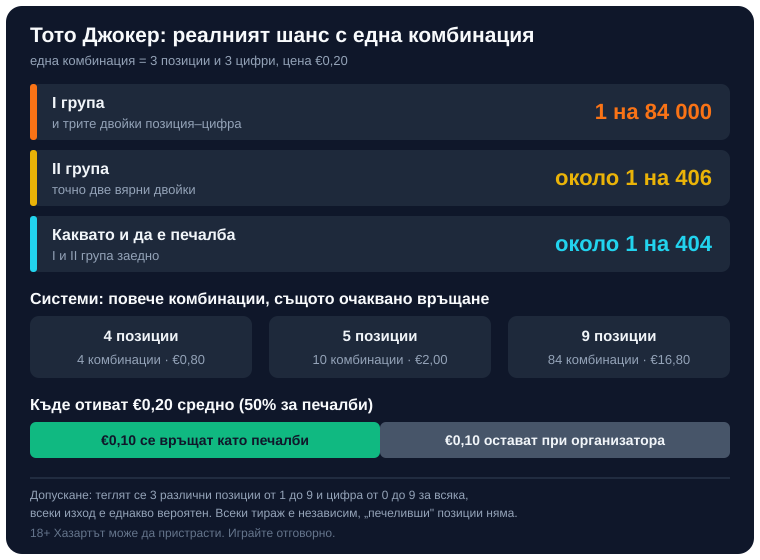

Title: Тото Джокер: как се играе и какъв е шансът за печалба
Meta: Как се играе Тото Джокер, кога са тиражите и какъв е реалният шанс: 1 на 84 000 за I група, около 1 на 406 за II. Плюс системи и измами.

# Тото Джокер: как работи и какъв е реалният шанс за печалба

Автор: Георги Тодоров · Публикувано: 10.10.2026 · Актуализирано: 10.10.2026
Правилата и цената са проверени към 10.10.2026 по официалната страница с правила на БСТ (info.toto.bg).

С една комбинация на Тото Джокер шансът за I група е 1 на 84 000, а за II група около 1 на 406. Комбинацията струва 0,20 € по правилата на info.toto.bg (цените се менят от време на време, затова ги сверете на toto.bg), и средно половината от събраните пари се връщат обратно като печалби.

## Какво е Джокерът и защо не е „допълнително число"

Тото Джокер е игра на Български спортен тотализатор (БСТ), в която залагате на позиции. Всеки фиш има фабричен номер (при онлайн игра той се генерира електронно). На тиража се определят три позиции и по една цифра за всяка от тях; ако на същите позиции във вашия номер стоят същите цифри, печелите. Изписването на латиница, toto joker, води до същата игра.

Из мрежата се срещат описания на Джокера като „допълнително число от 1 до 10". Грешно е, а таблото с резултати на БСТ го показва достатъчно ясно с двата си реда, „Печеливши позиции" (например 2, 3, 5) и „Печеливши числа" (например 3, 9, 8): на позиция 2 стои цифрата 3, на позиция 3 стои 9, на позиция 5 стои 8, и никакво отделно топче за отгатване няма. Играта съществува от 1999 г., по публично достъпни източници от 63-тия тираж.

## Как се играе Тото Джокер?

Джокерът се добавя само върху фиш за ТОТО 1 или ТОТО 2. „ТОТО 2 – Рожден ден" е единственото изключение.

1. Над фабричния номер на фиша има поле „ТОТО ДЖОКЕР" с позиции от 1 до 9.
2. Маркирате поне три позиции. Цифрите, които стоят на тях във вашия номер, са вашите цифри.
3. При повече от три маркирани позиции фишът става система.
4. Отметка „АВТОМАТИЧНО" дава три случайни позиции, ако не искате да избирате сами, а „ОТКАЗ" означава фиш без Джокер.
5. След обработката получавате квитанция. Пазете я, тя доказва, че залогът е валиден.

### Има ли Тото Джокер към 6 от 49?

Да. Джокерът си остава добавка към фиша, а не част от самата игра 6/49, но върху такъв фиш се добавя без проблем, както и върху фишовете за 5/35, 6/42, Зодиак и ТОТО 1.

## Кога са тегленията и как се разпределят печалбите

Тиражите са два седмично, в четвъртък и в неделя, и Джокерът участва и в двата. ТОТО 2 и Тото Джокер се теглят на живо по БНТ от 18:45 ч., а в тези дни онлайн сайтът на БСТ не работи между 18:40 и 19:10 ч.

I група иска и трите двойки позиция–цифра, за II група стигат две.

За печалби отиват 50% от постъпленията за тиража. Сумата на всяка група се дели поравно между печелившите комбинации в нея, а ако в някоя група няма печеливш, парите ѝ минават към I група на следващия тираж и така се трупа джакпот (горе-долу като при прогресивните джакпоти в казината). Публикуваните правила не уточняват как се дели половината между I и II група.

Типичните суми за I и II група и срокът за получаване на печалба не са посочени в достъпните правила; актуалните стойности и редът за изплащане се виждат в официалните резултати и правила на toto.bg.

## Какъв е реалният шанс за печалба?

Сметката по-долу приема, че при тегленето се избират 3 различни позиции от 1 до 9, за всяка от тях цифра от 0 до 9, и че всеки изход е еднакво вероятен. Начинът на теглене и равната вероятност на цифрите 0–9 не са публикувани на страницата с правила, затова числата по-долу важат само при това допускане.

**Позициите.** От 9 позиции могат да се изтеглят C(9,3) = 84 различни тройки, а вашата е една от тях: 1 на 84.

**I група.** Трябва да съвпаднат и трите цифри, всяка с шанс 1 на 10, което прави 1 на 1000. Умножено по 1/84, шансът за печалба от Тото Джокер в I група излиза **1 на 84 000**.

**II група.** До точно две вярни двойки се стига по два пътя. Първо, изтеглени са и трите ваши позиции, но цифрите съвпадат само на две от тях: 1/84 × 3 × (1/10)² × 9/10 = 9/28 000. Или са изтеглени само две от вашите позиции (такива са 18 от 84-те възможни тройки) и на двете цифрата е вярна: 18/84 × 1/100 = 60/28 000. Този втори път лесно се изпуска при пресмятане, макар да носи около 87% от шанса за II група. Заедно двата дават 69/28 000, около **1 на 406**.

**Каквато и да е печалба.** I и II група заедно: 13/5250, около **1 на 404**.

*Шансът с една комбинация, цената на системите и къде отиват средно €0,20; сметката е при допускане за равновероятно теглене.*

Главната печалба на ТОТО 2 – 6/49 е 1 на 13 983 816, приблизително 166 пъти по-трудна от I група на Джокера. При 1 на 84 000 обаче вероятността пак е нищожна.

## Системите и цената им

Системата пуска всички възможни тройки от маркираните позиции. С 4 позиции това са 4 комбинации за €0,80, с 5 позиции стават 10 комбинации за €2,00, а с всички 9 позиции фишът пуска 84 комбинации и струва €16,80.

С 4 позиции шансът за I група става 4 на 84 000, тоест 1 на 21 000, срещу четири пъти по-висока цена. Шансът и разходът растат заедно, в една и съща пропорция. Купувате повече комбинации наведнъж и толкова; очакваното връщане на всяко вложено евро не мърда.

## Колко пари се връщат средно?

При 50% за печалби от всяка комбинация за €0,20 средно се връщат около €0,10. Джакпотът само мести пари от един тираж към друг, общият дял на играчите си остава същият.

Една комбинация Джокер към всеки тираж за година прави 104 тиража и €20,80 залози, от които средно ще получите обратно около €10,40. II група при това темпо идва средно веднъж на около четири години, I група веднъж на около 808 години.

## Минали тиражи и „горещи" позиции

Ако тегленето е случайно, всеки тираж е независим и позициите и цифрите нямат памет. Таблиците с „най-често изтеглени" описват миналото и с това се изчерпват. НАП също го казва ясно: „стратегиите за добър късмет" не увеличават шансовете.

## Измами с Тото Джокер: как да ги разпознаете

**Платени „системи" и „печеливши позиции".** Печеливши позиции не съществуват, а случайно теглене не се надхитрява с формула, колкото и да струва тя.

**„Спечелихте, платете такса."** Идва съобщение за печалба от тото или лотария, но за да я получите, първо трябва да преведете такса. Авансова измама в чист вид, описана и в материалите на Revolut България за защита от измами. Истинският организатор не взема пари, за да ви изплати печалба, а при онлайн игра печалбите от ТОТО 1, ТОТО 2 и Тото Джокер се кредитират автоматично в сметката на играча в БСТ, без допълнителни стъпки и без плащане.

**Фалшиви сайтове.** Играйте само през официалните канали на БСТ и в лицензирани пунктове. НАП поддържа списък с лицензираните и списък с нелицензираните сайтове, а как да проверите конкретен сайт, описваме в [Законно ли е](/zakonno-li-e/). Сигнали за нелегален хазарт се подават на illegal_gambling@nra.bg; анонимните не се разглеждат.

**Квитанцията.** Пазете я, защото тя е доказателството за валиден залог.

## Законно ли е и как да играете разумно

Тото, лото, бинго и [кено](/blog/keno-pravila/) са числови лотарийни игри и по българския Закон за хазарта са хазарт. Според чл. 3 от закона всяка хазартна игра се организира само с лиценз от изпълнителния директор на НАП, а държавата може да получи такъв лиценз единствено за подпомагане на спорта, културата, здравеопазването, образованието и социалното дело. Непълнолетни не могат да участват. За данъчната страна на печалбите вижте [отделната ни статия](/blog/danaci-pechalbi-onlajn-kazino/), а при съмнение питайте счетоводител или НАП.

Джокерът е забавление, което по конструкция губи (на всеки €0,20 връща средно €0,10), и няма как да бъде доход. Играйте го за тръпката и с пари, които спокойно можете да загубите. НАП препоръчва бюджетът за хазарт да не надхвърля 5% от нетните ви доходи и съветва да не гоните загубите. Ако играта започне да ви тежи, можете да се впишете в националния регистър на уязвимите лица към НАП (чл. 10г от ЗХ) за срок най-малко 12 месеца, а информация има на 0700 18 700. Още практични насоки има на страницата за [отговорна игра](/otgovorna-igra/).

Георги Тодоров

---

**За автора:** Георги Тодоров тества лицензирани в България казино сайтове от 2024 г. със собствен бюджет и проверява лиценза в публичния регистър на НАП преди регистрация. Пише за Всички Казина за реалната цена на бонусите, скоростта на тегленията и математиката зад игрите.

**За Всички Казина:** Всички Казина е независим сайт за сравнение на онлайн казина с лиценз за българския пазар. Не сме оператор и не организираме игри. Сравняваме, проверяваме и обясняваме, за да избирате с отворени очи. Казината оценяваме по публична формула с шест претеглени критерия ([Как оценяваме](/kak-ocenyavame/)), а партньорските връзки, които финансират сайта, са обозначени. Тази статия не съдържа партньорски връзки.

**Отговорна игра:** *18+ Хазартът може да пристрасти. Играйте отговорно.* Насоки за лимити и самоизключване: [отговорна игра](/otgovorna-igra/). Самоизключване от всички лицензирани организатори в България: национален регистър на уязвимите лица към НАП (заявява се писмено от самия засегнат). Помощ: Национална информационна линия за наркотиците, алкохола и хазарта „Солидарност" 0888 99 18 66, делнични дни 10:00–17:00.

От 1 август 2026 г. дейността на афилиейт оператори в България се лицензира съгласно Закона за държавния бюджет за 2026 г. (ДВ, бр. 69 от 31.07.2026 г.). Всички Казина е подало заявление за лиценз пред Националната агенция по приходите и очаква издаването му.
