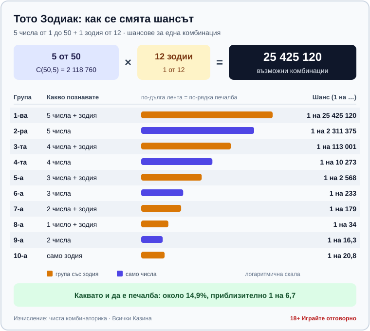

**TITLE TAG (55 chars):** Тото Зодиак: правила, печеливши групи и шанс за джакпот

**META DESCRIPTION (129 chars):** Тото 2 Зодиак (5 от 50 + зодия): кога е тиражът, десетте печеливши групи, шансът 1 на 25 425 120 и защо няма печеливши числа. 18+

---

# Тото Зодиак: правила, печеливши групи и реалният шанс за джакпот

**Автор: Георги Тодоров · Всички Казина**

*Публикувано: 10.10.2026 · Последна актуализация: 10.10.2026*

Шансът да спечелите джакпота на тото Зодиак с една комбинация е 1 на 25 425 120. Заради това число джакпотът се трупа тираж след тираж и никоя система за избор на числа не може да го помръдне (оттам и цели десет печеливши групи в играта). Затова тук ще намерите правилата, тиражите и сметката, но не и числа за залагане или съвети кога и колко да играете.

ТОТО 2 – Зодиак е числова игра на Български спортен тотализатор (БСТ), стартирала на 17.08.2014, с формат 5 от 50 плюс 1 от 12. Към тираж 79 (08.10.2026) toto.bg показва джакпот от 1 500 000,00 евро [VERIFY: актуален размер към датата на публикуване]. Сумата е снимка към тази дата и не е нито гарантиран минимум, нито таван.

## Как се играе: 5 от 50 и една зодия

На фиша отбелязвате пет числа от 1 до 50 и една зодия от дванадесетте, а при тегленето БСТ изтегля пет числа и една „печеливша зодия“. В тираж 79 се паднаха 1, 6, 7, 20 и 24 със зодия № 9, защото в официалните резултати зодията излиза като номер; кой номер на кой знак съответства, проверете на самия фиш или в правилата на toto.bg [VERIFY: съответствие номер ↔ зодиакален знак]. Изборът на знак не мести шанса, дванадесетте зодии са равностойни. Фиш се пуска в пункт на БСТ или онлайн на toto.bg, където плащанията минават през ePay.bg или с карта през БОРИКА.

В достъпните ни източници към момента на писане цена на една комбинация няма, така че сума не посочваме [VERIFY: цена на комбинация за Зодиак]; погледнете я в пункта или на сайта, преди да попълните първия си фиш.

Да не се бърка с моментната талонна игра „Зодиак“ на БСТ от края на 90-те: днешното ТОТО 2 – Зодиак (теглене 5 от 50 + 1 от 12, от 2014 г.) няма връзка с нея.

## Кога е тегленето и докога се пуска фиш

Зодиак участва и в двата седмични тиража на БСТ. За нечетния тираж залози се приемат от неделя 19:20 до четвъртък 18:00 ч., а тегленето е в четвъртък. За четния тираж приемът е от четвъртък 19:20 до неделя 18:00 ч., а тегленето е в неделя.

Според toto.bg тегленето на Зодиак се показва на живо след 19:00 ч. във Facebook страницата на БСТ [CONFLICT: toto.bg изрежда Зодиак и в списъка за БНТ от 18:45 ч.; Wikipedia посочва БНТ 1; човек да потвърди кое е актуално]. Тиражът се пуска за изплащане до 1 ч. след края на предаването, а при онлайн игра печалбата влиза автоматично в сметката ви. До каква сума печалба от хартиен фиш се изплаща направо в пункта и кога трябва да се обърнете към БСТ, не открихме в официален източник [DATA NEEDED: праг за изплащане в пункт и ред за големи печалби].

## Десетте печеливши групи и колко често печелят

За разлика от 6/49, при Зодиак печелите и с много малко познати числа, стига зодията да съвпадне, а самата зодия без нито едно число също е печеливша група. Шансовете в таблицата са чиста комбинаторика за една комбинация; сумите са от един конкретен тираж, № 76 от 27.09.2026 [VERIFY: сумите за тираж 76 са от вторичен агрегатор, time-sensitive; потвърдете дали са фиксирани за всички тиражи].

| Група | Какво трябва да познаете | Шанс (1 на …) | Тираж 76: печалба |
|---|---|---|---|
| 1-ва | 5 числа + зодия | 25 425 120 | няма печеливш |
| 2-ра | 5 числа | 2 311 375 | няма печеливш |
| 3-та | 4 числа + зодия | 113 001 | €3 000,00 |
| 4-та | 4 числа | 10 273 | €300,00 |
| 5-а | 3 числа + зодия | 2 568 | €60,00 |
| 6-а | 3 числа | 233 | €6,00 |
| 7-а | 2 числа + зодия | 179 | €3,00 |
| 8-а | 1 число + зодия | 34 | €1,00 |
| 9-а | 2 числа | 16,3 | €0,50 |
| 10-а | само зодия | 20,8 | €0,60 |

„5 числа“, „4 числа“ и т.н. без зодия означава, че числата са познати, а зодията не е.

Последните два реда вървят обратно на номерацията: десетата група (само зодия) се уцелва по-трудно от деветата, 1 на 20,8 срещу 1 на 16,3, и в тираж 76 е платила малко повече: €0,60 срещу €0,50. Ако съберете всички десет групи, около 14,9% от комбинациите печелят нещо, приблизително 1 на 6,7. А колко е това „нещо“, личи от същия тираж: 13 626 печеливши, общо €27 724,50 изплатени, като над 13 000 от тях са получили между €0,50 и €3.

*Десетте печеливши групи на Зодиак и шансът за всяка от тях при една комбинация (чиста комбинаторика).*

## Как се разпределя фондът и защо джакпотът расте

Част от постъпленията от фишовете изобщо не се връща като печалби, а отива за организатора и за обществените цели, заради които се издава лицензът. Точния дял на фонда за печалби не открихме в официален източник [VERIFY: дял на фонда за печалби от постъпленията].

От фонда на всеки тираж първо се изплащат фиксираните печалби на групите от 3-та надолу [VERIFY: кои групи са фиксирани; Wikipedia пише 3–8, но 9-а и 10-а също изглеждат фиксирани]. Ако в някоя фиксирана група печелившите са толкова много, че общата им сума надхвърли 15% от фонда, тези 15% се делят поравно между тях. Каквото остане, се разпределя 65% за 1-ва и 35% за 2-ра група [VERIFY: 65/35, таванът 15% и правилата за прехвърляне са от Wikipedia, не от правилника на БСТ].

Когато никой не познае 5 числа и зодия, сумата на 1-ва група минава в следващия тираж като джакпот. Ако няма печеливш нито в 1-ва, нито във 2-ра група, двете суми отиват заедно в джакпота, а ако 1-ва има печеливш, но 2-ра няма, парите за 2-ра се делят между печелившите от 1-ва. При шанс 1 на 25 425 120 първата група рядко има носител и джакпотът расте.

## Колко нереален е джакпотът

Пет числа от 50 могат да се изберат по C(50,5) = 2 118 760 начина, а умножени по 12 зодии, те дават 25 425 120 комбинации, от които печели една. При ТОТО 2 6/49 комбинациите са 13 983 816, така че джакпотът на Зодиак е около 1,8 пъти по-труден.

С една комбинация във всеки от двата тиража седмично ще чакате средно около 244 000 години до първия джакпот.

Шансът е същият при джакпот от 1 500 000 и при 150 000 евро. Понеже част от парите от фишовете не се връщат като печалби, средно всеки фиш връща по-малко, отколкото струва, тоест очакваната стойност е отрицателна. Плащате за тръпката от тегленето, и толкова.

## Има ли печеливши числа за тото Зодиак?

Не.

Всяка комбинация от пет числа и зодия има един и същ шанс във всеки тираж, 1 на 25 425 120, а тегленията са независими едно от друго, така че „горещи“ и „студени“ числа просто не съществуват, колкото и таблици с честоти да обикаляте. Изборът ви може да промени само едно нещо: с колко души бихте делили 1-ва група, ако я уцелите. Много играчи залагат рождени дати, тоест числа до 31, и при такава популярна комбинация рискът да делите сумата е по-голям при абсолютно същия шанс за печалба. НАП също посочва, че „стратегиите за добър късмет“ не увеличават шансовете. Затова не публикуваме числа за тото Зодиак и не бихме се доверили на сайт, който го прави.

## Закон, възраст и отговорна игра

Тото, лото, кено и другите числови лотарийни игри са хазарт по българския Закон за хазарта. Лиценз за организирането им издава само изпълнителният директор на НАП (чл. 3), а държавата може да получи лиценз единствено за подпомагане на спорта, културата, здравеопазването, образованието и социалното дело. По-подробно за [правния статус на хазарта в България](/zakonno-li-e/) и за [данъците върху печалбите](/blog/danaci-pechalbi-onlajn-kazino/) сме писали отделно.

Участието на непълнолетни законът забранява, така че Зодиак е игра само за пълнолетни (18+). Ако ви интересуват и други числови тегления, вижте [правилата на кено](/blog/keno-pravila/).

Никоя комбинация не прави очакваната стойност положителна, така че реално контролирате само колко харчите. НАП препоръчва бюджетът за хазарт да не надвишава 5% от нетните доходи. Определете месечната сума за Зодиак, преди да погледнете колко е джакпотът, и не я вдигайте, когато той порасне. Ако играта престане да бъде забавление, можете да се впишете в Регистъра на уязвимите лица (чл. 10г) към НАП, информация на 0700 18 700. Повече има в раздела ни за [отговорна игра](/otgovorna-igra/).

## Бързи отговори

**Колко числа се отбелязват на Зодиак?** Пет, от 1 до 50, плюс една зодия от 12.

**Кога е тегленето?** Вечер в четвъртък и в неделя. Фишът трябва да е пуснат до 18:00 ч. същия ден.

**Само зодия печели ли нещо?** Да, дори без нито едно познато число уцелената зодия носи малка печалба от 10-а група. Шансът е 1 на 20,8, а в тираж 76 тя е донесла €0,60.

**Какъв е шансът за джакпот?** С една комбинация е 1 на 25 425 120.

**Има ли числа, които излизат по-често?** Не. Във всеки тираж всяка комбинация има същия шанс като всяка друга.

---

*18+ · Хазартът може да доведе до зависимост. Играйте отговорно и само при лицензирани организатори. Всички Казина не организира игри и не приема залози.*

*18+ Хазартът може да пристрасти. Играйте отговорно.*

*От 1 август 2026 г. дейността на афилиейт оператори в България се лицензира съгласно Закона за държавния бюджет за 2026 г. (ДВ, бр. 69 от 31.07.2026 г.). Всички Казина е подало заявление за лиценз пред Националната агенция по приходите и очаква издаването му.*

[СЛОТ: За автора, био на Георги Тодоров]

[СЛОТ: За Всички Казина, стандартен boilerplate]
