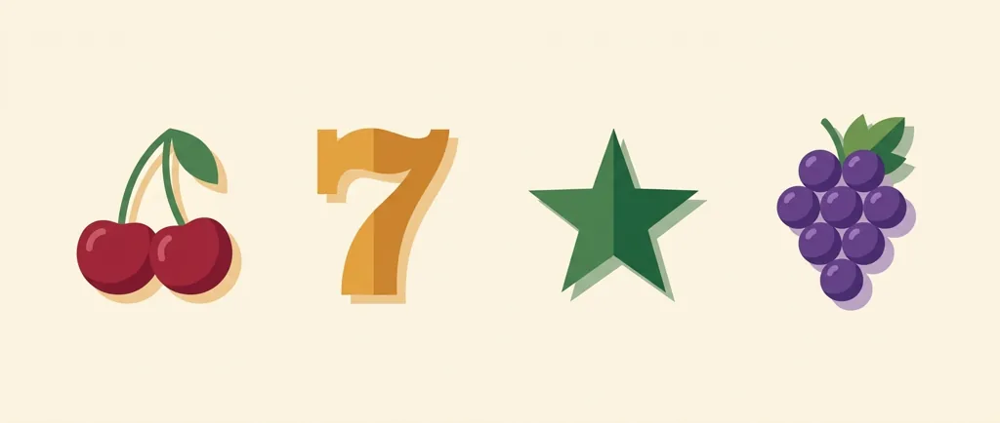
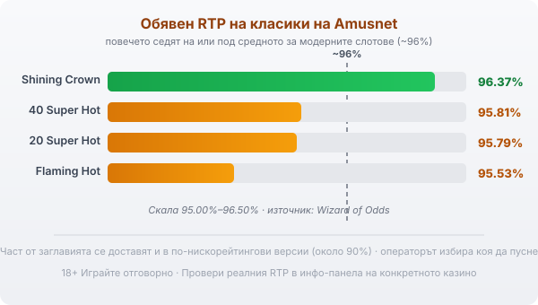

# Amusnet (EGT): профил на доставчика, механики и топ слотове

Плодовете, седмиците и звездата в голяма част от българските онлайн казина идват от една и съща компания: Amusnet. Дълги години тя се казваше EGT Interactive и стои зад класики като 20 Super Hot и Shining Crown. Компанията е българска по произход, а под простата визия на игрите ѝ работи специфична математика.

## Български корени и защо EGT стана Amusnet

Amusnet е компания с български корени и офис в София, израснала около групата EGT (Euro Games Technology), производителят на слот машините, който мнозина помнят от наземните зали и който е основан в България през 2002 г. Онлайн заглавията дълго излизаха под името EGT Interactive, а през 2022 г. компанията смени името си на Amusnet. Смяната на името обаче не докосна самите игри; заглавията и математиката им останаха каквито бяха.

## Не само ротативки

Ядрото на Amusnet са ротативките, като компанията изброява над 200 заглавия. До тях стоят игри на живо с истински дилъри, видео покер, рулетка и кено, а групата прави и физически машини за наземните зали. Една и съща марка стои зад голяма част от игрите в типичното българско казино, така че логиката ѝ се пренася от заглавие на заглавие.

## Какво значат сертификатите (и защо не са лиценз за игра)

Amusnet прави игрите, но не ги предлага сам: той е доставчик на софтуер, а самото казино е операторът, който приема залозите и държи парите. Игрите му се тестват от независими лаборатории като Gaming Laboratories International и BMM Testlabs, а компанията държи доставчически (B2B) лицензи за регулирани пазари като Малта, Румъния и Италия. Проверката означава, че генераторът на случайни числа е тестван и обявеният RTP отговаря на реалната математика на играта. Сертификатът потвърждава, че играта спазва обявените си правила. Тези правила обаче са писани в полза на казиното, а домашното предимство си остава вградено; тестът просто потвърждава, че то е точно такова, каквото пише.

## Класическите механики

Повечето известни заглавия на Amusnet споделят една и съща семпла схема. На барабаните са класическите плодове: череша, лимон, портокал, слива, грозде и диня. Седмицата играе ролята на wild и замества другите символи, за да допълни комбинация, но не замества scatter-а. Звездата е scatter и обикновено плаща, където и да падне, а не по фиксирана линия. След печалба играта често предлага гембъл: обърната карта, за която трябва да познаеш дали е червена или черна, за да удвоиш сумата. Гембълът е горе-долу как да хвърлиш монета, познаеш ли, удвояваш, сгрешиш ли, губиш печалбата от кръга. Той не мени математиката на играта, а само добавя резки колебания в банката.

## Jackpot Cards: прогресивът на Amusnet

Голяма част от класиките на Amusnet са включени в Jackpot Cards, прогресивната система на компанията. Тя има четири нива, кръстени на боите карти: спатия, каро, купа и пика. Системата може да се задейства на случаен принцип след кое да е завъртане, независимо от резултата на барабаните, при което ти обръщаш карти, докато събереш три от една боя и печелиш съответното ниво. По-големите залози повишават шанса да се включи и размера на наградата, но моментът остава случаен и рядък. Прогресивните джакпоти от този тип обикновено се пълнят от малка част от залозите на самите играчи. Наличието на джакпот не подобрява шансовете ти в обикновената игра и не сваля домашното предимство; просто пренарежда част от парите към един голям, рядък изход.

## Топ слотове и техните RTP

Няколко заглавия направиха компанията разпознаваема: 20 Super Hot, 40 Super Hot, Shining Crown, Burning Hot, Flaming Hot и серията Burning Hot с повече линии. Обявените RTP стойности на тези класики обаче издават възрастта им. По данни на Wizard of Odds Shining Crown връща 96.37%, 40 Super Hot 95.81%, 20 Super Hot 95.79%, а Flaming Hot 95.53%. Повечето седят на или под средното за модерните слотове, което често започва от 96% нагоре. Част от заглавията се доставят в няколко версии с различен RTP, като някои варианти падат чувствително по-ниско (в порядъка на 90%), и операторът избира коя да пусне. Затова числото по-долу е ориентир за самото заглавие, а конкретното казино може да върти друга версия.

*Обявени RTP на четири класически заглавия на Amusnet спрямо ориентира ~96%: повечето седят на или под средното за модерните слотове. Реалната стойност зависи от заглавието и от версията, която операторът е пуснал.*

## RTP: проверявай, не приемай

Една и съща игра може да ти връща различен процент в различни казина, затова в [методологията ни](/kak-ocenyavame/) гледаме реалния RTP на конкретното казино вместо рекламния. Отвори инфо-панела на играта, намери реда за RTP и виж кое число работи там, преди да заложиш. Ако версията е с чувствително по-нисък процент, плащаш по-скъпо за същата игра и си струва да потърсиш казино с по-добрия вариант.

## Демо режим, лимити и реален RTP

[Слот игрите](/slot-igri/) на Amusnet обикновено имат демо режим, в който да усетиш темпото и механиката, без да залагаш, а различните [ротативки](/kazino-igri/rotativki/) се сравняват най-честно точно по RTP. Ако искаш да сравниш доставчици един до друг, [прегледът ни на доставчиците](/blog/games-providers/) стъпва на същата логика. Задай си лимит за загуба и за време преди първото завъртане и провери реалния процент на конкретното казино. 18+ Хазартът може да пристрасти. Играйте отговорно. Ако усетите, че играта излиза извън контрол, вижте [инструментите за отговорна игра](/otgovorna-igra/).

---

**Георги Тодоров**
Публикувано: 09.09.2026 · Последна редакция: 09.09.2026

[About Всички Казина boilerplate]

**Отговорна игра.** 18+ Хазартът може да пристрасти. Играйте отговорно. Ако усетиш, че играта излиза извън контрол или искаш да я ограничиш, виж [инструментите за отговорна игра](/otgovorna-igra/) и възможността за самоизключване чрез националния регистър на уязвимите лица към НАП (подава се писмено само от засегнатото лице). Национална информационна линия за наркотиците, алкохола и хазарта („Солидарност") 0888 99 18 66, делнични дни 10:00–17:00.

**Разкриване на партньорства.** Всички Казина съдържа партньорски (афилиейт) връзки; когато отвориш оферта през такава връзка, това може да финансира сайта, без да променя цената за теб и без да влияе на оценките ни. От 1 август 2026 г. дейността на афилиейт оператори в България се лицензира съгласно Закона за държавния бюджет за 2026 г. (ДВ, бр. 69 от 31.07.2026 г.). Всички Казина е подало заявление за лиценз пред Националната агенция по приходите и очаква издаването му.
