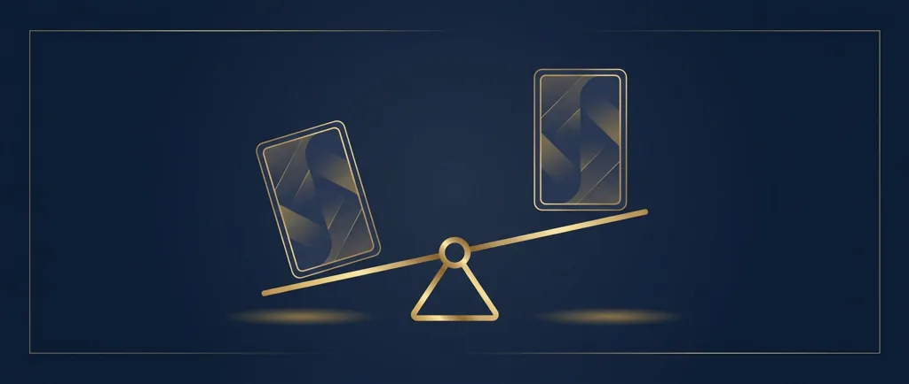
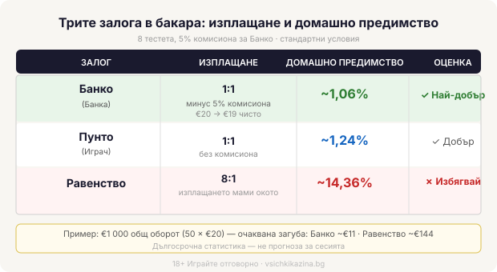

# Бакара: правилата и трите залога, обяснени просто

Бакара е една от малкото маси в казиното, на които не играете с картите си. Сядате, залагате на един от два изхода и гледате как дилърът раздава. Версията, която ще срещнете онлайн и в залите, се казва пунто банко и в нея никой на масата не взема решения за тегленето. Звучи странно за игра на карти, но точно това прави бакара бавна, спокойна маса, чиито правила се учат за пет минути.

Раздават се две ръце: Пунто (играч) и Банко (банка). На масата ви наричат играч, но реално сте залагащ, който избира на коя от двете ръце да заложи. Има и трета опция, равенство, когато двете ръце завършат с еднакъв сбор.

## Как се броят картите

Стойностите са лесни, стига да свикнете, че десетките не носят нищо. Асото е 1, картите от 2 до 9 се броят по номинал, а десетката, валето, дамата и попът са нула. Сборът на ръката се смята по последната си цифра: седмица и шестица правят 13, което в бакара е 3. Затова най-високото възможно число е 9. Ако първите две карти дадат 8 или 9, това е натурал и ръката приключва веднага.

## Кой тегли трета карта

Когато няма натурал, понякога се тегли трета карта, но кога точно се случва това не зависи от вас. Има фиксирана таблица, която дилърът следва всеки път по един и същи начин: при определени сборове Пунто тегли, при други остава, а тегленето на Банко зависи и от това каква трета карта е взел Пунто. Не е нужно да я помните. На масата тя тече автоматично и единственото ви решение остава направено още преди раздаването, с избора на залог.

## Трите залога и колко плащат

Залог на Пунто, който спечели, плаща 1:1. Залог на Банко също плаща 1:1, но казиното удържа комисиона, обикновено 5%, от печалбата. Банко тегли третата си карта, след като вече е видяла хода на Пунто, и заради това печели малко по-често; комисионата изравнява сметката за казиното. Печеливш залог от €20 на Банко ви носи €19 чисто, след като се приспадне €1 комисиона.

Равенството плаща 8:1 на повечето маси и точно това изплащане мами окото. Изглежда като начин да умножите залога, докато не погледнете колко рядко всъщност пада равенството.

## Колко ви струва всеки залог

*Сравнение на трите залога в бакара — изплащане и домашно предимство при стандартни условия (8 тестета, 5% ком.).*

Числата тук са публично изчислими и не зависят от конкретно казино. При стандартна маса с осем тестета и 5% комисиона домашното предимство на Банко е около 1,06%, на Пунто около 1,24%, а на равенството около 14,36%. Заложите ли €20 на Банко петдесет пъти, това прави €1000 общ оборот, а при предимство 1,06% средната очаквана загуба в дългосрочен план излиза към €11 за целия оборот. Същите €1000, заложени на равенство, водят до около €144 очаквана загуба. Разликата между €11 и €144 е цялата причина опитните играчи да подминават равенството.

Тези проценти са дългосрочна статистика, средно от милиони раздавания, а не прогноза за вашата вечер. В рамките на петдесет ръце спокойно може да сте на плюс или на много по-голям минус от €11. В [методологията ни](/kak-ocenyavame/) условията на игрите тежат като реално число, изчислено по същата тази математика. Като чиста цена за час на масата Банко е сред най-евтините залози, които казиното предлага.

## Защо „системите" не помагат

Около бакара се върти цяла митология от прогресии, повечето вариации на Мартингейл: удвоявай след загуба, докато не се върнеш на плюс. Домашното предимство обаче се начислява върху всеки отделен залог и никаква последователност от залози не го променя. Ръцете нямат памет: осем поредни падания на Банко не правят Пунто по-вероятна на деветата. Тъй като нямате никакво решение по картите, липсва и умението, с което при блекджек основната стратегия свива предимството. В бакара избирате залога и после гледате.

## Онлайн, на живо и в демо

Онлайн бакара идва в два вида. Версията с генератор на случайни числа раздава от наново разбъркано тесте при всяка ръка и върви бързо, сам срещу софтуера. Бакара на живо ви свързва със студио, в което истински дилър раздава пред камера, а вие залагате в реално време заедно с други хора. Правилата и изплащанията са едни и същи; разликата е в темпото и усещането. Преди реалните пари [казино игрите](/kazino-igri/) обикновено имат демо режим, в който можете да изиграете няколко ръце безплатно и да усетите колко бързо тече една маса.

## Струва си като маса, не като план

Бакара е сред най-евтините забавления в казиното, стига да стоите на Банко или Пунто и да подминавате равенството. Ниското домашно предимство обаче не значи предимство за вас. Казиното пак печели в дългосрочен план, а спокойното темпо на масата има навика да те задържи по-дълго, отколкото си планирал. Играйте с пари, които можете да загубите изцяло, задайте си лимит за депозит и за загуба преди да седнете, и приемете числото 1,06% за това, което е: цената на времето на масата. 18+ Хазартът може да пристрасти. Играйте отговорно. Ако усетите, че играта излиза извън контрол, вижте [инструментите за отговорна игра](/otgovorna-igra/).

---

**Георги Тодоров**
Публикувано: 08.09.2026 · Последна редакция: 08.09.2026

[About Всички Казина boilerplate]

**Отговорна игра.** 18+ Хазартът може да пристрасти. Играйте отговорно. Ако усетиш, че играта излиза извън контрол или искаш да я ограничиш, виж [инструментите за отговорна игра](/otgovorna-igra/) и възможността за самоизключване чрез националния регистър на уязвимите лица към НАП (подава се писмено само от засегнатото лице). Национална информационна линия за наркотиците, алкохола и хазарта („Солидарност") 0888 99 18 66, делнични дни 10:00–17:00.

**Разкриване на партньорства.** Всички Казина съдържа партньорски (афилиейт) връзки; когато отвориш оферта през такава връзка, това може да финансира сайта, без да променя цената за теб и без да влияе на оценките ни. От 1 август 2026 г. дейността на афилиейт оператори в България се лицензира съгласно Закона за държавния бюджет за 2026 г. (ДВ, бр. 69 от 31.07.2026 г.). Всички Казина е подало заявление за лиценз пред Националната агенция по приходите и очаква издаването му.
