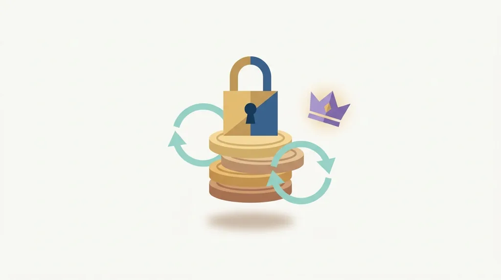
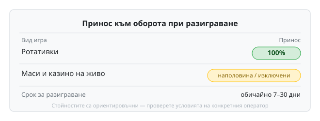

Категория "Казино бонуси и VIP" събира бонуса за добре дошли, безплатните завъртания на конкретни ротативки и VIP или лоялните програми с кешбек за редовни играчи. На банера процентът изглежда щедър: 100%, 150%, понякога и повече върху депозита. Реалната стойност на бонуса не се решава от този процент, а от условията под него, които рядко някой чете преди да натисне бутона. Безплатните завъртания често идват с отделно, по-леко изискване за разиграване от паричния бонус, но пак с изискване – и пак върху конкретна игра, не по избор. Преди да тръгнете оттам, разгледайте и нашата подборка [бонуси без депозит](/bonusi/bez-depozit/) – условията там обикновено са по-леки, именно защото няма депозит зад тях.

## Какво определя дали бонусът си струва

Превъртането, изискването за разиграване, е първото число за проверка. Само процентът обаче не казва нищо без базата: върху депозит и бонус заедно, или само върху бонуса. Обяснили сме механиката в [как работи изискването за разиграване](/blog/kak-raboti-razigravaneto/) – например 35 пъти върху депозит плюс бонус тежи почти двойно повече от същите 35 пъти само върху бонуса. Има и таван на залога, докато бонусът е активен: заложите ли над него дори веднъж, операторът има основание да анулира печалбите, независимо колко близо сте до изпълнение на условието. Срокът за разиграване тече успоредно, обичайно между 7 и 30 дни, и изтича, без значение колко остава от изискването. Ротативките обикновено допринасят с пълните 100% към оборота. Маси и казино на живо често са намалени наполовина или изключени напълно от сметката.

*Принос по вид игра към изискването за разиграване; срокът обичайно е 7–30 дни — конкретните условия варират при всеки оператор.*

## VIP и лоялни програми

VIP и лоялните програми работят по различен принцип. Нивата се качват с оборота ви, не с еднократна регистрация, и носят кешбек, по-бързи тегления или личен мениджър на по-високите стъпала. Някои казина делят играчите на 4-5 нива, други просто увеличават процента кешбек постепенно, без явна стълба. Условията тук са по-малко стандартизирани от казино до казино – реалният процент кешбек и базата, върху която се начислява, заслужават същата проверка като превъртането на всеки друг бонус.

За конкретни примери какво предлагат казината в момента вижте [бонус без депозит 2026](/blog/bonus-bez-depozit-2026/). Бонусът и VIP кешбекът остават част от развлечението. Определете бюджет предварително и не вдигайте залога само защото има активен бонус зад него – загубата не се компенсира с по-голям риск.

---

**Георги Тодоров**
Публикувано: 19.09.2026 · Последна редакция: 19.09.2026

[About Всички Казина boilerplate]

**Отговорна игра.** 18+ Хазартът може да пристрасти. Играйте отговорно. Ако усетиш, че играта излиза извън контрол или искаш да я ограничиш, виж [инструментите за отговорна игра](/otgovorna-igra/) и възможността за самоизключване чрез националния регистър на уязвимите лица към НАП (подава се писмено само от засегнатото лице). Национална информационна линия за наркотиците, алкохола и хазарта („Солидарност") 0888 99 18 66, делнични дни 10:00–17:00.

**Разкриване на партньорства.** Всички Казина съдържа партньорски (афилиейт) връзки; когато отвориш оферта през такава връзка, това може да финансира сайта, без да променя цената за теб и без да влияе на оценките ни. От 1 август 2026 г. дейността на афилиейт оператори в България се лицензира съгласно Закона за държавния бюджет за 2026 г. (ДВ, бр. 69 от 31.07.2026 г.). Всички Казина е подало заявление за лиценз пред Националната агенция по приходите и очаква издаването му.
