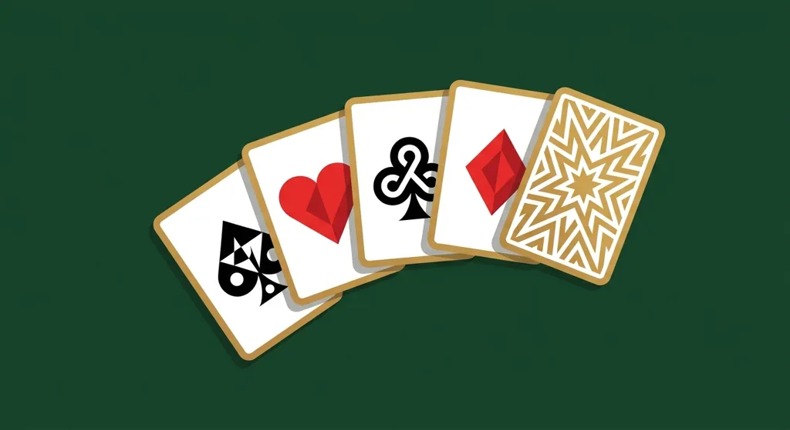
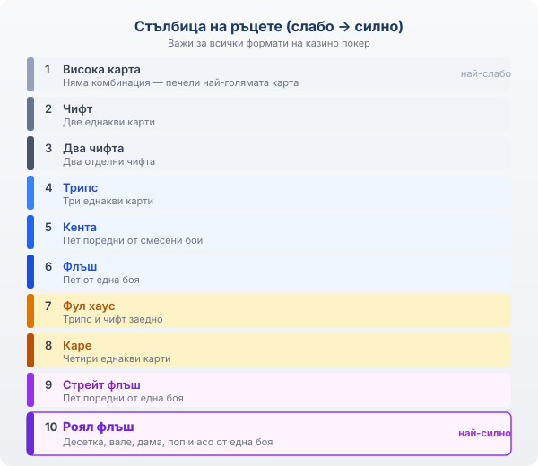
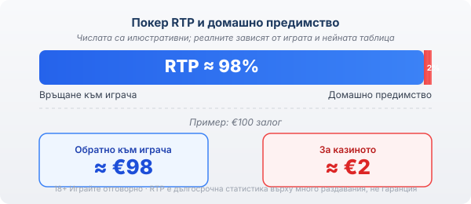

# Как се играе покер в казино: видовете игри и правилата зад тях

В покер стаята играеш срещу останалите на масата, а банката само държи тестето и взима процент от него (rake). В казино покера отсреща стои самото казино: то раздава и плаща по фиксирана таблица, затова носи вградено предимство във всяка ръка. Името и подредбата на картите са същите, но математиката отдолу е друга.

Това предимство не е скрито и не е измама. То е число, което може да се сметне, и точно то решава колко ще ти струва забавлението, преди изобщо да си стигнал до правилата на конкретния формат.

## Стълбицата на ръцете, която важи навсякъде

Всеки формат стъпва на една и съща стълбица. Ето я, от най-слабото към най-силното:

*Стълбица на ръцете, валидна за всички формати на казино покер — от висока карта до роял флъш.*

- висока карта
- чифт (две еднакви)
- два чифта
- трипс (три еднакви)
- кента (пет поредни от смесени бои)
- флъш (пет от една боя)
- фул хаус (трипс и чифт заедно)
- каре (четири еднакви)
- стрейт флъш (пет поредни от една боя)
- роял флъш, тоест десетка, вале, дама, поп и асо от една боя

Роял флъшът е най-рядката ръка и почти навсякъде плаща най-много. Чифтът е долният праг, от който при повечето игри изобщо тръгват изплащанията. Оттук нататък подредбата не мърда; сменя се само начинът на залагане.

## Видео покер

Видео покерът се играе на екран и по усещане е най-близо до ротативка, само че иска решения, не чист късмет. Залагаш, идват пет карти, задържаш които искаш и подменяш другите с нови. Крайната ръка се плаща по таблица, която в популярния вариант Jacks or Better тръгва от чифт валета нагоре. Дилър и човек за блъфиране няма; насреща ти е само изплащателната таблица.

Това е един от малкото казино формати, където изборът ти реално мести числата. Знаеш ли кои карти да задържиш при всяко раздаване, домашното предимство е сред най-ниските в цялото поле от [игрите в казиното](/kazino-igri/). Играеш ли произволно, расте бързо. А таблиците се различават между отделните игри и оператори, така че две на пръв поглед еднакви машини може да връщат различно. Тази таблица е първото за проверка, преди да заложиш реални пари.

## Казино холдем (Casino Hold'em)

Казино холдемът взема структурата на тексас холдема и я обръща срещу дилъра. Две свои карти, на масата излизат общи карти, и на един момент избираш: пасуваш и губиш анте залога, или продължаваш с допълнителен залог срещу ръката на дилъра. Накрая двете ръце се мерят по същата стълбица. Няма други играчи, чиито блъфове да четеш, така че всичко опира до сметка колко силна е ръката ти спрямо това, което може да държи дилърът. Много маси предлагат и допълнителен страничен залог (често наричан AA бонус) върху силата на първите ти карти; той се плаща отделно и по своя таблица, затова си струва да го погледнеш, преди да го включиш.

## Три карти покер и Caribbean Stud

Три карти покер се играе, както казва името, само с три карти, и е бърз заради това. Залагаш анте, гледаш трите си карти, решаваш дали да пасуваш или да добавиш залог, за да се мериш с дилъра. Подредбата е леко разместена спрямо петкартовия покер: с три карти кентата бие флъша, понеже флъшът излиза по-лесно. Много маси плащат допълнителен бонус за силна ръка независимо какво държи дилърът.

Caribbean Stud върви с пет карти, а дилърът показва една от своите открита. Залагаш анте, виждаш картите си, избираш да се откажеш или да добавиш залог. Уловката е в квалификацията: ръката на дилъра трябва да стигне обикновено до асо-поп или по-добра комбинация, за да се брои напълно срещу твоята, иначе изплащането е различно. Форматът е сред тези с по-високо домашно предимство. Правилата се учат за минути, но цената на тази простота е малкото решения, с които да свиеш предимството.

## Домашно предимство и RTP, без заблуди

RTP (return to player) е средният процент, който играта връща на играчите, изчислен върху милиони раздавания, а не върху една твоя сесия. Останалото стои при казиното в дълъг период и се нарича домашно предимство. При хипотетична игра с RTP около 98% домашното предимство е около 2%. Значи на всеки заложен €100 в много дълъг период при казиното остават средно към €2. Твоята конкретна вечер може да е далеч над или далеч под това. (Числата тук са илюстративни; реалните зависят от играта и нейната таблица.)

Отделно от предимството стои волатилността, тоест колко често и колко едро плаща една игра. При ниска волатилност печалбите идват често, но дребни. При висока може дълго да не пада нищо, а после наведнъж да дойде едро попадение. Дали това ти върши работа зависи от бюджета и търпението ти: високата волатилност изяжда малкия банкрол бързо, още преди голямото попадение да е дошло.

Правилната стратегия свива предимството, но не го маха. В покер стаята е иначе: там, срещу други играчи, силният може да е трайно на печалба, докато срещу казиното сметката винаги клони към къщата, колкото и добре да играеш.

*При хипотетичен RTP около 98% домашното предимство е около 2% — примерно €2 от €100 залог остават за казиното (числата са илюстративни; реалните зависят от играта и нейната таблица).*

## Демо режим: правилата се учат безплатно

Почти всяка от тези игри има демо режим, тоест игра с виртуални кредити, без реални пари и често без регистрация. Честният начин да усетиш темпото на видео покера или реда на решенията в казино холдема, преди да сложиш свои пари. Правилата стават автоматични с повторение. Чак когато ги владееш, има смисъл да минеш на реален залог.

Хазартът е платено забавление с известна цена, не начин за печелене на пари или бягство от финансов проблем. Заложи само това, което можеш да загубиш изцяло, и си сложи [лимит преди първия депозит](/otgovorna-igra/). 18+ Хазартът може да пристрасти. Играйте отговорно.

## Кое да пробваш първо

Ако тепърва започваш, започни с видео покер. Дава ти най-много контрол за най-малко пари и учиш стълбицата на ръцете покрай самата игра, понеже при всяко раздаване те пита кои карти да задържиш. Три карти покер е за вечер без много мислене. Caribbean Stud изглежда също толкова лесно, но за тази лекота плащаш с по-високо предимство и с почти никакви решения освен „продължавам или спирам". Казино холдемът пък е за онзи, който вече харесва тексас холдема, но не му се сяда срещу живи играчи.

Никой формат не е „по-печеливш" от друг като обещание. Честният начин да избираш казино е [да знаеш какво оценяваш](/kak-ocenyavame/): във Всички Казина минаваме всяко през публична методика, а не през усещане. Останалото е тесте карти и една таблица, която не се интересува колко силно ти се играе.

---

**Георги Тодоров**
Публикувано: 07.09.2026 · Последна редакция: 07.09.2026

[About Всички Казина boilerplate]

**Отговорна игра.** 18+ Хазартът може да пристрасти. Играйте отговорно. Ако усетиш, че играта излиза извън контрол или искаш да я ограничиш, виж [инструментите за отговорна игра](/otgovorna-igra/) и възможността за самоизключване чрез националния регистър на уязвимите лица към НАП (подава се писмено само от засегнатото лице). Национална информационна линия за наркотиците, алкохола и хазарта („Солидарност") 0888 99 18 66, делнични дни 10:00–17:00.

**Разкриване на партньорства.** Всички Казина съдържа партньорски (афилиейт) връзки; когато отвориш оферта през такава връзка, това може да финансира сайта, без да променя цената за теб и без да влияе на оценките ни. От 1 август 2026 г. дейността на афилиейт оператори в България се лицензира съгласно Закона за държавния бюджет за 2026 г. (ДВ, бр. 69 от 31.07.2026 г.). Всички Казина е подало заявление за лиценз пред Националната агенция по приходите и очаква издаването му.
