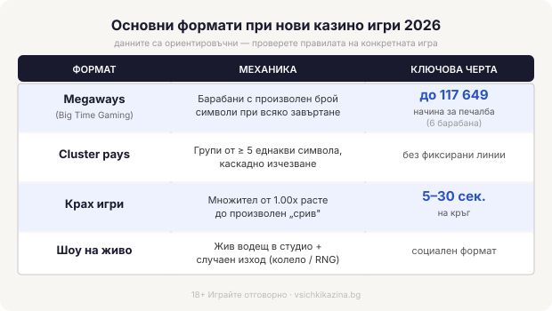

# Нови казино игри 2026: как да прецените ново заглавие, преди да заложите

Нова игра не ви дава по-добри шансове. Домашното предимство е вписано в математиката на заглавието още преди то да излезе и не пада, защото иконата в лобито носи етикет „ново". С това си струва да започнете, преди да завъртите нещо, пуснато тази седмица, само защото е пуснато тази седмица.

## RTP е дългосрочна статистика, не обещание за вечерта

RTP (return to player, връщане към играча) показва каква част от заложеното една игра връща на всички играчи заедно, за милиони завъртания. При ротативките типичната стойност се движи около 96%. Останалото е домашното предимство, цената на развлечението, която операторът задържа в дългосрочен план. Хиляди завъртания по €0.20 на заглавие с около 96% RTP връщат близо 96% от вложеното едва като обща сметка за цялата дълга серия. Една отделна вечер от няколкостотин такива микрозалога спокойно свършва далеч над или далеч под тази граница, затова RTP не бива да се чете като прогноза за сесията. Стойността обикновено е изписана в информацията на играта или в помощния екран. Ако ново заглавие крие своя RTP или го дава само като диапазон без пояснение, това само по себе си е сигнал да сте по-предпазливи, а не да наваксвате с по-голям залог. Как превръщаме тази цифра в реална част от оценката сме описали на страницата за [нашата методология](/kak-ocenyavame/).

## Колко често и колко едро плаща играта: волатилността

Волатилността казва колко често и колко едро плаща една игра. Ниска волатилност значи чести, но дребни печалби, докато при висока минавате през дълги сухи серии заради рядкия голям удар. Висок RTP може да върви с всякаква волатилност, така че двете числа се четат заедно, а не поотделно. Съобразете волатилността с бюджета си и с това колко дълго планирате да играете.

## Механиката: линии, начини за печалба и решетки

Старите ротативки плащат по фиксирани линии. По-новите заглавия често броят „начини за печалба" вместо линии, а част от тях сменят самата структура на решетката при всяко завъртане. Megaways, механика, въведена от Big Time Gaming, променя броя символи на всеки барабан при всяко завъртане и при шест барабана стига до 117 649 начина за печалба. На екрана това е повече визуален шум, отколкото сметка: барабаните подскачат нагоре и надолу, символите се сипят и почти не успявате да проследите откъде дойде една печалба.

Cluster pays се държи съвсем различно. Линии няма, печалбата идва от група от 5 или повече еднакви символа, които се допират някъде по решетката, обикновено с каскади, при които печелившите символи изчезват и на тяхно място падат нови. „Задръж и завърти" (hold-and-win) пък носи друго усещане, по-бавно и по-нервно: специални символи се заключват на място и се въртят повторно, докато решетката се напълни или спрат да идват нови, а с всеки празен завъртеж чакате да падне още един заключен символ.

Броят линии или начини за печалба не е самоцел: повече начини по правило значат по-чести, но по-дребни попадения, докато играта прехвърля тежестта към бонус функцията. Погледнете и максималната печалба и тавана на множителя, защото те определят практическия предел на едно завъртане, а рекламираният огромен множител често важи само при почти невъзможна комбинация. Прочетете таблицата с изплащания докрай, преди да заложите: там пише какво задейства безплатните завъртания, какви са специалните символи и дали правилата се менят при различен размер на залога. Видите ли опция за директно купуване на бонус функцията (bonus buy или feature buy), имайте предвид, че тя е ограничена в редица юрисдикции.

## Форматите при новите казино игри 2026: крах, задръж и завърти, шоу на живо

*Четирите главни формата при нови казино игри — с ключовите характеристики от текста.*

Крах игрите останаха сред най-видимите формати. Механиката е кратка: множител тръгва от 1.00x и расте, а вие решавате кога да кешаутнете, преди играта да „се срине" в момент, определен на случаен принцип. Кръговете траят секунди, обикновено между 5 и 30. Aviator на Spribe е най-разпознаваемото име в жанра, JetX на Smartsoft Gaming е друго. Голяма част от тези игри рекламират „provably fair", тоест начин сами да проверите, че конкретният кръг не е бил подправен. Това е полезно, но не замества лицензираната сертификация на генератора на случайни числа, която регулаторът изисква, така че не го бъркайте с гаранция за честност на цялата платформа. Megaways и cluster заглавията също продължават да излизат на поток. Шоу игрите на живо, с водещ в истинско студио като Crazy Time на Evolution, стоят някъде между ротативка и телевизионна игра, а Cash or Crash, пак на Evolution, е крах вариант с жив водещ. Форматът на живо добавя чат и водещ, които задържат вниманието по-дълго от една самотна ротативка, така че е лесно да останете на масата повече, отколкото сте планирали. При крах игрите темпото е част от риска: кръг, който трае секунди, кани към бърз следващ залог, а бързите залози изпразват бюджета по-незабелязано от бавните. Колкото и ново да е името и лъскава графиката, всяко от тези заглавия е построено така, че операторът да излиза на печалба в дългосрочен план.

## Кой стои зад играта и защо демото е истинският тест

Разработчикът има значение, защото установен доставчик със заглавия, минали през независими лаборатории, е друга сделка спрямо анонимно студио без история зад гърба си. Преди да сложите пари, демо режимът е честният тест: безплатна игра без депозит, в която усещате темпото и волатилността, четете таблицата с изплащания и гледате как се държат функциите, без нито едно евро на масата. Няколко десетки завъртания в демо обикновено стигат, за да усетите дали дългите паузи без печалба ще ви изнервят, или ще ги понесете спокойно. Тук е и рискът, който идва с новостта. А блясъкът на всяко ново заглавие е точно това, за което да сте нащрек. Свежата графика и усещането, че изпускате нещо, са сложени там нарочно, за да ви накарат да забравите бюджета си и да залагате по-бързо и по-едро. 18+ Хазартът може да пристрасти. Играйте отговорно. Хазартът не е финансова стратегия, а платено развлечение с известна предварително цена, затова, ако ще пробвате ново заглавие, направете го с пари, които можете да загубите изцяло, и с лимити за депозит и загуба, зададени преди първия депозит, не след него.

Форматът се сменя, математиката остава същата. „Ново" е маркетингов етикет, не по-добър шанс. Целия каталог и логиката, по която подреждаме [казино игрите](/kazino-igri/), можете да разгледате при нас.

**Георги Тодоров**
Публикувано: 08.09.2026 · Последна редакция: 08.09.2026

[About Всички Казина boilerplate]

**Отговорна игра.** 18+ Хазартът може да пристрасти. Играйте отговорно. Ако усетиш, че играта излиза извън контрол или искаш да я ограничиш, виж [инструментите за отговорна игра](/otgovorna-igra/) и възможността за самоизключване чрез националния регистър на уязвимите лица към НАП (подава се писмено само от засегнатото лице). Национална информационна линия за наркотиците, алкохола и хазарта („Солидарност") 0888 99 18 66, делнични дни 10:00–17:00.

**Разкриване на партньорства.** Всички Казина съдържа партньорски (афилиейт) връзки; когато отвориш оферта през такава връзка, това може да финансира сайта, без да променя цената за теб и без да влияе на оценките ни. От 1 август 2026 г. дейността на афилиейт оператори в България се лицензира съгласно Закона за държавния бюджет за 2026 г. (ДВ, бр. 69 от 31.07.2026 г.). Всички Казина е подало заявление за лиценз пред Националната агенция по приходите и очаква издаването му.
