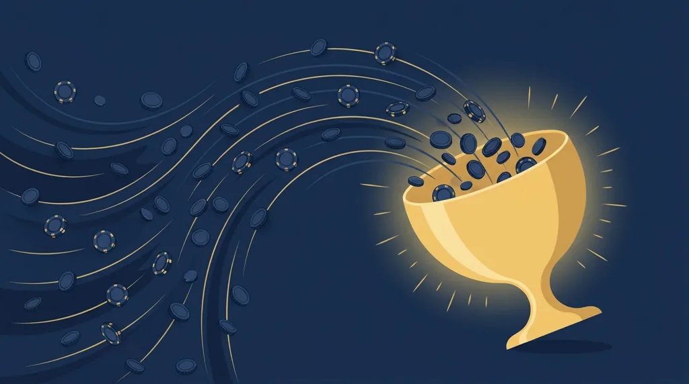
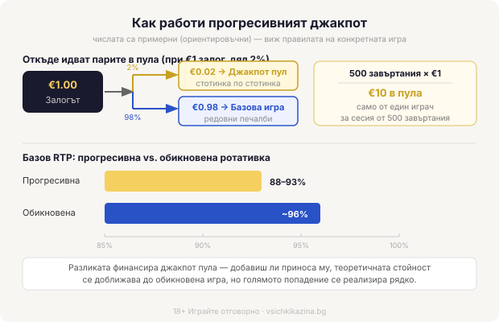

# Прогресивни джакпоти: как расте пулът и какви са реалните шансове

Прогресивният джакпот расте, защото малка част от всеки реален залог се отклонява в общ пул. Никой оператор не „зарежда" наградата от джоба си. Играчите я пълнят завъртане по завъртане, стотинка по стотинка, затова сумата на екрана е истинска и мърда в реално време, а не е рекламно кръгло число. И точно затова вероятността именно твоето завъртане да я отключи е нищожна.

## Откъде идват парите в пула

*Разпределение на залога и RTP компромисът при прогресивна ротативка (числата са примерни).*

От всеки залог обикновено между 1% и 5% отиват в джакпот пула, а остатъкът захранва базовата игра. При €1 залог и дял от 2% това са две стотинки към джакпота на всяко завъртане, докато другите 98 стотинки работят в обичайната математика на ротативката. Две стотинки са нищо. Но една сесия от 500 завъртания по €1 вече праща €10 в пула само от теб, а хиляди хора, които въртят едновременно с часове, го качват видимо с всяка минута. Дялът е фиксиран предварително и не зависи дали печелиш, или губиш. Пълни се от оборота.

## Защо джакпотът не пада на нула

Удари ли някой джакпота, пулът не изчезва до нула. Нулира се на предварително зададена начална сума, наречена семенна, например €10 000, и оттам тръгва да расте наново. Семенната сума идва от малък резерв, който се заделя, докато джакпотът още се пълни. Затова дори „току-що спечелен" джакпот пак изглежда апетитно голям минути по-късно, а екранът рядко показва скучно ниско число.

## Когато джакпотът е на няколко нива

Много игри не предлагат един джакпот, а стълбица от няколко: обикновено ги наричат мини, минор, мейджър и понякога гранд. Малките падат често и връщат скромни суми, колкото да поддържат усещането за движение, а горното ниво е рядкото, голямото число. Дялът от твоя залог се разпределя между тези нива по вътрешна схема на играта. На такива игри думата „джакпот" почти винаги значи някой от долните нива, а не онзи от началната страница.

## Самостоятелен, локален, мрежов

Не всички джакпоти са с еднакъв обхват, и обхватът решава почти всичко. Самостоятелният стои в една игра при едно казино, пълни се само от нейните играчи и затова расте най-бавно, рядко минавайки скромни суми. Локалният обединява няколко игри в рамките на едно казино и вече събира повече хора в един пул. Мрежовият, наричан още wide-area, връзва дяловете от много казина през мрежата на един доставчик на игри, и точно той стига до многомилионните числа по началните страници. Механизмът е един и същ навсякъде: широката мрежа качва пула бързо, но точно затова шансът на отделния играч да го хване става още по-малък.

## Джакпоти с гарантиран край

Част от игрите обещават, че джакпотът ще падне преди да мине определена сума или до определен час. Тези пудове изглеждат по-приятелски, защото имат таван и някой със сигурност ще ги вземе скоро. Уловката е, че таванът е ниският, честият джакпот, не мечтаният. И гарантираният край не казва нищо за това кой ще е късметлията: пак може да е всеки друг от хилядите включени.

## Какво плащаш за големия пул

Големият пул има цена и я плаща базовата игра. Базовият RTP на прогресивна ротативка обикновено е малко по-нисък от този на обикновена, ориентировъчно 88-93% срещу около 96%, защото част от всеки залог финансира джакпота вместо да се връща в редовните печалби. Не е измама, а счетоводство: парите за мечтаната сума идват някъде, и това място е твоят базов процент на връщане. Добавиш ли към базовия RTP и приноса на самия джакпот, теоретичната стойност се доближава до обикновена игра, но тази добавка се реализира почти само в редките огромни попадения, тоест повечето играчи усещат именно по-ниския базов процент. RTP пак си остава дългосрочна статистика над милиони завъртания, никога обещание за отделната сесия. Ако искаш да видиш как гледаме на условията около бонусите и игрите, [начинът ни на оценяване](/kak-ocenyavame/) го описва открито. Волатилността е друг въпрос, на темперамент и бюджет, а не белег за по-добра или по-лоша игра.

## Реалните шансове

Вероятността да вземеш голям мрежов джакпот е от порядъка едно на десетки милиони на едно завъртане. За мащаба: при илюстративен шанс от 1 на 30 милиона и темпо от около 500 завъртания на час говорим за порядъка на 60 000 часа непрекъсната игра, преди статистиката да „очаква" едно попадение. Никой не играе толкова. При това всяко завъртане е независимо от предишното, значи дългото въртене не те приближава до наградата с нито един милиметър, а джакпот, който „отдавна не е падал", не е по-назрял от вчерашния. И често има уловка на входа: за най-голямото ниво трябва максимален залог или изричен opt-in, иначе просто не си допустим, колкото и да въртиш. Това е математика на лотария, а не на стратегия. Реклама, която ти обещава друго, разчита на усещането ти, не на числата.

## Голям залог, голям шанс?

По-големият залог обикновено праща и по-голям дял в пула, а понякога отключва по-висок множител или самото право на най-горното ниво. Това обаче не подобрява шанса ти на единица заложена стотинка: просто плащаш повече за същата дълга лотария и изчерпваш бюджета си по-бързо. Ако казиното иска максимален залог за допустимост, реши предварително дали изобщо ти е по джоба да го въртиш достатъчно дълго, та да има смисъл. В повечето случаи отговорът е не, и това само по себе си е полезен филтър кое да подминеш.

## Джакпотът като развлечение, не като план

Прогресивният джакпот е форма на развлечение с предварително известна цена. Хазартът не е финансова стратегия: всяка игра е построена така, че операторът печели в дългосрочен план, а прогресивният пул само прави рядкото попадение по-зрелищно. Ако ще гониш такова число, гони го само с пари, които можеш да загубиш изцяло, задай си лимит за депозит и загуба преди първото завъртане, и пусни играта в демо режим, за да усетиш темпото ѝ без залог. Разбереш ли механиката, спираш да чакаш пула и започваш да гледаш самата игра, а джакпот ротативките са само една част от [казино игрите](/kazino-igri/), не отделна вселена с други правила. 18+ Хазартът може да пристрасти. Играйте отговорно. Ако усетиш, че играта тегли повече, отколкото си планирал, виж [инструментите за отговорна игра](/otgovorna-igra/). Числото на банера е истинско, само че почти сигурно не е за теб, и планът ти не бива да разчита на него.

---

**Георги Тодоров**
Публикувано: 07.09.2026 · Последна редакция: 07.09.2026

[About Всички Казина boilerplate]

**Отговорна игра.** 18+ Хазартът може да пристрасти. Играйте отговорно. Ако усетиш, че играта излиза извън контрол или искаш да я ограничиш, виж [инструментите за отговорна игра](/otgovorna-igra/) и възможността за самоизключване чрез националния регистър на уязвимите лица към НАП (подава се писмено само от засегнатото лице). Национална информационна линия за наркотиците, алкохола и хазарта („Солидарност") 0888 99 18 66, делнични дни 10:00–17:00.

**Разкриване на партньорства.** Всички Казина съдържа партньорски (афилиейт) връзки; когато отвориш оферта през такава връзка, това може да финансира сайта, без да променя цената за теб и без да влияе на оценките ни. От 1 август 2026 г. дейността на афилиейт оператори в България се лицензира съгласно Закона за държавния бюджет за 2026 г. (ДВ, бр. 69 от 31.07.2026 г.). Всички Казина е подало заявление за лиценз пред Националната агенция по приходите и очаква издаването му.
