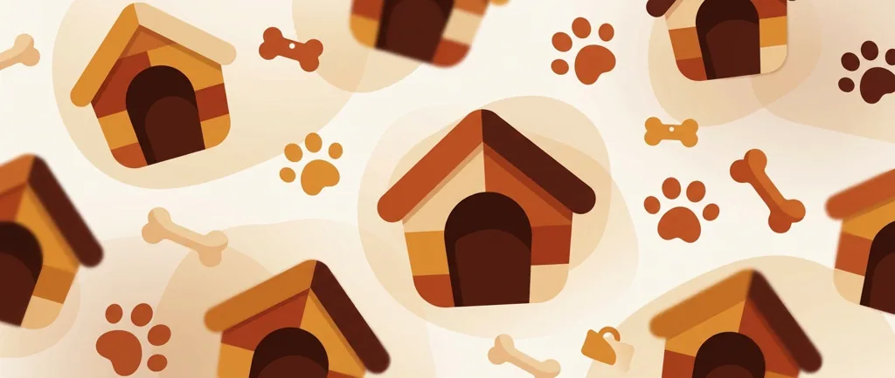
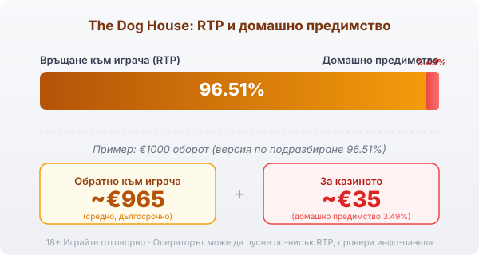

# The Dog House: RTP, волатилност и как се играе

The Dog House е слот на Pragmatic Play от 2019 г. върху класическа мрежа от 5 колони и 3 реда с 20 фиксирани линии. Играта не залага на много функции наведнъж. Цялата ѝ идентичност се върти около една механика: лепкавите wild символи с множители в безплатните завъртания. Останалото е нарочно семпло, за да изпъкне точно тази част.

## Простата основа: 5×3 и 20 линии

Основната игра е толкова традиционна, колкото изглежда. Символите падат по 5 колони и 3 реда, а печалбите се четат по 20 фиксирани линии отляво надясно. Кучетата с различни породи са символите с по-висока стойност, а картите за игра носят по-малко.

## Лепкавите wild-ове са цялата игра

Wild символът е кучешката колиба и се появява само на средните три колони. Всеки wild носи случаен множител: x1, x2 или x3. В основната игра wild-ът заменя липсващ символ, помага за линия и изчезва на следващото завъртане, нищо повече. В безплатните завъртания правилото се сменя. Там всеки паднал wild залепва на мястото си и остава до края на бонуса, а множителите на всички залепени wild-ове се събират и умножават печалбите на всяко следващо завъртане. Ако средната зона се напълни с колиби, носещи по x2 и x3, печалбата от едно завъртане може да нарасне драстично.

## Безплатните завъртания и защо са отделна игра

Бонусът се пуска от 3 или повече символа-лапа, разпръснати по екрана, и дава 10 безплатни завъртания. Паднат ли отново 3 или повече лапи по време на бонуса, идват още 10 завъртания, а вече залепените wild-ове си остават по местата. По този начин основната игра и безплатните завъртания са две различни игри по размер на печалбата: в основната wild-овете са мимолетни, а в бонуса се трупат и се умножават помежду си.

## RTP: обявеното число и реалното

Обявеният RTP на The Dog House е 96.51%, което оставя домашно предимство от 3.49%. При €1000 оборот това означава средно връщане от порядъка на €965 в дългосрочен план и около €35 за казиното, разпределени върху много завъртания. Както при други заглавия на Pragmatic Play, играта се лицензира в повече от една RTP версия и казиното избира коя да зареди, така че реалният процент при два оператора може да е различен. В [методологията ни](/kak-ocenyavame/) гледаме реалния RTP, а не рекламния, затова отвори инфо-панела на конкретното казино и провери кое число работи там, преди да заложиш.

*Обявен RTP 96.51% (версия по подразбиране): при €1000 оборот средно ~€965 се връщат на играча, ~€35 остават за казиното. Операторът може да зареди по-ниска версия, затова провери инфо-панела.*

## Висока волатилност и таванът 6750x

The Dog House е игра с висока волатилност, пет от пет по вътрешната скала. Банката може да се изчерпи бързо заради дълги серии от празни или дребни завъртания, а голямото идва рядко и почти винаги от натрупаните множители в бонуса. Максималната печалба е 6750 пъти залога и се стига обикновено с няколко залепени wild-а с x2 и x3 и добър ретригер. При €1 залог 6750x са €6750, но такъв резултат е статистическа рядкост.

## Bonus buy и ante bet: удобство, не предимство

The Dog House предлага два бързи начина към бонуса. Ante bet качва залога и увеличава шанса за лапи-скатери. Bonus buy отива по-далеч: срещу цена около 75 до 100 пъти залога купуваш директен вход в 10-те безплатни завъртания, без да ги чакаш. Купуването не сваля домашното предимство. Плащаш отпред за достъп до волатилния режим, а математиката в дългосрочен план остава същата. Наличността на самата функция зависи от юрисдикцията и оператора, а в някои пазари е ограничена или забранена. Ако е достъпна, цената ѝ е реален залог и трябва да влезе в бюджета ти като такъв.

## Как да го играеш разумно

Преди реални пари [слот игрите](/slot-igri/) обикновено имат демо режим, в който да видиш колко рядко идва плътният бонус, без да залагаш. Задай си лимит за загуба и за време преди първото завъртане и го спазвай. 18+ Хазартът може да пристрасти. Играйте отговорно. Ако усетите, че играта излиза извън контрол, вижте [инструментите за отговорна игра](/otgovorna-igra/).

## За кого е тази игра

The Dog House пасва на играч, който харесва чиста, разбираема механика без десетки функции и е готов да търпи дълги серии без печалба заради шанса за плътен бонус с натрупани множители. Ако търсиш чести дребни печалби и по-плавен баланс, високата волатилност тук ще ти дойде тежко. Провери на инфо-панела кой RTP е зареден и залагай със сума, която можеш да загубиш изцяло.

---

**Георги Тодоров**
Публикувано: 10.09.2026 · Последна редакция: 10.09.2026

[About Всички Казина boilerplate]

**Отговорна игра.** 18+ Хазартът може да пристрасти. Играйте отговорно. Ако усетиш, че играта излиза извън контрол или искаш да я ограничиш, виж [инструментите за отговорна игра](/otgovorna-igra/) и възможността за самоизключване чрез националния регистър на уязвимите лица към НАП (подава се писмено само от засегнатото лице). Национална информационна линия за наркотиците, алкохола и хазарта („Солидарност") 0888 99 18 66, делнични дни 10:00–17:00.

**Разкриване на партньорства.** Всички Казина съдържа партньорски (афилиейт) връзки; когато отвориш оферта през такава връзка, това може да финансира сайта, без да променя цената за теб и без да влияе на оценките ни. От 1 август 2026 г. дейността на афилиейт оператори в България се лицензира съгласно Закона за държавния бюджет за 2026 г. (ДВ, бр. 69 от 31.07.2026 г.). Всички Казина е подало заявление за лиценз пред Националната агенция по приходите и очаква издаването му.
