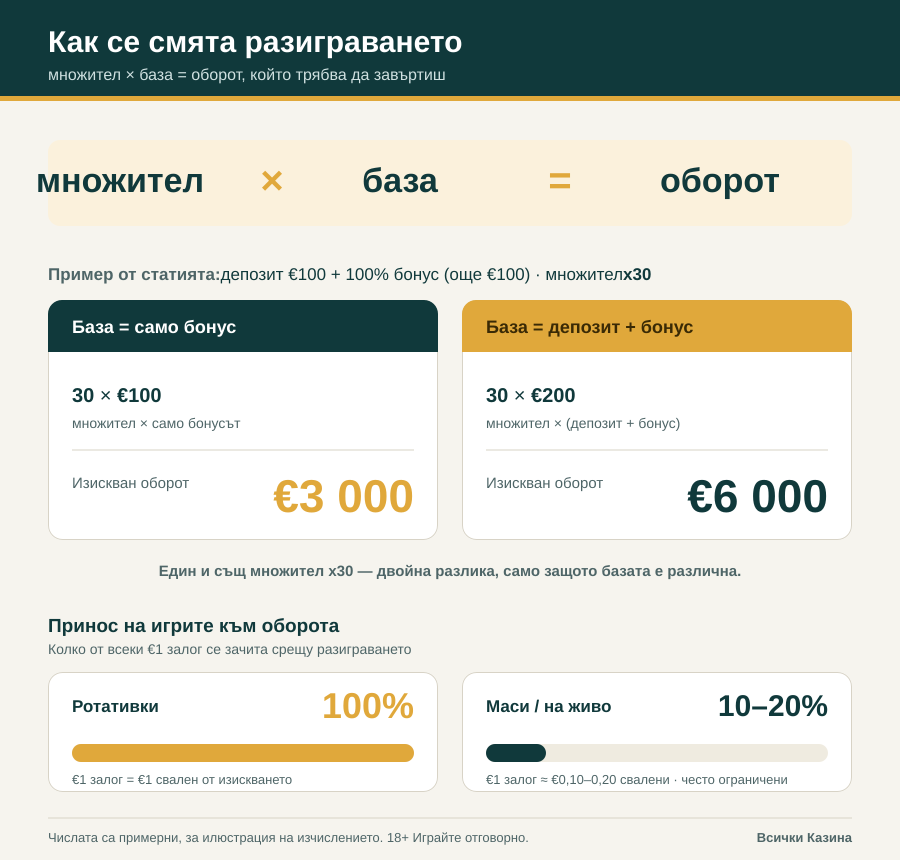
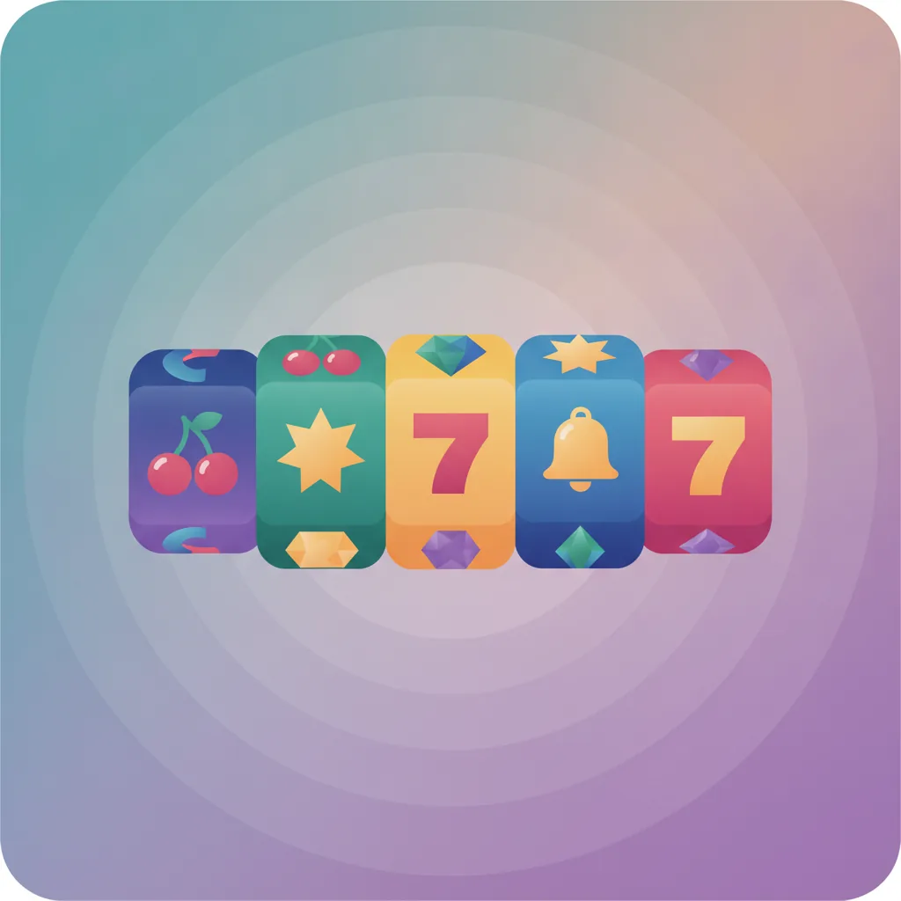

# Sample article images — за преглед (review only, do NOT merge)

Тестова партида от **две** примерни изображения за статии, направени по SEO правилата за изображения:
описателни малки-букви-с-тирета имена на файлове, български ALT текст, WebP < 100KB за растер,
без фалшиви скрийншоти, без лога/имена на реални оператори, без фалшиви бонус числа, без хора/лица,
съобразени с отговорната игра (RG).

Дата: 2026-09-08 · клон: `test/images-2026-09-08`

---

## 1) Инфографика (данни, рендерирана като код) — за статията за разиграване

- **За коя статия:** `content/2026-09-07-kak-raboti-razigravaneto` — „Как работи изискването за разиграване (wagering)".
- **Файл:** `test/images/razigravane-mnozhitel-baza-oborot.svg`
- **ALT текст (BG):** „Инфографика: как множителят по базата дава изисквания оборот — при депозит €100 и 100% бонус с множител x30 базата само бонус дава €3000, а базата депозит+бонус дава €6000; принос на игрите — ротативки 100%, маси и на живо 10–20%."
- **Формат + размер:** SVG (векторен), **6.2 KB**.
- **SEO обосновка:** SVG-то е реален текст, а не пиксели — Google чете думите и числата директно, файлът е миниатюрен (по-бърз LCP), остава кристално ясен на всеки екран и се рендерира нативно в GitHub. Описателното име на файла и българският ALT добавят тематични сигнали за „разиграване/множител/оборот".
- **Автентичност:** числата идват **директно** от чернова `05b-final-draft.md` на самата статия — 30 × €100 = €3000 (база само бонус), 30 × €200 = €6000 (база депозит+бонус), принос ротативки 100% / маси и на живо 10–20%. Нищо не е измислено; долу изрично пише, че числата са примерни за илюстрация.

## 2) AI изображение (декоративен hero, чрез Gemini image API) — за статията за безплатни игри

- **За коя статия:** `content/2026-09-07-bezplatni-kazino-igri` — водачът за безплатни/демо казино игри.
- **Файл:** `test/images/bezplatni-kazino-igri-demo-hero.webp`
- **ALT текст (BG):** „Стилизирана декоративна илюстрация на барабани от онлайн слот с цветни символи — черешки, звезда, звънче и скъпоценни камъни — в модерен плосък стил."
- **Формат + размер:** WebP, 1024×1024, **19.8 KB** (конвертиран от 1.03 MB PNG с Pillow, quality 82).
- **Gemini API:** ✅ работи. Модел **`gemini-2.5-flash-image`** през `:generateContent`, върнат като inline `image/png` данни (base64), после конвертиран към WebP локално с Pillow (в средата няма `cwebp`/ImageMagick).
- **SEO обосновка:** декоративен hero за визуален интерес и engagement, но лек (WebP < 20 KB → бърз LCP); описателното име на файла и българският ALT дават контекст за „безплатни казино игри / демо" без да претоварват страницата.
- **Хигиена / бележка за автентичност:** оригинална илюстрация — **без** реални лога/имена на оператори, **без** хора или лица, **без** фотореализъм, **без** рекламен текст или фалшиви бонус числа. Единствените „числа" в картинката са класическите слот символи „7" (универсална иконография на барабаните), а не оферта или промо стойност. Изображението е чисто декоративно и не насърчава хазарт.

---

## Приложена хигиена (обобщено)

| Правило | Инфографика (SVG) | AI hero (WebP) |
|---|---|---|
| Описателно име малки-букви-с-тирета | ✅ `razigravane-mnozhitel-baza-oborot.svg` | ✅ `bezplatni-kazino-igri-demo-hero.webp` |
| Български ALT текст | ✅ | ✅ |
| WebP < 100 KB (за растер) | n/a (векторен, 6.2 KB) | ✅ 19.8 KB |
| Без фалшиви скрийншоти | ✅ | ✅ |
| Без реални лога/имена на оператори | ✅ | ✅ |
| Без фалшиви бонус числа | ✅ (примерни, обозначени) | ✅ |
| Без хора/лица | ✅ | ✅ |
| Съобразено с отговорна игра (RG) | ✅ „18+ Играйте отговорно" | ✅ неутрално, декоративно |

> ⚠️ **Само за преглед.** Тази партида е тест за оценка на SEO подхода към изображенията. Не сливай този PR и не променяй pipeline-а.
