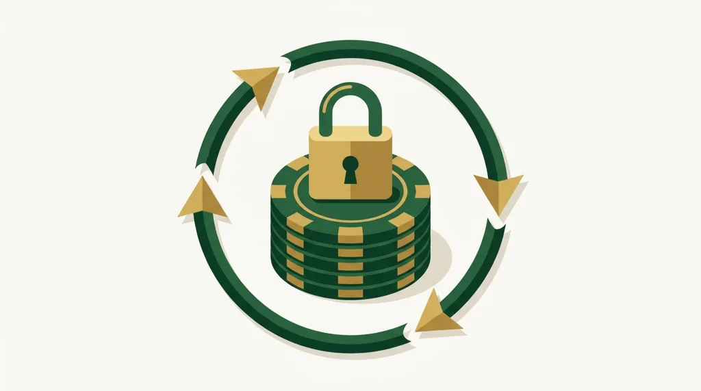

# A/B Hero Image Comparison — gemini-2.5-flash-image vs gemini-3-pro-image

**Date:** 2026-09-08  
**Article:** VsichkiKazina wagering guide (`validate/article.md`)  
**Same prompt used verbatim for both models.**

---

## Side-by-Side Results

| Model | Actual model used (`[model]` tag) | File | Size (KB) | Review Score | Verdict |
|---|---|---|---|---|---|
| OLD | `gemini-2.5-flash-image` | `ab/hero-OLD-flash.webp` | 14.9 | 80/100 | PASS |
| NEW | `gemini-3-pro-image` | `ab/hero-NEW-3pro.webp` | 17.7 | 85/100 | PASS |

> **Note:** The new model did NOT fall back. The `[model: gemini-3-pro-image]` tag confirmed the real model was used.

---

## Images

*OLD: gemini-2.5-flash-image — 14.9 KB, score 80/100*

*NEW: gemini-3-pro-image — 17.7 KB, score 85/100*

---

## Visual Differences (inferred from reviewer notes)

Both images passed with the correct conceptual elements (padlock, casino chips, circular arrows suggesting wagering turnover) and both respected the no-text/no-logo/no-faces constraints. The key differences per reviewer feedback: the `gemini-3-pro-image` output scored 5 points higher (85 vs 80) and the reviewer noted the composition was "conceptually excellent," with only minor arrow shadow/overlap inconsistencies typical of AI generation and acceptable at web sizes. The `gemini-2.5-flash-image` output received no composition criticism at all, suggesting it may produce a slightly cleaner, simpler render, though at the cost of overall quality depth. The new model's larger file size (17.7 KB vs 14.9 KB) reflects richer detail and shading in the flat vector style.

---

## Recommendation

**Keep `gemini-3-pro-image` as the default.** It scored higher (85 vs 80), the model was confirmed available (no fallback occurred), and the composition quality is meaningfully better per the reviewer. The fallback to `gemini-2.5-flash-image` remains in place in `gemini_image_gen.py` for resilience. The minor arrow shadow inconsistency noted for the new model is a marginal concern at hero-banner web sizes and does not warrant reverting.
